# Inferring Extended Finite State Machine Models from Software Executions

Neil Walkinshaw · Ramsay Taylor · John Derrick

Received: date / Accepted: date

Abstract The ability to reverse-engineer models of software behaviour is valuable for a wide range of software maintenance, validation and verification tasks. Current reverse-engineering techniques focus either on control-specific behaviour (e.g., in the form of Finite State Machines), or data-specific behaviour (e.g., as pre / post-conditions or invariants). However, typical software behaviour is usually a product of the two; models must combine both aspects to fully represent the software's operation. Extended Finite State Machines (EFSMs) provide such a model. Although attempts have been made to infer EFSMs, these have been problematic. The models inferred by these techniques can be non-deterministic, the inference algorithms can be inflexible, and only applicable to traces with specific characteristics. This paper presents

We thank Ivo Krka at the University of Southern California for providing us with some of the traces for the evaluation. Ramsay Taylor and John Derrick are supported by the EU FP7 PROWESS projects. Neil Walkinshaw is grateful for the support provided by the UK Ministry of Defence (MOD) through the BATS and HASTE projects. Information contained in this document should not be interpreted as representing the views of the MOD, nor should it be assumed that it reflects any current or future MOD policy. The information cannot supersede any statutory or contractual requirements or liabilities and is offered without prejudice or commitment.

N. Walkinshaw Department of Computer Science The University of Leicester University Road Leicester, LE1 7RH, UK Tel.: +44 (0)116 252 3953 Fax: +44 (0)116 252 3604

R. Taylor and J. Derrick Department of Computer Science The University of Sheffield 211 Portobello Sheffield, S1 4DP

E-mail: nw91@le.ac.uk

E-mail: j.derrick@sheffield.ac.uk, ramsay@gmail.com

a novel EFSM inference technique that addresses the problems of inflexibility and non-determinism. It also adapts an experimental technique from the field of Machine Learning to evaluate EFSM inference techniques, and applies it to three diverse software systems.

Keywords Reverse Engineering · EFSMs · Dynamic Analysis

## 1 Introduction

Reverse-engineered models that accurately capture the behaviour of a software system are useful for a broad range of software maintenance, validation, and verification tasks. Their use is becoming increasingly popular from a testing perspective, where they have been used as oracles for regression testing [\[17\]](#page-41-0), to detect intrusions and anomalous behaviour [\[43\]](#page-43-0), and to automatically generate test cases [\[18,](#page-42-0) [42\]](#page-43-1). Beyond testing, inferred models can aid software comprehension [\[12\]](#page-41-1) and requirements engineering [\[14\]](#page-41-2).

This range of applications has given rise to a multitude of model inference techniques. Most techniques are dynamic; they take as input a set of execution traces of the system in question and infer models that generalise upon them. These have largely focussed either on the inference of sequential models in the form of Finite State Machines (FSMs) [\[2,](#page-41-3) [12,](#page-41-1) [32,](#page-42-1) [50,](#page-44-0) [6,](#page-41-4) [31\]](#page-42-2), or data pre- and post-conditions, as espoused by tools such as Daikon [\[17\]](#page-41-0).

Such models tend to only provide a partial view of software behaviour. In practice, behaviour is often the result of interplay between the sequencing of events or function calls (as modelled by FSMs) and the values of the associated parameter or data-state variables (as modelled by invariants). This observation has prompted attempts to infer more complete models that are able to combine the two facets of behaviour.

One of the most common modelling techniques to blend control and data is known as the Extended Finite State Machines (EFSMs) [\[10\]](#page-41-5). EFSMs can be conceptualised as conventional Finite State-Machines that operate on an underlying memory, where transitions are annotated by guards on the memory. EFSMs have been used as a basis for testing [\[23\]](#page-42-3), and dependence analysis [\[3\]](#page-41-6). They can be trivially converted to other notations such as Abstract State Machines [\[7\]](#page-41-7), and X-Machines [\[24\]](#page-42-4), which have been used extensively for tasks such as model-checking and the specification of agent-based systems.

Though useful, current approaches to reverse-engineer EFSMs suffer the following key drawbacks:

– Non-determinism: In current approaches, inferred data constraints carry out a descriptive rˆole (summarising the data for individual transitions). They are not inferred in such a way that specific configurations of data are causally linked to subsequent control-events. As a consequence they fail to capture the explicit logical relationship between data and control. A walk through a machine can involve numerous points at which there are several possible paths to take for a given data-state.

– Inflexibility: Current inference approaches are limited to highly specific combinations of control and data-inference algorithms. However, software systems can be very diverse, which demands flexibility. Depending on the domain, systems might differ substantially in the typical trace size and diversity, the proportions of spurious events, noise, numerical variables, boolean variables, or structured variables such as lists etc. These can require completely different learner configurations; no single, specific learning algorithm will be effective on all types of system.

This paper presents a generalised technique MINT (short for Model Inference Technique), to infer EFSMs. It address the problem of inflexibility by enabling the use of arbitrary data-classifiers to infer data guards. The guardinference is combined with conventional state-machine inference in such a way that the final result is always deterministic. The specific contributions are as follows:

- An EFSM inference technique that is (1) capable of inferring EFSMs that are deterministic and (2) modular, allowing the use of a wide family of data classifier algorithms to analyse the data-state.
- An openly available proof of concept implementation that incorporates the WEKA classifier framework [\[22\]](#page-42-5) and Daikon [\[17\]](#page-41-0).
- A qualitative and quantitative evaluation, where the former compares our models to the models that would be produced by baseline techniques, and the latter assesses its accuracy and scalability with respect to several openly available modules from the telecoms domain.

The paper is structured as follows. Section [2](#page-2-0) gives some basic definitions and introduces a motivating example, and Section [3](#page-6-0) discusses the existing inference techniques. In Section [4](#page-11-0) we present our EFSM inference algorithm and describe its implementation. We discuss the evaluation in two sections: Section [5](#page-16-0) takes a qualitative look at the inferred models, and compares these to alternative models inferred by baseline techniques. Then Section [6](#page-23-0) quantitatively evaluates the approach by assessing the accuracy and scalability with respect to three diverse case study systems. Section [7](#page-38-0) gives an overview of related work. Finally, in Section [8](#page-40-0) we conclude and discuss potential future work.

## <span id="page-2-0"></span>2 Background

This section presents the core definitions that are to be used throughout the rest of this paper, and introduces a small motivating case study to set out the basic EFSM inference challenge.

# 2.1 Definitions

This subsection presents definitions of program execution traces, Finite State Machines and Extended Finite State Machines.

#### <span id="page-3-1"></span>2.1.1 Traces

As is the case with most behavioural model inference techniques, the technique presented in this paper takes as input a set of program traces. These are of a generic format, consisting of sequences of event names or function labels accompanied by variable values.

The trace-encoding process is identical in principle to that described by Ammons et al. [\[2\]](#page-41-3). We presume that the interactions with the system can be characterised in terms of particular event names and associated variable values. Depending on the abstraction, an event name might be a function name, and the variables might be the parameter values. As described by Ammons et al., structured data can be flattened to its primitive values. Formally, a trace can be defined as follows:

# <span id="page-3-0"></span>Definition 1 (Events and Traces)

An event is a tuple (l, v), where l is the name of a function and v is a mapping from parameter variables for l to concrete values. A trace t ∈ T is a finite sequence of events, often written as h(l0, v0), . . .(ln, vn)i.

Given a set of traces T, L<sup>T</sup> denotes the set of labels in the events in the traces in T (known as the alphabet of T). Similarly V<sup>T</sup> denotes the set of variables referred to in T. The concatenation of two traces a and b is denoted ab. A trace a is a prefix of a trace c if there exists a trace b such that ab = c. The set of prefixes of a set of traces T is denoted Pr (T). ✷

Example 1 In our running example of a mine pump (introduced below), (turn\_on, (water = 73.442, methane = 596.779, pump = off)) constitutes an event, and in such events we will often omit the parameter names, abbreviating this to: (turn\_on, 73.442, 596.779, off) whenever there is no ambiguity. ✷

# Definition 2 (Positive and negative traces)

Given a system S, a traces tr is said to be a positive trace of the system if it represents a feasible behaviour that S may exhibit, and said to be a negative trace if that behaviour is not possible in S. ✷

As is the case with any machine learning technique, the value and accuracy of the end result tends to rely on a suitable encoding of the input data. When collecting a trace of a software execution, there is often the choice of which events or method calls to track, and of which data-variables to record (e.g. input parameters, state-variables, return values, etc.). The specific mechanism and encoding used to collect the traces is flexible and depends on the intended purpose of the model. We have found that the following tracing heuristics tend to be generally suitable:

– Make responses explicit: The simplest way to encode a trace would be to create an event for each invocation of a function within the subject system (e.g., open file, close file). However, often the subject system can produce responses that have a significant bearing on subsequent behaviour (e.g., by throwing an exception if a file cannot be found). Accordingly, if possible, the possible range of responses to a given input should also be encoded as separate events in the trace to make the interaction with the system as fine-grained as possible.

- Detailed event types: If possible, events that play a different rˆole in the system should be given different labels. For example, if certain inputs lead to different types of exceptions, instead of simply using the label exception it is better to distinguish between them (e.g., null-pointer-exception and file-not-found-exception).
- Selectivity with data-variables: If possible, the inclusion of data variables that do not have a bearing on future behaviour should be minimised. This is to reduce the scope for errors by the data-classifiers that will be used to infer guards.

#### 2.1.2 Finite State Machines and Extended Finite State Machines

#### <span id="page-4-0"></span>Definition 3 (Finite State Machine)

A Finite State Machine (FSM) can be defined as a tuple (S, s0, F, L, T). S is a set of states, s<sup>0</sup> ∈ S is the initial state, and F ⊆ S is the set of final states. L is as defined as the set of labels. T is the set of transitions, where each transition takes the form (a, l, b) where a, b ∈ S and l ∈ L. When referring to FSMs, this paper assumes that they are deterministic. ✷

In intuitive terms, Extended Finite State Machines [\[10\]](#page-41-5) augment conventional FSM with a memory. Transitions between states are not only associated with a label, but are also associated with a guard that represents conditions that must hold with respect to the variables in the memory:

#### <span id="page-4-1"></span>Definition 4 (Extended Finite State Machine)

An Extended Finite State Machine (EFSM) is a tuple (S, s0, F, L, M , ∆, T), where S, s0, F and L are defined as in a conventional FSM. M represents the memory of the EFSM – a collection of variables. An assignment of variables in the memory to concrete values is denoted m ∈ M . The update function ∆ is the function L × M → M . The set of transitions T is an extension of the conventional FSM version, where transitions take the form (a, l, m, b), where a, b ∈ S, l ∈ L, and m ∈ M . ✷

It should be noted that the EFSMs as inferred here, and in the work by Lorenzoli et al., are not complete because the update function (the actual rules involved in transforming of variable values at each transition) is not inferred. In our and Lorenzoli et al.'s case, the models are declarative; they capture the sequences of events and variable values that are (or are not) possible, but do not explicitly capture how the individual variables are updated.

### <span id="page-5-0"></span>2.2 Motivating Example

To motivate this work, we consider a scenario where we need to reverseengineer the behaviour of a mine pump controller [\[29\]](#page-42-6). The pump controls water levels in a mine, and is activated or deactivated depending on the levels of water. However, it also monitors the levels of methane in the mine, and must switch the pump off if the levels of methane become too high.

Let us consider the scenario where we are required to analyse the behaviour of such a controller. The source code is unavailable but we are able to obtain traces of its behaviour. In the trace below, each event is shown in a separate line, along with the associated levels of water, methane and pump activity (i.e., whether it is on or off). The entire set of traces contains 2931 events, of which a snippet of one trace is shown below:

... turn\_on 73.44274560979447 596.7792240239261 false low\_water 28.898501010661718 584.0357656062484 true switch\_pump\_off 28.898501010661718 584.0357656062484 true turn\_off 28.898501010661718 584.0357656062484 true highwater 31.47476437422098 588.4568312662454 false switch\_pump\_on 31.47476437422098 588.4568312662454 false

This trace consists of a sequence of events, each given on a new line, thus each event has some structure: not just an event name (such as highwater) but also data (such as pump = false abbreviated to false in the traces above). So the question we are faced with is this: Given such a trace, what is the (sequential) behaviour of the system? Model inference techniques try to infer the correct model, often by extracting a FSM that is consistent with the traces given. But this trace has more information than just the event name; there is also data associated with each event. Can we infer a more accurate and complete model of the system by using these data values? We know intuitively that the activities are based on the data, but how? In other words, what is the model that can accurately capture this behaviour for us?

As we will elaborate in Section [3,](#page-6-0) techniques already exist that are capable of inferring models from these traces. However these suffer from significant drawbacks (which will be elaborated in Section [3\)](#page-6-0):

- FSM inference: Several techniques exist to infer FSMs from traces [\[2,](#page-41-3) [12,](#page-41-1) [32,](#page-42-1) [50,](#page-44-0) [6,](#page-41-4) [31,](#page-42-2) [42\]](#page-43-1). Although these can be quite accurate, they fail to capture the crucial relationship between the events and the data-state. The need to "discretise" the data into FSM labels is not only impractical, but tends to yield models that disproportionately large.
- EFSM inference: Although an attempt has been made to infer EFSM models [\[38\]](#page-43-2), it similarly suffers. Although it does manage to associate dataconstraints to transitions (with the help of Daikon [\[17\]](#page-41-0)), the inference can become prohibitively expensive and the resulting models are generally nondeterministic. Non-deterministic models pose significant problems from an analysis point of view; a single sequence of events may or may not be permitted by the same model. If used for test-generation, non-determinism leads to an explosion in the number of test cases required [\[23\]](#page-42-3).

The challenge lies in striking a balance between producing a model that is useful for reasoning about software behaviour (i.e., is deterministic and reasonably compact), but is also accurate. We will return to this when we perform our evaluation, since an evaluation is not now just about how accurate the model is, but about how useful, e.g., not too large that it becomes unreadable.

#### <span id="page-6-0"></span>3 Basic Inference Techniques

The EFSM inference approach proposed in this paper works by combining two complementary model types: (1) the FSM component that models the order in which various events or functions can be executed and (2) the rules that relate the data state of the system to the execution of these events. Each of these model families have been the subject of a substantial amount of model inference research in their own right, both within the fields of software engineering and machine learning. The remainder of this section presents a highlevel overview of the key existing techniques, providing enough information for the next section to show how they can be combined in a modular way. It concludes with a short overview of the weaknesses of existing EFSM inference techniques that have attempted to combine FSM and data rule inference.

#### <span id="page-6-1"></span>3.1 Evidence-Driven State Merging

The challenge of inferring an FSM from a set of example traces has been an established research challenge since Gold's pioneering research on language identification in the late 60s [\[20\]](#page-42-7). Numerous inference techniques were developed, spurred by several competitions that encouraged novel techniques to infer models from training sets made available over the internet [\[31,](#page-42-2) [50\]](#page-44-0). Evidence-Driven State Merging (EDSM) is one of the most popular and accurate inference techniques to emerge. It won the Abbadingo competition [\[31\]](#page-42-2) and was used as a baseline for the recent STAMINA competition [\[50\]](#page-44-0). We use the basic steps of the EDSM algorithm as a basis for our EFSM inference algorithm. Its basic functionality is described below. More in-depth descriptions of the individual components of the algorithm are available in Lang's original paper [\[31\]](#page-42-2), or one of the selection of software engineering references that describe its use [\[14,](#page-41-2) [50\]](#page-44-0).

Most FSM inference techniques (including the popular k-tails algorithm [\[6\]](#page-41-4)) fit into the family of "state-merging" techniques. These are variants of the same underlying algorithm. Unlike many similar machine learning techniques, we cannot presume the presence of negative traces or examples – in our scenario we only have software traces to work from, which are by definition positive. Accordingly, the algorithms presented here do not consider negative traces. The basic state merging algorithm is shown in Algorithm [1.](#page-7-0) From here on, we use sout to refer to the outgoing transitions from state s, and sin to refer to the incoming transitions. Traces are as defined in Definition [1,](#page-3-0) but the data variable values are ignored (given that FSMs do not incorporate data).

```
Data: S, s0, F, L, T, s1, s2, s3, s4, Traces
  /* S, s0, F, L, T are as per definition 3, s0, . . . s4 ∈ S, Traces is the set of input
     traces */
  Result: A deterministic FSM consistent with Traces
1 infer(Traces) begin
2 (S, s0, F, L, T) ←generatePTA(Traces);
3 foreach (s1, s2) ∈ choosePairs((S, s0, F, L, T)) do
4 (S, F, T) ← merge(S, F, T, s1, s2);
5 return (S, s0, F, L, T)
  /* Function to merge s1 to s2 and ensure that the result is deterministic. */
6 merge(S, F, T, s1, s2)begin
7 S ← S \ {s1};
8 F ← F \ {s1};
9 T ← changeSources(s1out, s2, T);
10 T ← changeDestinations(s1in , s2, T);
11 while (s3, s4) ←findNonDeterminism(S, T) do
12 (S, F, T) ←merge(S, F, T, s3, s4);
13 return (S, F, T)
```

Algorithm 1: Basic state merging algorithm.

<span id="page-7-0"></span>The algorithm begins by composing the traces into the most specific possible correct FSM — the Prefix Tree Acceptor (PTA) – and then proceeds to merge states to produce progressively smaller and more generalised hypothesis FSMs. The key steps are introduced below:

line 2: the set of traces Traces is arranged by the generatePTA function into an initial FSM in the form of a Prefix Tree Acceptor (PTA) [\[14\]](#page-41-2). This can be described intuitively as a tree-shaped state machine that exactly accepts Traces, where traces with the same prefix share the same path from the initial state in the PTA up to the point at which they diverge. Leaf states are added to F as final (accepting) states. For an intuitive illustration, there is an example PTA in Figure [1.](#page-12-0)

lines 3-5: The state merging challenge is to identify pairs of states in the current hypothesis FSM that represent equivalent states in the subject system, and to merge them. Starting off from the PTA, pairs of states are iteratively selected and merged, until no further pairs of equivalent states can be found, which indicates convergence at the final hypothesis FSM.

choosePairs: This function is responsible for returning a list of state-pairs that are most likely to be equivalent from a given FSM. The general process is described in Algorithm [2.](#page-8-0) The selectPairs function selects a set of state pairs in the current machine that are deemed to be suitable merge-candidates (using an approach known as the Blue-Fringe algorithm [\[31,](#page-42-2) [14\]](#page-41-2)). These pairs are then scored by the calculateScore function. This operates by counting the number of transitions in the outgoing paths from the two states that share the same labels (this is always finite because one of the states is always the root of a tree [\[31\]](#page-42-2)). Finally, the state pair with the highest score is deemed to be most likely to be equivalent, and is returned.

merge: The merge function merges s1 into s2 by first removing s1 from S and (if s1 ∈ F) replacing s1 with itself in F. It continues by redirecting all transitions s1in to s2, and changes the source states of all transitions s1out, making s2 their new source state. The resulting transition system is checked

```
Data: S, T, s1, s2, score, PairScores,t1,t2
1 choosePairs(S, T) begin
2 PairScores ← ∅;
3 foreach (s1, s2) ∈ selectPairs(S) do
4 score ← calculateScore(s1, s2);
5 PairScores ← PairScores ∪ {(s1, s2, score)};
6 return sortDescending(PairScores)
7 calculateScore(s1, s2) begin
8 score ← 0;
9 while (t1,t2) ← equivalentTransitions({s1, s2}) do
10 score ← score + 1;
11 score ← score+calculateScore(t1dest,t2dest );
12 return score
```

<span id="page-8-0"></span>Algorithm 2: The EDSM candidate pair selection procedure

for non-determinism, and this is eliminated by recursively merging the targets of non-deterministic transitions. A more detailed description of this process can be found in Damas et al.'s description [\[14\]](#page-41-2).

#### 3.2 Data Classifier Inference

The technique presented in this paper extends existing FSM inference approaches to produce EFSMs. Besides learning rules about sequences of events, the presence of a memory in EFSMs requires us to also learn rules about its variable values, and how these relate to particular events in the system.

The process that is referred to here as "data classifier inference" [\[39\]](#page-43-3) refers to a broad range of techniques that seek to identify patterns or rules between variables from a set of observations, and to map these to a particular outcome or "class". The possible classes could be {true, false} if the aim is to infer whether a given set of variable values is possible or not, or more elaborate, e.g., {rain, sun, overcast} if the aim is to predict the weather from a set of factors. In our context we are interested in what the next event is, and thus our class will be the set of events.

A huge variety of techniques have been developed in the machine learning domain, spurred by problems in domains as diverse as natural language processing, speech recognition, and bioinformatics. A part of the reason for this diversity is that techniques can contain specific optimisations for their target domain. Amongst the hundreds of different techniques, core techniques include Quinlan's C4.5 Decision Trees inference algorithm [\[40\]](#page-43-4), ensemble-learning approaches such as AdaBoost [\[19\]](#page-42-8), and Bayesian inference techniques such as the simple naive Bayes approach [\[39\]](#page-43-3).

<span id="page-8-1"></span>Classifier inference techniques start with a sample of observations (referred to here as a training set), which map a set of variable values to their respective classes, where a class is some categorical outcome (here the set of events). The goal is to produce some form of a decision procedure that is able to correctly predict the class of a set of unseen variable values. More formally, a training set and the classifier inference problem can be defined as follows:

### Definition 5 (Training set)

Given a variable domain V and a set of classes C , a training set T<sup>D</sup> of size n can be defined as a set {(v0, c0), . . . ,(vn, cn)}, where a vector of variable assignments v<sup>i</sup> is mapped to its corresponding class c<sup>i</sup> . ✷

# Definition 6 (Data classifiers and the inference problem)

A data classifier DC : V → C is a function that maps variables to classes. The inference problem can be characterised as inferring a classifier DC from a trace T that generalises upon the observations in the trace to classify further elements correctly when v 6∈ T. We denote the output from a classifier dc given a value v as dc(v). ✷

Our use of classifier inference is to turn traces into training sets by using information contained about the data values in the events in the program traces to determine which event will occur next. For example, we will use the data values in the mine pump example to discover that if methane is less than 598.52559, then the next event will be switch\_pump\_on, whereas if methane is greater than 598.52559, then the next event will be critical.

#### <span id="page-9-0"></span>3.2.1 Choosing a Classifier

As data classifiers embody the rules that form guards on EFSM transitions, their readability is of special significance. Classifiers such as C4.5 [\[40\]](#page-43-4) produce readable if-then-else rules that explicitly relate input to output. Others, such as neural net models, are based upon other representations (e.g. weighted probabilistic graphs), which are much harder to interpret. Although both can be used as the basis for EFSM inference (as will be shown in our experiments), the choice of model ultimately depends on the broader context in which the EFSM is to be used.

If, for example, we wish to reverse-engineer a state machine to be inspected by a human, it would be necessary to choose an explicit algorithm such as C4.5 to produce readable transition guards. An alternative scenario might not require human-readable models. Let us consider as an example an intrusion detection system. Here, models of 'typical' software or network behaviour are inferred from a given set of traces, and this model is then used to classify future executions as suspicious (if they do not conform to the behaviour predicted by the model). Here, no human intervention is required, so the model could as well use data classifiers that are not human-readable, but could have other benefits (e.g. efficiency, resilience to noise, accuracy).

Given the various trade-offs that can arise between different families of Machine Learning approaches, the question of which one to choose is complex, and has been the question of a substantial amount of research [\[52\]](#page-44-1). Several comprehensive implementation frameworks have emerged to facilitate experimentation, such as the Java WEKA API [\[22\]](#page-42-5) used for our work, which includes implementations of approximately 100 of the most of the established inference techniques.

### <span id="page-10-0"></span>3.3 Current EFSM Inference Approaches

The area of software model inference is vast, and has been active for the past 40 years [\[6\]](#page-41-4). Aside from the wealth of FSM inference and data-specification inference techniques, there are several techniques that have sought to combine the two. Notable examples include Dallmeier et al.'s ADABU technique [\[8\]](#page-41-8) and Lorenzoli et al.'s GK-tails algorithm [\[38\]](#page-43-2). Both have been generally evaluated on Java programs, but can in principle be applied to arbitrary program traces.

ADABU obtains models by obtaining a detailed record of the data-state at each point in the execution. It then adopts a simple, prescribed mapping to obtain abstract data characterisations at each point. For example, numerical values x are mapped to x > 0, x == 0, or x < 0, and objects are mapped to null or instance of c for some c. These are then combined into an abstract state machine according to the sequence in which these abstract states appear in the traces. The result is not strictly-speaking an EFSM (transitions do not have guards), but is mentioned here because it still combines data with control, and formulates this as a state machine.

For GK-tails the basic idea is to build on top of the normal state-merging approach described above (they choose the well established k-tails variant [\[6\]](#page-41-4)). Each state transition is labelled not only with a label, but also with the set of variable values that correspond to the execution at that point. As transitions are merged into each other during the state merging process, they map to increasing numbers of data values.

The GK-tails algorithm uses Daikon [\[17\]](#page-41-0) to infer rules that link the variables together for each transition. These rules are then used to determine whether or not a pair of states is compatible (this would be part of the choosePairs function in the context of our state-merging description). The use of data-rules to prevent incompatible state merges is an important contribution, and has inspired our approach (which will be presented in Section [4\)](#page-11-0).

Although they have proven to be successful for certain tasks, both approaches are hampered by key limitations. The first problem is flexibility. Both approaches are tied to very specific forms of data abstraction (mapping concrete data values into abstract rules): the ADABU data-abstraction is hard-coded, and in the case of GK-tails it is tied to Daikon. It is however well established from the field of machine learning that in practice different algorithms excel (and under-perform) according to the specific characteristics of a given data set. It is implausible that a data abstraction technique would be well suited for arbitrary sets of software traces (as formalised in Wolpert's "No Free Lunch" theorem [\[53\]](#page-44-2)). In the context of software, sequential can vary substantially, depending on various characteristics of the system. Sequences of events might be determined by subtle numerical changes to variables, others might be dependent on variations in string or boolean variables, others might involve a degree of stochasticity or noise. These require different learners to yield the most accurate models.

The second problem is specific to GK-tails (since it infers EFSMs, whereas ADABU does not). Data rules that summarise the guards on a transition are inferred on a per-transition basis. This has two downsides. The first is the sheer volume of trace data that is required; each transition (in the ultimate model) needs to have been executed with a sufficiently broad range of data to yield a model that is accurate in its own right – a highly unrealistic presumption for most dynamic analysis tasks. The second limitation is non-determinism. Since each transition data model is inferred independently, it is possible (and probable) that the resulting model contains states where, at a given state, the same data configuration can lead to several possible outgoing transitions. These non-deterministic models are less likely to be accurate, and pose several significant problems if they are to be used for automated analysis or testgeneration.

Models inferred by GK-tails still have an intrinsic value for several purposes, and the inaccuracies discussed above can often be tolerated depending on the purpose of the model. For example, such models can still be useful if the model is intended as a descriptive overview of system behaviour. However, for purposes where the model might be required for classifying correct or incorrect behaviour, or to simulate a software system, models have to be more precise and deterministic.

#### <span id="page-11-0"></span>4 The EFSM Inference Algorithm

This section presents our EFSM inference algorithm. It adopts a similar template to the approach proposed by Lorenzoli et al. [\[38\]](#page-43-2). It also builds upon established state-merging techniques, and also works by attaching data values to transitions. However that is where the similarity ends. Instead of relying on a single data model inference approach, the algorithm proposed here is modular ; it enables the incorporation of arbitrary data classifier inference techniques (there are over fifty in the WEKA library used by our reference implementation). Secondly, by using classifiers, the data rules and their subsequent control events are explicitly tied together. Finally, instead of inferring rules on a pertransition basis, a set of global data rules are inferred (e.g., some classifiers infer them as if-then-else constructs), so they are able to take advantage of all of the available data, instead of just those data points that are attached to individual transitions.

The approach described here (along with alternatives such as GK-Tails) have been implemented in Java as a tool called MINT (Model Inference Tool). The tool has been made openly available[1](#page-11-1) , under the GNU GPLv3 licence. All of the examples and experimental materials featured in this paper can be downloaded from the project website.

This section starts off with a description of the algorithm itself. This is followed by a description of the state-merging algorithm that underpins the

<span id="page-11-1"></span><sup>1</sup> <https://bitbucket.org/nwalkinshaw/efsminferencetool>

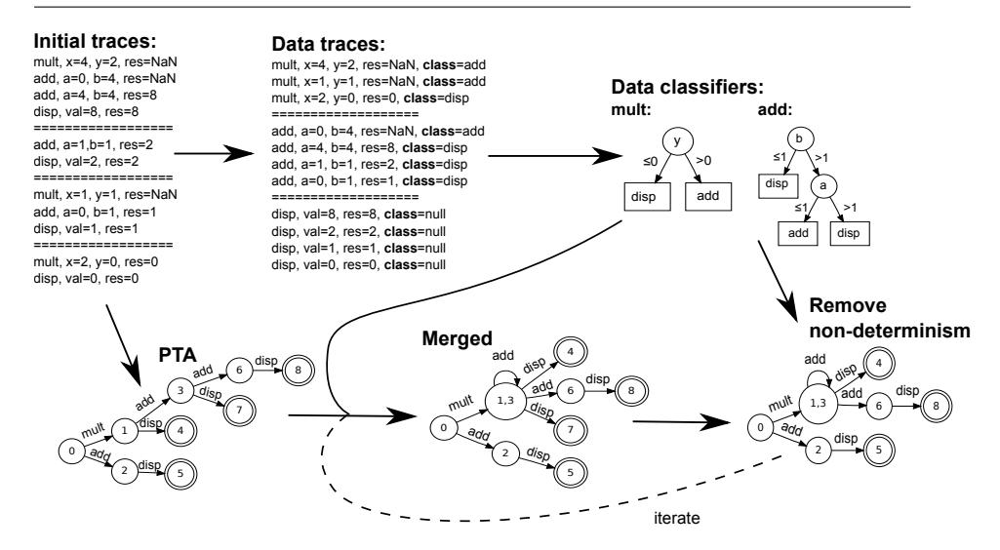

<span id="page-12-0"></span>Fig. 1 Illustration of the key inference steps with respect to traces from an imaginary calculator system. The classifiers used in this example happen to be decision trees, but could assume any representation depending on the chosen data rule inference algorithm. For space reasons the transitions are not labelled by their associated data guards.

inference of the transition system. Finally, a small example is included to illustrate the key steps, and to provide an intuition of the final machine.

#### 4.1 Inference Algorithm

The inference algorithm builds upon the state-merging baseline in Algorithm [1.](#page-7-0) In simple terms, there is an extra step beforehand, which is the inference of a set of classifiers. Each classifier corresponds to a label in the trace (e.g., the signature of a method in a Java trace). From a set of inputs to the method, the classifier serves to predict the next event name in the trace (i.e., the name of the next method to be called). In the rest of the inference algorithm, the purpose of most functions remains the same, however this time their behaviour is modulated by the classifiers. Also, there is a new function consistent, which ensures that the model that is produced at each iteration is consistent with all of the classifiers.

The algorithm is shown in Algorithm [3,](#page-13-0) and the key steps are illustrated in Figure [1.](#page-12-0) For an intuitive understanding, it is easiest to start with Figure [1,](#page-12-0) and to then trace the equivalent steps in Algorithm [3.](#page-13-0) The following description will draw upon both. Starting with a set of initial traces (top left), the algorithm starts by processing them to create one "training set" per label (shown to the right in the diagram). This adds a "class' variable to each data point, showing for every data configuration what the label of the subsequent event is. The training set can then be used to infer a set of classifiers (moving

```
\textbf{Data} \colon EFSM,\, C,\, k,\, c,\, Data\, Trace,\, s1,\, s2,\, t1,\, t2,\, Vars,\, Failed
    /* Here A is shorthand for the collection (S,s_0,F,L,\Delta,T) as per definition 4.
        Components of A are denoted by subscript (e.g. A_S).
    /* C is a mapping from transition labels to classifiers. The classifier for a given
        label l is denoted C_l.
    /* s_1, s_2 \in S
    /* \ t1, t2 \in T
    /* DataTrace is a trace as in definition 5.
    /* Vars is a one-to-many mapping from transitions in T to trace elements in Traces.
        k is an (optional) integer \geq 0 representing a minimum merge score. Failed is a set
        of failed state pairs
    Result: An EFSM consistent with Traces
 1 Infer(Traces, k) begin
          Failed \leftarrow \varnothing;
          DataTraces \leftarrow \texttt{prepareDataTraces(}Traces);
 1
          C \leftarrow inferClassifiers(DataTraces).
          (A, Vars) \leftarrow \texttt{generatePTA}(Traces, C);
         foreach (s1, s2) \in choosePairs(A, C, k) \setminus Failed do
 6
               (A', Vars') \leftarrow merge(A, (s1, s2), Vars, C);
               if consistent (A', C, Vars') then
 8
                    A \leftarrow A';
 9
10
                    Vars \leftarrow Vars';
11
                | Failed \leftarrow Failed \cup (s1, s2)
12
         \mathbf{return}\ A
14 merge(A, s1, s2, Vars, C)begin
         A_S \leftarrow A_S \setminus \{s1\};

A_F \leftarrow A_F \setminus \{s1\};
15
16
17
          A_T \leftarrow \text{changeSources}(A_T, s1_{out}, s2);
          A_T \leftarrow \text{changeDestinations}(A_T, s1_{in}, s2);
18
          while (t1, t2) \leftarrow equivalentTransitions(A_T, s2, Vars, C) do
19
              if (t1_{dest}) = t2_{dest} then
20
                    Vars(t2) \leftarrow Vars(t2) \cup Vars(t1);
21
22
                    A_T \leftarrow A_T \setminus \{t1\};
24
               (A, Vars) \leftarrow merge(A, (t1_{dest}, t2_{dest}), Vars, C);
25
         return (A, Vars)
   equivalentTransitions(A, s, Vars, C) begin
26
27
         for each \sigma \in A_{\Sigma} do
28
               c \leftarrow C(\sigma);
29
               foreach t_1, t_2 \in \{A_T \mid s \xrightarrow{\sigma} \} do | foreach x \in Vars(t_1), y \in Vars(t_2) do
30
31
                         if c(x) == c(y) then
32
                               T \leftarrow T \cup (t_1, t_2);
33
         \mathbf{return}\ T
34
                        Algorithm 3: EFSM Inference Algorithm
```

<span id="page-13-0"></span>to the right in the diagram). The examples used here are decision trees (such as those produced by the C4.5 algorithm [40]), but they could be any suitable representation of a decision procedure, such as neural nets or if-then-else clauses [22].

At this point, the initial set of traces is re-analysed, but this time to produce a Prefix Tree Acceptor (PTA) [50] (line 4 in the algorithm, bottom left in the diagram). The PTA is a tree-shaped state machine that exactly represents the set of given traces, where traces with the same prefix share the same path in the tree up to the point where they differ (leading to separate branches in the PTA).

There are however two important differences from the PTAs used here and those that are used in the conventional state merging algorithm. In this PTA, transitions are labelled not only with the name of a function, but also with the sets of data variable values that correspond to each transition (in the algorithm this mapping is represented by Vars). This is elided in Figure [1,](#page-12-0) but in the full rendering of the PTA, the transition 0 mult −−−→ 1 would map to {(x = 4, y = 2, res = NaN ),(x = 1, y = 1, res = NaN ),(x = 2, y = 0, res = 0)}. Secondly, a pair of states (a, b) only share the same prefix in the PTA if the inferred classifiers yield identical predictions for every data-configuration in the prefix of a as they do for b. This means that the PTA represents the most specific EFSM that exactly represents the given set of traces.

Together, the embellished PTA and the data classifiers (i.e., the next event names) are used as a basis for iterative state-merging, following a similar iterative loop to the original state-merging procedure in Algorithm [1.](#page-7-0) The key differences are as follows.

The choosePairs function (line 5) takes several additional variables into account. k is an optional parameter to represent the minimum score before a pair of states can be deemed to be equivalent. A pair of transitions can only be deemed to be equivalent if their attached data values lead to the same predictions by the relevant classifier in C .

The merge function (line 6 – shown in full in lines 14-28) is similar to the the generic version, but differs in the way it detects non-deterministic transitions, and merges those transitions. Instead of merely detecting non-determinism by matching transition labels, it uses the equivalentTransitions function (detailed below) to also determine whether the data variables are treated as equivalent by the accompanying classifier. When transitions are merged, their corresponding sets of data values are merged as well.

The equivalentTransitions function identifies non-deterministic transitions. For the merged state s, it iterates through every pair of outgoing transitions from s that share a matching label (). It then uses the classifier for that label (c()) to compare the variable values that are attached to the two transitions. If, for every pair of variable values, the classifier gives the same result, the transitions can be treated as equivalent.

This process of using classifiers to distinguish between transitions with the same labels is illustrated in Figure [2.](#page-15-0) Let us suppose that the inference algorithm is considering whether to merge the two states that are targets of the two transitions. If we ignore the data values, this would seem to make sense. However, according to the data classifier inferred for add, the two transitions are different, because it predicts different outcomes for the data values attached to them. For one transition, the classifier predicts that the next event will be a further add, whereas for the other the classifier predicts a disp. Our approach will only merge pairs of states if, for all subsequent merges of transitions, there is no such conflict.

Once states and transitions have been merged, the merge function has the additional responsibility of reallocating the data values from the source

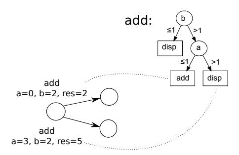

<span id="page-15-0"></span>Fig. 2 Example of how the decision tree inferred for the add function can distinguish between transitions with the same labels, but data values that correspond to different classifier outcomes.

transitions to the target ones. This is achieved by updating the map Vars from transitions to data variables (line 21). The resulting merged model and updated mappings from transitions to data are returned as (A', Vars').

Finally, once the merge has been processed, the resulting model is checked by the function consistent. This makes sure that, for each transition in the merged machine A', the attached data Vars' are consistent with the classifiers in  $\Delta$ . For each transition  $t \in A'_T$ , the corresponding data variable values are obtained from Vars'(t). This is provided to the corresponding classifier in  $\Delta$ , which returns a predicted subsequent label (i.e. the name of the method to be executed subsequently). This is checked against the transition structure of A'. If the target state of t does not have an outgoing transition with the predicted label, consistent returns false.

If A' is consistent with  $\Delta$  and Var', the 'current' state machine A is updated to A', Var is updated to Var', and the whole process iterates until no further merges can be found. If consistent returns false, the current merge is ignored, and the next merge is attempted. This whole process continues until no more merges can be identified, when the process returns  $(A, \Delta)$ .

#### 4.2 Tracing a path through an inferred EFSM

Having inferred an EFSM E, the question arises of how to determine whether a given trace  $\langle (l_0, v_0), \ldots (l_n, v_n) \rangle$  can be mapped to a path of transitions in  $E_T$ . There are two ways to do this. If the classifier is of the type that it is possible to derive explicit data constraints for each transition (e.g. as illustrated in section 5), it is possible to trace paths by reconciling these constraints with the variables in each trace element.

However, a more general approach (that also works for 'black-box' classifiers such as Naive Bayes and Neural Nets) is to pick transitions through the EFSM by using the classifiers and that trace elements that are attached to the transitions during the merging process in *Vars*. Starting in the initial state, any transition that is compatible with the first trace element is identified by

the process adopted by equivalentTransitions and shown in Figure [2.](#page-15-0) If it returns a transition the process is repeated with respect to the next element. If no transition is returned then the trace is deemed to be incompatible with the EFSM.

## <span id="page-16-0"></span>5 Qualitative Evaluation

In this section we seek to show what the inferred models look like, and how they compare against models produced by the current state of the art. We choose the Mine Pump system that was referred to in Section [2.2.](#page-5-0)

We begin by providing a brief overview of the models inferred by baseline approaches: We start by inferring a conventional FSM, then use the GK-Tails algorithm to infer an EFSM, and finally use our MINT approach to infer an EFSM.

The experiments were carried out on an Apple MacBook Pro with a 2.6GHz Intel Core i5 CPU and 16GB RAM (of which 1GB was assigned to the Java Virtual Machine).

### 5.1 Inferring an FSM without Data

The model inferred by the standard EDSM algorithm (with k = 2)[2](#page-16-1) is shown in Figure [3.](#page-17-0) The key strength of the data-less model is its conciseness. Ultimately, the entire contents of all the traces with a total of 2931 events are compacted into a state machine of 15 states and 18 transitions.

The downside, however, is that it provides only a partial description of the behaviour of the system. The first two transitions are labelled highwater and critical. Under what circumstances is one chosen instead of the other? Further down the machine there is a state with a loop labelled critical, and a non-looping outgoing transition labelled not critical. What determines the choice between these transitions?

These questions become critical when the model is applied to tasks such as model-checking or testing. If, for example, one wanted to devise a test-sequence to cover a particular task in the model, one would be reduced to guessing the requisite variable values.

#### <span id="page-16-2"></span>5.2 Inferring an EFSM with GK-tails

Given the size of the infered model (39 states and 57 transitions, with several large constraints), it cannot be presented here in its entirety. To give an idea of its structure, a scaled-down version is available in the appendix, and a zoomable PDF is available online. Figure [4](#page-18-0) shows the initial portion of the model, to give an idea of the nature of the transition guards that are inferred.

<span id="page-16-1"></span><sup>2</sup> Here, k refers to the parameter that determines when we merge states, not to k-folds.

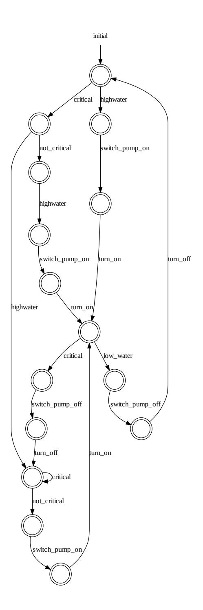

<span id="page-17-0"></span>Fig. 3 Conventional FSM as inferred by EDSM Blue-Fringe algorithm with k=2

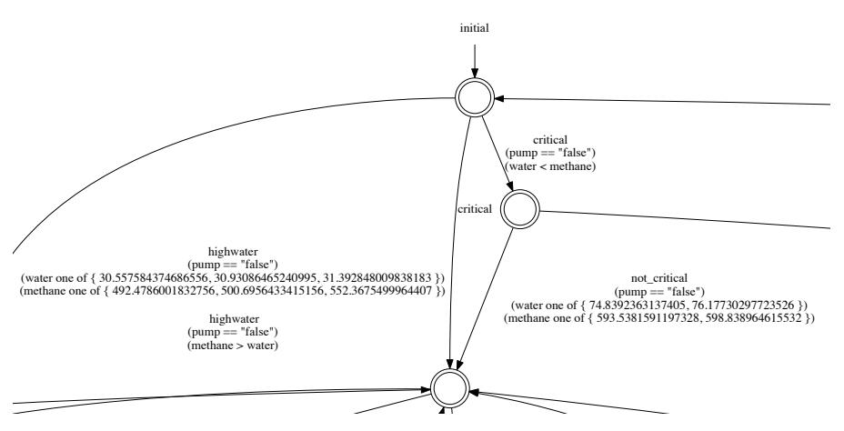

<span id="page-18-0"></span>Fig. 4 Iinitial portion of EFSM inferred by GK-Tails

As can be seen in Figure 4, the guards tend to be highly specific. Transitions can be annotated with labels such as:

```
label = highwater:
water one of {30.557584374686556, 30.93086465240995, 31.392848009838183}
methane one of {492.4786001832756, 500.6956433415156, 552.3675499964407}
pump == "false"
methane > water
```

This is to be expected, as GK-Tails infers data constraints on a pertransition basis. It makes no generalisations about rules that apply accross all transitions. For transitions where there is not a large amount of trace data, this leads to necessarily specific rules. From the perspective of the model as whole, this leads to a high degree of *under-generalisation*; if the model has to classify new data that was not a part of the original training set, it is unlikely that the highly specific data constraints will recognise it.

Although the Daikon constraints can be problematic from an accuracy perspective, they remain very useful from a descriptive point of view. The constraints provide a concise summary of exactly what the trace data looks like at a particular transition. This is a valuable idea, and prompted us to include a post-processing option in our MINT tool, which provides optional additional descriptive constraints for transitions once the model has been inferred (as illustrated later on in this section).

#### 5.3 Inferring the MinePump model with MINT

We recall the example of the mine pump controller, as briefly discussed in Section 2.2. We have a collection of traces with a total of 2931 events (illustrated on page 6), and we wish to better understand the underlying behaviour by

inferring an EFSM. The full set of traces that were used for this example is available from the accompanying webpage[3](#page-19-0) .

The following output is obtained by running our tool, using its default settings. The entire run of 30 traces with 2931 events took 4476 ms.

This uses the WEKA J48 decision tree learner (the C4.5 algorithm [\[40\]](#page-43-4)) to infer the underlying data relations. This produces the following decision trees:

```
critical
==========
pump = true: switch_pump_off
pump = false
| methane <= 607.2162
| | methane <= 602.640094: not_critical
| | methane > 602.640094
| | | water <= 31.699162: not_critical
| | | water > 31.699162: critical
| methane > 607.2162
| | water <= 74.875037: highwater
| | water > 74.875037: critical
not_critical
==========
: switch_pump_on
highwater
==========
methane <= 598.525559: switch_pump_on
methane > 598.525559: critical
turn_off
==========
methane <= 597.355089: highwater
methane > 597.355089: not_critical
turn_on
==========
methane <= 590.815697: low_water
methane > 590.815697
| water <= 35.75304: low_water
| water > 35.75304: critical
```

Decision trees be read as a set of if-then-else rules, where the conditions are on the values of the variables, and the outcomes represent the next event. For example, looking at the highwater tree, if methane <= 598.525559 the model predicts that the next event is switch pump on, otherwise the next event is critical. For the not critical tree, there are no conditions on the variables, the next event is always switch pump on.

These data models already provide some basic constraints on the sequential behaviour of the system. They show which combinations of variable values lead from one function to another. However, they fail to provide a macroscopic view of the order in which the events can occur. This is provided by the state transition diagram.

The final inferred model is provided in its entirety in Figure [5.](#page-20-0) Where possible we will refer directly to the inferred model as a whole. Where our discussion involves areas of the model that are particularly hard to read, we will reproduce a separate, magnified sub-area.

<span id="page-19-0"></span><sup>3</sup> <http://www.cs.le.ac.uk/people/nwalkinshaw/efsm/>

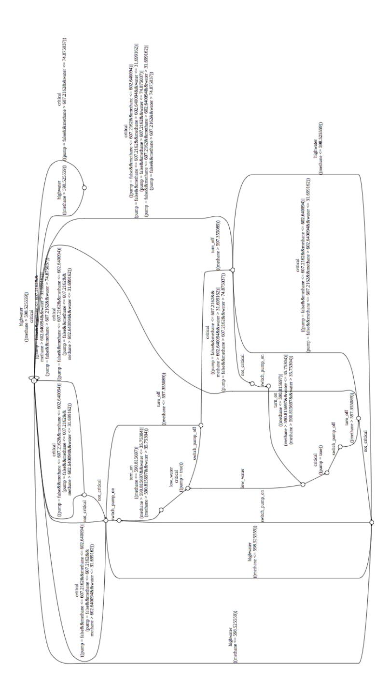

<span id="page-20-0"></span>Fig. 5 Inferred EFSM of the Mine Pump (as laid out by GraphViz)

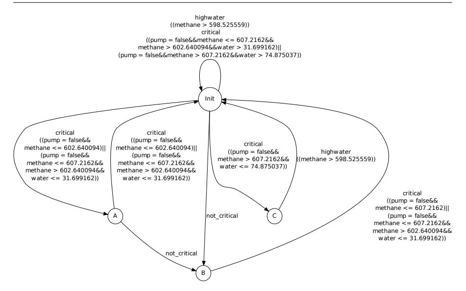

Fig. 6 Initial portion of the larger EFSM from Figure [5](#page-20-0)

The first thing to observe about the model is that it is actually quite compact. We can see that 30 traces with 2931 events have been reduced to just 29 transitions, connecting 16 states. The value of the transition system is that it makes explicit any loops, or nested loops, that would be exceedingly difficult to discern from just looking at the traces alone.

One fact that becomes apparent from the model is that there are certain "well-defined" states. For example, all of the transitions labelled high-water, where methane≤ 598.525559 lead to the bottom-most state in the machine (marked A). From here, it is only possible for a switch pump on event to occur. All of the low-water transitions lead to the state marked B, at which point the pump can only be switched off.

The machine contains several examples that illustrate how the data constraints for different outgoing transitions of a given states are deterministic. Although the labels are the same, they are distinguished by their associated data constraints. This is captured by an extract from the machine, homing in on the transitions around the initial state, shown in Figure [5.3.](#page-20-0)

From the Init state, there are three outgoing transitions that are labelled critical (one loops to the Init state, and the others go to A and C ). At first glance, it is hard to distinguish between their guards; a lot of the conditions overlap (and could probably be simplified with the help of a constraint solver). The conditions outgoing from Init are simplified and summarised as follows:

- 1. Stay in the same state if (602.64009 < methane ≤ 607.2162 and water > 31.699162) or (methane > 607.2162 and water > 74.875037).
- 2. Go to state A if (methane ≤ 602.64009) or (602.64009 < methane ≤ 607.2162 and water ≤ 31.699162).

3. Go to state C if  $(methane > 607.2162 \text{ and } water \leq 74.875037)$ .

This shows that the constraints are mutually exclusive. There is no configuration of methane and water that would lead to a nondeterministic choice.

#### 5.3.1 Activating the Daikon Option

When analysing the output from GK-Tails in Section 5.2, we observed that the use of Daikon to label transitions could be useful for the purposes of providing transition-specific information about the attached data. Although certain classifiers can be used to extract explicit constraints for the EFSM transitions (such as the J48 constrainst used in the above example), others (e.g. Naive Bayes) cannot. In such cases, Daikon provides the means to at least provide some elementary rules describing the data on each transition.

Given the extensible architecture of MINT, this was relatively straightforward to implement. All that was required was a decorator class (we called it DaikonMachineDecorator) that takes the inferred model, and post-processes it by using Daikon to augment the labels. The resulting model is too complex to include in a readable format here, but is available online as a zoomable PDF.

We take an arbitrary transition from our conventional MINT model, labelled with the critical event. The core data constraints are as follows (&& denotes a logical AND and || denotes a logical OR, derived from the J48 models as described above):

```
(pump = false && methane <= 607.2162 && methane > 602.64009 && water > 31.69916)
||(pump = false && methane > 607.2162 && water > 74.875037)
```

Once augmented by Daikon, the result is:

```
(pump = false && methane <= 607.2162 && methane > 602.64009 && water > 31.69916)
||(pump = false && methane > 607.2162 && water > 74.875037)

[Daikon:]
(pump == false) &&
(water one of { 29.52568745646882, 44.83925073627964, 47.19036859812776 })&&
(water < methane) &&
(methane one of { 600.4670870705706, 603.2950429347378, 607.6059627141653 })
```

These additional constraints provide an alternative perspective on the data. As such, it is helpful to keep the two separate. The top Weka-generated constraints are the general rules that fed into the inference of the transition structure. The lower Daikon invariants can give more specific descriptions of the individual groupings of trace-observations that pertain to a particular transition. Amongst these constraints, there are relationships between variables that may be entirely absent from the constraints inferred by WEKA, such as the fact that (at least for this transition) the water level is always less than the methane level.

This post-processed EFSM with Daikon constraints must be interpreted with care. The Daikon constraints do not convey the general guards that should be applied to the conditions (as with GK-Tails, they do not generalise beyond a single transition). However, they do provide at least a preliminary answer to the question "Why were these [WEKA] rules inferred for this transition?", by providing a more detailed view of the transition-specific data.

#### <span id="page-23-0"></span>6 Experimental Evaluation

In this section we provide a experimental evaluation of the approach. The research questions are as follows:

RQ1: Which configurations lead to accurate models?

RQ2: How does MINT scale?

- (a) How large are the inferred models in terms of states and transitions?
- (b) How long does model inference take?
- (c) What is the relation between the number of traces and the time taken to infer a model?

We first provide an overview of the experimental methodology, followed by the results, and a brief discussion of the threats to validity.

## 6.1 Methodology

We ran the MINT algorithm on traces from three software systems (an SMTP implementation written in Java, a resource locker and a frequency server, both written in Erlang). For each system we generated a set of "negative" traces as well, which would correspond to invalid executions of the system. We then used k-folds cross validation (explained below) to derive accuracy scores for each of the systems.

# 6.1.1 Systems

For this evaluation we chose five, relatively diverse systems. They were primarily chosen because they are all sequential systems that rely on an internal data-state (i.e. are suitable for modelling with EFSMs), and have been used in previous research on either state-based modelling or testing. The details are given below. The alphabet refers to the number of event-labels that occur within the traces.

– Mobile Frequency Server: A server module written in Erlang, which allocates frequencies to mobile phones that attempt to contact each other. This is a relatively small system that has served as a case study for the development of concurrent and distributed testing techniques, and is extensively described by Cesarini and Thompson [\[9\]](#page-41-9).

Alphabet: 8 Nr. Traces: 100

Average trace length: 20 Average variables per event: 3 – Resource Locker: The resource locker implements a distributed resourcelocking algorithm in Ericsson's AXD 301 ATM switch [\[5\]](#page-41-10).

Alphabet: 8 Nr. Traces: 100

Average trace length: 20

Average variables per event: 1.3

– java.security.Signature A Java SDK class that provides the functionality of a digital signature algorithm. The traces were collected by several executions of the Columba email client[4](#page-24-0) .

Alphabet: 14 Nr. Traces: 71

Average trace length: 14.52 Average variables per event: 16.7

– java.net.Socket A Java SDK class that represents the end point of communication between two machines. Traces were collected by several executions of the Columba email client, as well as the Voldemort distributed database[5](#page-24-1) .

Alphabet: 56 Nr. Traces: 100

Average trace length: 44.18 Average variables per event: 32.17

– java.util.StringTokenizer A Java SDK utility class for tokenizing a string. The traces (produced by Krka et al. [\[30\]](#page-42-9)) were collected via several executions of JEdit[6](#page-24-2) .

Alphabet: 14 Nr. Traces: 100

Average trace length: 33.36 Average variables per event: 14.5

The mixture of Java and Erlang systems is deliberate. As a black-box approach, it makes sense not to restrict the evaluation to a specific platform. The Erlang modules present a relatively restricted interface. The Java classes on the other hand present relatively comprehensive APIs, where each trace event is associated with an extensive set of data values.

# 6.1.2 Trace Collection

To collect traces for the two Erlang modules we built a random test-generation framework. This invoked random functions, accompanied by random input parameters, for 20 iterations. Tests that resulted in a failure for some reason (i.e. by not adhering to the preconditions of the module) were discarded. For RQ1 we collected 100 traces per Erlang system. However, for RQ2 we collected larger numbers to probe scalability.

<span id="page-24-0"></span><sup>4</sup> <http://sourceforge.net/projects/columba/>

<span id="page-24-1"></span><sup>5</sup> <http://www.project-voldemort.com/voldemort/>

<span id="page-24-2"></span><sup>6</sup> <http://www.jedit.org/>

The traces for the three Java components were kindly provided by Krka et al.. These had been used previously for their experiments on FSM inference [\[30\]](#page-42-9). The traces were provided in the Daikon format. To use them we developed a small Daikon trace reader for our tool.

#### 6.1.3 Synthesis of Negative Traces

To fully assess the accuracy of the inferred models (as will be elaborated below), it is necessary to collect 'negative' traces; traces that are not valid or correct examples of software behaviour. The challenge is to produce negative traces that are not too obviously invalid. In our case, we want traces that are invalid, but might be perceived as valid by a conventional learner that does not account for data state.

To generate these traces we experimented with two approaches. One approach which we adopted in our initial experiments [\[51\]](#page-44-3) involved introducing small code changes (mutations) to the program code to change its behaviour. The approach we have subsequently adopted for the experiments in this paper involved the provision of a manually selected set of trace mutations, and applying them to the sets of traces to yield negative traces. These approaches are discussed in more detail below.

Generating negative traces by automated program mutation Program mutation [\[26\]](#page-42-10) is a technique was developed as a basis for assessing the adequacy of test sets. Mutation testing seeds the source code of a program with small changes (mutations), such as changing a > to a <, or changing the value of constants. The rationale is that the test set can thus be evaluated in terms of the proportion of mutations that it is able to expose, by providing an input that leads to a different output than would have been produced in the non-mutated program. In our context, a program execution that diverges in behaviour from the behaviour observed on the non-mutated program can be deemed to be a 'negative' trace.

In our context we are not simply dealing with inputs and outputs. We are dealing with sequential traces of events. Accordingly, for the purposes of our work, we can deem a mutation to have succeeded if it changes the sequential ordering of events in an execution.

We used this approach to generate negative traces for a preliminary study of our work [\[51\]](#page-44-3), using the MAJOR mutation framework [\[27\]](#page-42-11) for Java classes, and a custom mutation tool based on Wrangler [\[33\]](#page-43-5) for the Erlang programs.

However, a subsequent analysis of the negative traces highlighted some weaknesses with this approach. Firstly, a mutation could well change the execution trace of a program, but not change the order of events; variable values might be changed, but not in such a way that the sequential orderings of events were affected. On the other hand, mutations could be triggered that changed the sequencing of events in such an obvious way that they failed to properly probe the ability of MINT to infer some of the more subtle data-related event sequences. Finally, there was the problem that this hampered our reuse of the traces from Krka et al.'s studies [\[30\]](#page-42-9) (the three Java systems listed above). Although the traces were available, the exact inputs used to extract them (necessary to collect the mutated traces) were not.

Generating negative traces with hand-picked mutations In the light of the weaknesses mentioned above, we opted to develop an alternative, more reliable approach to negative trace generation. Instead of relying on quasi-random mutations of the program code, we generated customised mutations that could be (automatically) applied directly to the given set of positive traces, which would yield traces that were guaranteed to be negative.

For each system, we identify a set of rules that characterise sequences of events that cannot happen. For example, having inspected the implementation of a Stack data structure, we might produce a property stating that if a stack is empty and a pop is called, the next event cannot be another pop or a push (because we know it has to be an exception). Having identified a set of such rules, we process the set of positive traces to find the points at which the preconditions of these rules are met. The prefix of these points is used to formulate a new trace, and the invalid suffix is added to produce a trace that is guaranteed to be invalid.

This approach can give rise to some threats to validity however. These have been discussed in full in Section [6.3.](#page-36-0)

#### 6.1.4 k -Folds Cross Validation

EFSM inference techniques are intrinsically difficult to evaluate. Current approaches are "model-based", in the sense that they rely upon some reference model that can be used as a basis for computing accuracy [\[34,](#page-43-6) [35,](#page-43-7) [13,](#page-41-11) [45\]](#page-43-8). This requirement for hand-crafted models can however be restrictive in terms of the size and complexity of the model against which a technique can be evaluated. Whereas (deterministic) FSMs always have a unique canonical minimal state-machine, this is not necessarily the case for EFSMs, where variations in data-guard conditions can lead to a multitude of structurally different (albeit functionally equivalent) models.

In machine learning it is typically the case that there are no gold-standard reference models. One of the most popular evaluation techniques that can be used in such a situation (which we adopt for this study) is a technique known as k-folds cross validation [\[28\]](#page-42-12). Here, the simplifying assumption is made that the given set of examples (test cases in our case) collectively exercise the full range of behaviour from which we are inferring a model. The set is randomly partitioned into k non-overlapping sets. Over k iterations, all bar one of the sets are used to infer a model, and the remaining set is used to evaluate the model according to some metric (discussed below). For each iteration a different set is used for the evaluation. The final accuracy score is taken as the average of the k accuracy scores.

Of course, given the probability that test sets are not "rich enough", the accuracy score cannot be interpreted as an absolute score of the accuracy of

the model with respect to the system in question. As with all dynamic analysis techniques, an incomplete test set will yield an incomplete model [\[13\]](#page-41-11). However, it can be used in our experimental setting to compare the relative performance of different model inference configurations (this has previously been carried out by Lo et al. [\[37\]](#page-43-9)). If we go further and accept that the test set represents a reasonable sample of typical program behaviour, then the resulting scores can be interpreted as being at least indicative of the actual accuracy score.

#### 6.1.5 Measuring Accuracy

The use of k-folds Cross Validation involves the key step by which a set of traces (that was not used to infer the model) is used to assess its accuracy. Essentially, each trace is compared to the model, to determine whether the two are 'in agreement' (i.e. that the model correctly accepts positive traces and correctly rejects negative traces).

There are several measures by which to assess the extent of agreement between a set of traces and a model. Basically, the set of traces classified by the model (to determine whether it accepts them as positive or rejects them as negative), and from this we end up with four numbers: The number of True Positives (TP), True Negatives (TN), False Positives (FP) and False Negatives (FN). From these numbers it is possible to calculate various 'Binary Classification Measures' [\[41\]](#page-43-10).

In line with previous research on state machine inference [\[14,](#page-41-2) [48,](#page-43-11) [50,](#page-44-0) [45\]](#page-43-8), we choose Sensitivity (also known as the True-Positive Rate) and Specificity (or True-Negative Rate). In terms of TP, TN, FP, and FN, these are computed as follows:

$$Sensitivity = \frac{TP}{TP + FP}$$

$$Specificity = \frac{TN}{TN + FP}$$

Sensitivity is also known as 'Recall'. We chose Specificity instead of Precision (which is usually paired with Recall) because Precision does not take True Negatives into account. In our case, we consider the ability of a model to correctly reject negative traces to be just as important as the ability to correctly accept positive ones.

Finally, the two measures (Sensitivity and Specificity) can be summarised as the 'Binary Classification Rate' or BCR, which is computed as the average of the two:

$$BCR = \frac{Sensitivity + Specificity}{2}$$

#### 6.1.6 Assessing Scalability

To assess scalability, we used the set of traces from our Resource Locker system, for which we were able to collect a large number of test executions. We executed MINT for increasing numbers of traces (increasing by 25 at each iteration), and tracked the number of milliseconds required to infer the final result. For each trace set we ran MINT with different data classifier algorithms, to identify any performance penalties that might be attached to particular algorithms.

#### 6.1.7 Controlled Variables

MINT is parameterised by the choice of data classifier algorithm and the minimum score from which to merge a pair of states (k). To account for the impact of these factors on accuracy, we ran separate experiments for values of k from 0 to 4, and for each k we inferred models using four of the most popular classifier algorithms in WEKA [\[22\]](#page-42-5) (using the default WEKA settings for each algorithm). The algorithms were selected to fit a broad range of numerical or discrete systems, and are: C4.5 [\[40\]](#page-43-4) (listed as J48), Naive-Bayes [\[39\]](#page-43-3), AdaBoost [\[19\]](#page-42-8), JRIP (also known as RIPPER).

For each system this resulted in 20 configurations. Since we were using fivefolds for the cross validation (five models were inferred per configuration), this meant that 100 models were inferred per system (so 500 models in total).

Each model inference was given a time limit of 10 minutes. If the timeout was hit, the resulting accuracy scores were recorded as an NA. If all of the attempts to infer a model for a k-folds cross validation timed out, the result was also recorded as an NA (to differentiate from an inaccurate model with a score of zero).

#### 6.2 Results

# RQ1: Which configurations lead to accurate models?

The full results can be found in Appendix [B.](#page-2-0) There were 10 configurations for which the model inference timed out, all of which are for the Socket class (the reasons for the timeout will be discussed below).

The accuracy for all the configurations is shown in Figure [7.](#page-29-0) Specificity is plotted along the x axis, and Sensitivity is plotted on y. In summary – coordinates that appear in the top-right hand area are successful. Co-ordinates that appear in the top-left area tend to have been under-generalised (not enough states were merged). The converse applies to co-ordinates that appear in the bottom-right area; they have been over-generalised (too many states have been merged). The most successful configurations, along with their corresponding BCR values, are summarised in Table [1.](#page-30-0)

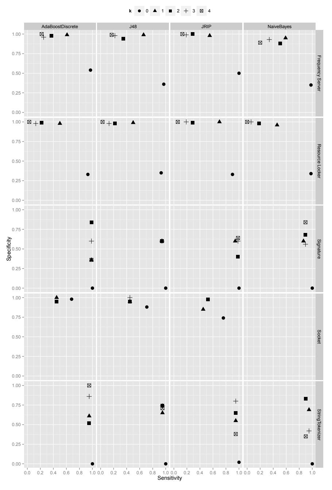

<span id="page-29-0"></span>Fig. 7 Sensitivity and Specificity results for all configurations. Each row represents a particular subject system, and each column represents a data-classifier algorithm.

<span id="page-30-0"></span>Table 1 Configurations for each system, where both sensitivity and specificity were ≥ 0.6. Ordered first by system, and then by BCR.

| System           | Algorithm  | k | Sensitivity | Specificity | BCR  | Time (ms) |
|------------------|------------|---|-------------|-------------|------|-----------|
| Resource Locker  | JRIP       | 1 | 0.70        | 1.00        | 0.85 | 28642.00  |
| Frequency Server | J48        | 1 | 0.66        | 0.99        | 0.82 | 9444.00   |
| Frequency Server | AdaBoost   | 1 | 0.61        | 0.99        | 0.80 | 12879.00  |
| Signature        | AdaBoost   | 2 | 0.98        | 0.84        | 0.91 | 1551.00   |
| Signature        | NaiveBayes | 4 | 0.90        | 0.84        | 0.87 | 1519.00   |
| Signature        | JRIP       | 4 | 0.98        | 0.64        | 0.81 | 1530.00   |
| Signature        | AdaBoost   | 3 | 0.98        | 0.60        | 0.79 | 1514.00   |
| Signature        | JRIP       | 3 | 0.98        | 0.60        | 0.79 | 1532.00   |
| Signature        | NaiveBayes | 2 | 0.90        | 0.68        | 0.79 | 1581.00   |
| Signature        | J48        | 1 | 0.94        | 0.60        | 0.77 | 1684.00   |
| Signature        | JRIP       | 1 | 0.94        | 0.60        | 0.77 | 1527.00   |
| Signature        | J48        | 2 | 0.94        | 0.60        | 0.77 | 1690.00   |
| Signature        | J48        | 3 | 0.94        | 0.60        | 0.77 | 1764.00   |
| Signature        | J48        | 4 | 0.94        | 0.60        | 0.77 | 1700.00   |
| Signature        | NaiveBayes | 1 | 0.86        | 0.60        | 0.73 | 1525.00   |
| StringTokenizer  | AdaBoost   | 4 | 0.95        | 1.00        | 0.97 | 15409.00  |
| StringTokenizer  | AdaBoost   | 3 | 0.95        | 0.86        | 0.91 | 18700.00  |
| StringTokenizer  | JRIP       | 3 | 0.95        | 0.80        | 0.88 | 21625.00  |
| StringTokenizer  | NaiveBayes | 2 | 0.90        | 0.83        | 0.86 | 32104.00  |
| StringTokenizer  | J48        | 2 | 0.95        | 0.74        | 0.84 | 7283.00   |
| StringTokenizer  | J48        | 3 | 0.95        | 0.74        | 0.84 | 12973.00  |
| StringTokenizer  | J48        | 4 | 0.95        | 0.71        | 0.83 | 14339.00  |
| StringTokenizer  | NaiveBayes | 1 | 0.95        | 0.69        | 0.82 | 20559.00  |
| StringTokenizer  | J48        | 1 | 0.95        | 0.65        | 0.80 | 6987.00   |
| StringTokenizer  | JRIP       | 2 | 0.95        | 0.65        | 0.80 | 8487.00   |
| StringTokenizer  | AdaBoost   | 1 | 0.95        | 0.61        | 0.78 | 8196.00   |
| Socket           | AdaBoost   | 0 | 0.68        | 0.98        | 0.83 | 267084.00 |
| Socket           | J48        | 0 | 0.71        | 0.88        | 0.80 | 259888.00 |
| Socket           | JRIP       | 0 | 0.76        | 0.74        | 0.75 | 199268.00 |

Choice of classifier The rˆole of the classifier in determining the accuracy of the final model varies from system to system. For Resource Locker, Frequency Server and Socket, the plots look relatively similar across the rows; the choice of data classifier has little impact on accuracy. However, Signature and String-Tokenizer the situation is different. In both systems all configurations achieve a high degree of Sensitivity. However, for a given value k, one classifier can result in a very low Specificity, whereas others can result in a high all-round accuracy score.

As shown in the full table of results in Appendix [B,](#page-2-0) there was no single data classifier algorithm that outperformed the others for all systems. Each data classifier performed well for certain systems. The best overall performer was the AdaBoost algorithm, the only algorithm to belong to one of the top three configurations for each of the systems (the top configuration for three of the systems).

Choice of k As with the classifier, the value of k required to obtain the best results varies from system to system. For the two Erlang systems, k = 1

was the best choice. However for the other systems this varied, and was also dependent upon the choice of data classifier.

This is especially clear in Figure [7,](#page-29-0) with respect to the StringTokenizer class. For the AdaBoost configuration, a choice of k = 4 produced almost perfect results (BCR=0.97), whereas for the same system and value of k, the NaiveBayes classifier resulted in a BCR of just 0.62.

Looking across the full set of results (in Appendix [B\)](#page-2-0), there are some systems for which a lower value of k was better (1 or 2), and some for which a higher value (3 or 4) produced the best results. The Erlang systems[7](#page-31-0) produced the best results for low values of k, whereas Signature and StringTokenizer produced the best values for higher values.

One probable explanation for this lies in the manner in which the systems in question were executed. The Erlang systems were executed by a random tester; their functions were attempted in arbitrary patterns. The Java systems on the other hand were traced in-situ, where client programs exercised their methods in relatively specific sequences. With the Erlang systems, the consequence would have been that it would be harder to distinguish a pair of states by their suffixes, whereas with the Java systems the suffixes for specific states would be more distinct. For systems in the latter category, a higher value of k ought to lead to better merges.

Conclusions Ultimately, the choice of configuration is critical to the accuracy of the final result. However, there is no single ideal choice of data classifier, or a single ideal choice of k. This depends, to a large extent, on the characteristics of the target system, and the manner in which it is invoked. This ultimately supports our requirement for flexibility outlined in Section [3.3.](#page-10-0) The ability to select from a variety of data classifier inference algorithms is crucial because there is no such thing as an algorithm that will return appropriate models for arbitrary systems (as characterised by Wolpert's 'no free lunch' theorem [\[53\]](#page-44-2)).

RQ2 (a):How large are the inferred models in terms of states and transitions?

To investigate the sizes of the inferred models, we consider the results of the experiment used to answer RQ1. The sizes of the models in terms of states and transitions are shown in Figure [8.](#page-32-0) Given the substantial differences in sizes between systems, the scales are varied per-system and per-classifier algorithm.

As might be expected, the sizes of the models, both in terms of states and transitions, vary substantially from one system to the next. Signature tends to produce the smallest models (in the region of 1-40 states and 20- 40 transitions). Socket is on the other end of the scale (140-2000 states and 1300-1600 transitions).

However, across all of the systems, increasing the value of k tends lead to notable increases in size. For all systems k = 0 yields the smallest systems,

<span id="page-31-0"></span><sup>7</sup> Socket timed out for higher values of k, and is therefore not included in this particular aspect of the discussion.

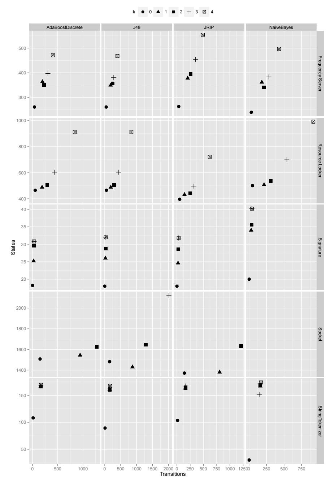

<span id="page-32-0"></span>Fig. 8 Average numbers of transitions and states for inferred models across all configurations. Each row represents a particular subject system, and each column represents a data-classifier algorithm.

and k = 4 produces the largest ones. This is especially pronounced in the two Erlang systems. For Resource Locker, when k = 0 the models have approximately 50 states and 400 transitions. When k = 4, the models for Naive Bayes have approximately 920 states and 990 transitions.

Conclusions The size of an inferred model can vary drastically, depending on the characteristics of the underlying system. Another key factor is the value of k. As shown in the answer to RQ1, a high value of k can for some systems (though certainly not all) lead to more accurate results. However, the flip-side is that the models tend to be much larger.

#### RQ2 (b): How long does model inference take?

To investigate the amount of time required to infer the models, we again consider the experiment used to answer RQ1, and look at the time taken for each configuration. The times are plotted in Figure [9.](#page-34-0)

This shows again that, for each system and configuration, the times can vary substantially. For Frequency Server inference could take from approximately 1000-5000 miliseconds (under a minute). However, for Socket, times could range from 178301 miliseconds (3 minutes) to over 10 minutes (when it timed out).

As far as the choice of classifier algorithm is concerned, the performance is similar for AdaBoost, J48, and JRIP. However, there is a substantial increase in time required for NaiveBayes. From a follow-up analysis, we have determined that this difference is not in fact caused by the initial inference of the Naive Bayes classifier (which happens only once at the beginning). Instead, it comes down to the fact that the resulting model takes longer to query than the other types of model. Given that the inferred models are used extensively during inference, such a difference can have a disproportionate effect on the inference time of the EFSM.

For most of the configurations, an increase in the value of k can also lead to longer inference times. This can be explained by the size of the resulting models. If the models are small, it tends to take less time to find a pair of matching states. However, when k is large, the model contains more states and transitions, and it takes longer to find suitable merge candidates.

The Socket case study merits a degree of elaboration here. For higher values of k, the inference times would increase substantially regardless of classifier. However, for NaiveBayes, all inference efforts timed out. Socket traces are especially "rich" when compared to the other systems; they have an alphabet of 56 different events (four times as many as the Signature and StringTokenizer), and an average of 32 variable values per event (twice as many as Signature). The high number of events, coupled with a high k score, explains the large models (meaning that it takes longer to find and execute merges). On top of this, large numbers of variables can lead to very high overheads when fed to models produced by learners such as Naive Bayes.

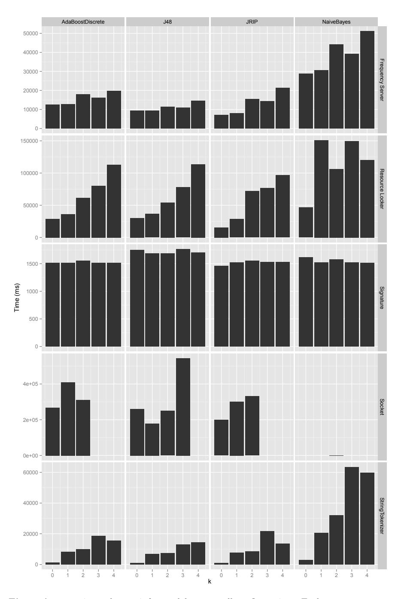

<span id="page-34-0"></span>Fig. 9 Average time taken to infer models across all configurations. Each row represents a particular subject system, and each column represents a data-classifier algorithm.

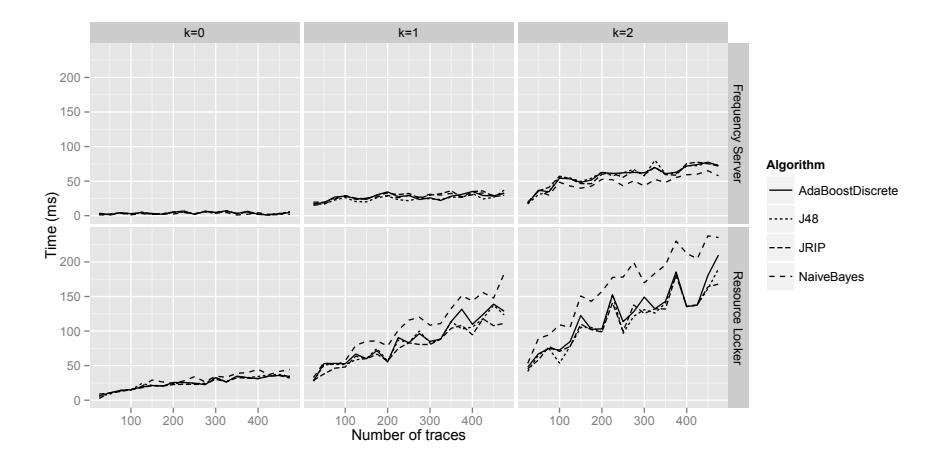

<span id="page-35-0"></span>Fig. 10 Average time taken (over 5 k-folds iterations) to infer a model as the number of traces increase for Resource Locker and Frequency Server case studies.

Conclusions The amount of time taken to infer a model can vary substantially from one system to the next. Again, the choice of classifier inference algorithm and k are instrumental.

RQ2 (c): What is the relation between the number of traces and the time taken to infer a model?

Figure [10](#page-35-0) shows, for the two Erlang systems, the relationship between the number of traces and the amount of time taken to infer a model. The timing is plotted for sets of traces that vary in size, starting at 25 traces, and increasing to 500 by increments of 25.

Whereas an increase in traces has very little impact on the time taken for Frequency Server, it has a substantial impact for Resource Locker. This is especially the case as k increases, and particularly for configurations with the Naive Bayes learner.

The effect of k has been discussed previously, and is straightforward to explain. A higher k tends to produce larger models. These have more states (and thus more candidates for potential merges), and consequently take longer to process by the state merging algorithm. However, this does not explain the difference in timing between the two systems, where k is the same.

The reason lies in the inferred classifiers. The data models inferred for the Locker system prevent more states from being merged than in the Frequency Server. This leads in itself to larger state machines, which in turn take longer to process. For k = 0 the average number of states for the Frequency Server is 37.75, whereas the average for Resource Locker is 53. This difference grows as k increases, leading to ever widening differences in time taken.

Conclusions Of course, the amount of time required to infer a model increases as the number of traces increases. The degree of this increase depends on two main factors. Additional traces do not necessarily lead to a substantial increase in the number of states and transitions in the prefix tree, because they might repeat patterns of events that are already there. They do however always add additional data variables. These add to the data that has to be analysed by the data classifiers. This is why the choice of data classifier can have such a marked effect on performance. Configurations that include classifiers that produce models that are time-consuming to process (such as Naive Bayes) tend to fare especially badly as the volume of data increases.

#### <span id="page-36-0"></span>6.3 Threats to Validity

This is a preliminary experimental evaluation. The selection of systems is small. This is a clear threat to external validity, in the sense that the accuracy and scalability results cannot be interpreted to be representative of performance with respect to all software systems.

The threat has been somewhat mitigated by selecting systems and sets of traces that are reasonably diverse in nature. They differ extensively in terms of their alphabet size, the numbers of data parameters, and the trace lengths. Nonetheless, the experiments deliberately avoid drawing any general conclusions about performance and accuracy, but instead focus on the underlying factors that affect performance and accuracy.

A further threat to external validity lies in the configuration of the WEKA classifiers. Each classifier has its own (often extensive) set of configuration options. We simply chose the default configuration options in WEKA for each classifier. The benefit of this is that it avoids the internal threat to validity of biasing results in our favour. However, it does open up the external threat that this specific configuration is unsuitable and misrepresents the performance of MINT with respect to that particular classifier.

There exist two threats to construct validity. The negative traces have been synthesised by manually identifying specific states that should not precede specific events. There is the risk that these were in fact mistaken (that the resulting traces are valid after all). To mitigate this, we inspected the source code for all of the systems to ensure that the preconditions were correct.

There is also the risk that these mutations are too specific. This has to be traded off against the fact that, if we were to allow arbitrary negative traces, that many would be so trivially obvious that they would not properly assess the learner. To mitigate this threat, we ensured that, for any negative property, the number of corresponding negative traces would be as diverse as possible. This was achieved by only specifying the essential variable values for a given property (maximising the number of times it could be identified in the set of positive traces), and providing as many impossible suffixes as possible.

## 6.4 Discussion

The two evaluation sections have shown that MINT is capable of inferring models that can approximately summarise and accurately predict the behaviour given by a set of traces. The word 'approximately' has to be emphasised here. As is the case with any tractable Machine Learning technique, there is an inevitable degree of error [\[44\]](#page-43-12). In this section we briefly discuss the possible sources for this inaccuracy.

Trace abstraction The approach is based on the premise that it is possible to extract a trace from a system, where each trace event is accompanied by a fixed number of variables, where each variable is of a fixed type. Whereas this is reasonably straightforward for Java systems and the Erlang systems used in our case studies, there are classes of system for which obtaining such a trace can be difficult. As an example, for the PoolBoy system used in our initial evaluation [\[51\]](#page-44-3), the variables are recorded as Strings, but actually correspond to nested lists or fixed tuples of process identifiers. To enable the inference of models from such systems, it is invariably necessary to re-code the traces to a more suitable abstraction (as discussed in Section [2.1.1\)](#page-3-1).

Data classifiers Given that the approach is a fusion of two complementary Machine Learning techniques (data classifier inference and state merging), these are the two most obvious sources of inaccuracy. As discussed in Section [3.2.1,](#page-9-0) an inappropriate data classifier might predict the wrong follow-on events for a given data configuration, which can lead to state merges being incorrectly accepted or rejected.

The ability to infer accurate data classifiers does not only rely on the selection of suitable inference algorithms, but also depends on the availability of the necessary data. If a decision depends on the value of a specific variable, then it must be made available for inference. This however has to be balanced with the additional problem that, given too many variables, it becomes much harder to identify those relationships between variables and subsequent events that are relevant (known as the feature identification problem).

State merging algorithm Aside from the choice of classifier, the choice of state merging algorithm is a further possible source of inaccuracy. The challenge of merging pairs of states to iteratively yield a state machine is discussed at length in Section [3.1.](#page-6-1) Although the EDSM algorithm we have chosen tends to select suitable pairs of states, it remains vulnerable to merging pairs of states that should in fact be kept separate [\[50\]](#page-44-0), and ruling out better merges in doing so. This can lead to models that represent sequences of events that are infeasible in reality.

What is the ideal scenario? The above limitations beg the following question: What would be the characteristics of a system for which the EFSM inference would excel? From a data point of view (in light of the problems discussed above), a system (or trace thereof) would contain only variables that have a direct bearing on the subsequent behaviour, and the number of these variables would ideally be low for each event. From a state-merging point of view, the number of elements that could possibly succeed a given event should ideally be low (to prevent false merges), however all of these possible sequencings should be represented in the set of traces.

#### <span id="page-38-0"></span>7 Related Work

As discussed in Section [2,](#page-2-0) the challenge of inferring state machines from traces has existed for over 40 years. In the context of software-engineering, the bulk of this work has focussed on conventional Finite State Machines [\[2,](#page-41-3) [12,](#page-41-1) [32,](#page-42-1) [50,](#page-44-0) [6,](#page-41-4) [31\]](#page-42-2). Within the Machine Learning field of Grammar Inference, there have been extensive efforts to infer much broader families of 'automata' (albeit characterised as languages or grammars) [\[16\]](#page-41-12).

The challenge, however, of inferring EFSMs from traces that are annotated with data has only been addressed in earnest over the past decade. Our work builds upon the early work by Lorenzoli et al. [\[38\]](#page-43-2) (as presented in the background section). This approach, along with Dallmeier et al.'s ADABU approach are detailed in Section [3.3.](#page-10-0) However, there have been several other efforts, which are discussed in more detail in the rest of this section.

Active inference of (data-)state based models State merging algorithms make the assumption that there is no external source of information besides the set of traces. However, in several Software Engineering settings, this presumption might be restrictive. There could be other sources of information that could be queried, to enable the gradual refinement and improvement of a model.

There are two current approaches to infer state machines with data. Howar et al.'s approach is an extension of Angluin's L∗ algorithm [\[4\]](#page-41-13), and is built into the LearnLib tool [\[25\]](#page-42-13). Aarts et al.'s approach [\[1\]](#page-41-14) is built upon the notion of Counter Example Guided Abstraction Refinement [\[11\]](#page-41-15).

The reliance upon an oracle limits the size and complexity of the models that can (at least accurately) be inferred by these approaches. If (as is often assumed) the goal is to infer a model that is exactly correct, this can require an extensive amount of additional input from the oracle (in the form of queries and counter-examples), even for models that are very small by comparison to the models used in this work.

Of course, the upside is that these techniques can offer very strong guarantees about the accuracy of the models that have been inferred. Whereas our approach can offer approximate (albeit we would argue reasonable) arguments about accuracy, these approaches can leverage the existence of an oracle to make much stronger guarantees.

In our ongoing work we are interested to explore the extension of our approach to an active variant. This will seek to build upon our previous work (based on conventional FSMs) [\[46\]](#page-43-13), investigating the use of active state merging algorithms (the QSM algorithm [\[14\]](#page-41-2)) for tasks such as software testing [\[48\]](#page-43-11).

Combining LSC inference with invariants Lo and Maoz [\[35\]](#page-43-7) developed an approach that infers Live Sequence Charts (LSCs) [\[15\]](#page-41-16), which are augmented with invariants. The approach operates by first mining the Live Sequence Charts (by observing those interactions that occur frequently). Once an LSC has been inferred, it is augmented by extracting those parts of the traces that correspond to the relevant elements in the LSC, and using Daikon to provide the invariants.

There are several parallels with our approach. Both approaches are marrying sequential models (albeit different ones) with data. In both cases, elements of the state-based model are linked to the original trace elements. The key difference lies in the way the data models are used. In this paper, the data models are not decorating the sequential model in a post-hoc step; they are used to shape the sequential model as it is being inferred.

Combining state machine inference with data constraints Recently, Krka et al. [\[30\]](#page-42-9) have built on the work by Lorenzoli et al. to build state machines that are augmented with data constraints. Both approaches examine the data constraints that are linked to the outgoing transitions from pairs of states to determine compatibility. However, Krka et al.'s SEKT algorithm makes use of an additional set of Daikon predicates that represent the 'global' program state. Thus, a pair of states can only be merged if (a) the data values on the transitions are compatible and (b) the data values correspond to the same global state.

Krka et al.'s idea of inferring a set of 'global' rules that pertain to the full set of program traces is very similar to what happens in our approach. We infer all of the data models at once, in advance of program inference. However, the nature and purpose of the models inferred in this approach is flexible in our approach (we can incorporate any data classifier inference technique). Also, the purpose of the models is different too; they are not intended to summarise the underlying data state of the system, but denote the rules that link the data state to the events that can follow.

Evaluation of sequential models by k -folds cross validation This work has adopted a technique known as k−folds cross validation to evaluate the accuracy of the inferred models. This approach has been carried out before by Lo et al. [\[36\]](#page-43-14), in their work on detecting sequential failure patterns. They developed an approach to detect sequences of events that indicate a program failure at runtime.

Although the main relation to this work lies in their use of k−folds cross validation, we are especially interested in applying our EFSM inference approach to the problem of online failure detection in our future work.

#### <span id="page-40-0"></span>8 Conclusions and Future Work

This paper has introduced a new algorithm for the inference of EFSMs. It enables the combination of established state-merging techniques with arbitrary data classifier inference algorithms, to infer models that more fully capture the behaviour of a software system. The approach does not rely on source code analysis, and has accordingly been demonstrated with respect to three systems written in entirely different programming languages and paradigms.

One of the contributions of the paper is a novel evaluation methodology that does not rely on the prior existence of hand-crafted models. This combines the k-folds cross validation method with program mutation (which is used to identify "negative" examples). Our preliminary results from the experiments indicate that the algorithm is capable of returning accurate models if it uses suitable data classifiers. This latter point is especially important, and supports one of the key motivations for this work; there is no single combination of learners that will perform uniformly well for arbitrary software systems. The algorithm presented here offers the flexibility to incorporate different data classifier algorithms, depending on the characteristics of the data. In the immediate future we will carry out a more extensive, systematic evaluation on a larger number of diverse systems, to gain more reliable insights into the performance and accuracy of the approach.

Alongside the work on further evaluation, we intend to use the models to build upon our early research on combining model inference with test generation. So far, this has concentrated solely on simple finite state machines [\[48,](#page-43-11) [49,](#page-44-4) [42\]](#page-43-1) and data classifiers [\[18\]](#page-42-0). It is envisaged that the ability to incorporate these richer models will lead the the ability to produce more more rigorous test sets.

We are also investigating the application of EFSM inference to areas beyond software engineering. One particular area of interest is the problem of interactive theorem proving. Here, the challenge is to achieve a mathematical proof by providing an interactive theorem prover with the requisite proof-steps. We have so far used MINT to show how the sequences of steps required to achieve a proof can be inferred as EFSMs [\[21\]](#page-42-14), and are currently investigating the application of these models to automated proof generation.

Finally, there remains the fact that the EFSMs inferred here (and by other techniques) are missing an important component. Although they produce state machines with guards, they are missing the actual data functions that transform the data state at each transition. Although this has been the subject of previous work by the authors [\[47\]](#page-43-15), the technique proposed at the time relied on source code analysis. Our future work will investigate alternative dynamic analysis techniques that do not require source code (and are not restricted to specific languages), by exploring the use of techniques such as Genetic Programming.

## References

<span id="page-41-14"></span>1. Aarts F, Heidarian F, Kuppens H, Olsen P, Vaandrager F (2012) Automata learning through counterexample-guided abstraction refinement. In: In Proceedings FM 2012, 18th International Symposium on Formal Methods

- <span id="page-41-3"></span>2. Ammons G, Bod´ık R, Larus JR (2002) Mining specifications. In: POPL 2002, Portland, Oregon, pp 4–16
- <span id="page-41-6"></span>3. Androutsopoulos K, Gold N, Harman M, Li Z, Tratt L (2009) A theoretical and empirical study of EFSM dependence. In: Software Maintenance, 2009. ICSM 2009. IEEE International Conference on, IEEE, pp 287–296
- <span id="page-41-13"></span>4. Angluin D (1987) Learning Regular Sets from Queries and Counterexamples. Information and Computation 75:87–106
- <span id="page-41-10"></span>5. Arts T, Earle CB, Derrick J (2004) Development of a verified Erlang program for resource locking. International Journal on Software Tools for Technology Transfer 5(2-3):205–220
- <span id="page-41-4"></span>6. Biermann AW, Feldman JA (1972) On the synthesis of finite-state machines from samples of their behaviour. IEEE Transactions on Computers C(21):592–597
- <span id="page-41-7"></span>7. B¨orger E, St¨ark RF (2003) Abstract State Machines: A Method for Highlevel System Design and Analysis. Springer
- <span id="page-41-8"></span>8. C VD, Lindig, Wasylkowski A, Zeller A (2006) Mining object behavior with ADABU. In: Proceedings of the 2006 international workshop on Dynamic systems analysis, ACM, pp 17–24
- <span id="page-41-9"></span>9. Cesarini F, Thompson S (2011) Erlang by Example. O'Reilly Media
- <span id="page-41-5"></span>10. Cheng K, Krishnakumar A (1993) Automatic functional test generation using the extended finite state machine model. In: 30th Conference on Design Automation, ACM, pp 86–91
- <span id="page-41-15"></span>11. Clarke E, Grumberg O, Jha S, Lu Y, Veith H (2000) Counterexampleguided abstraction refinement. In: Computer aided verification, Springer, pp 154–169
- <span id="page-41-1"></span>12. Cook J, Wolf A (1998) Discovering models of software processes from event-based data. ACM Transactions on Software Engineering and Methodology 7(3):215–249
- <span id="page-41-11"></span>13. Dallmeier V, Knopp N, Mallon C, Fraser G, Hack S, Zeller A (2012) Automatically generating test cases for specification mining. IEEE Transactions on Software Engineering 38(2):243–257
- <span id="page-41-2"></span>14. Damas C, Lambeau B, Dupont P, van Lamsweerde A (2005) Generating annotated behavior models from end-user scenarios. IEEE Transactions on Software Engineering 31(12)
- <span id="page-41-16"></span>15. Damm W, Harel D (2001) Lscs: Breathing life into message sequence charts. Formal Methods in System Design 19(1):45–80
- <span id="page-41-12"></span>16. De La Higuera C (2005) A bibliographical study of grammatical inference. Pattern recognition 38(9):1332–1348
- <span id="page-41-0"></span>17. Ernst MD, Cockrell J, Griswold WG, Notkin D (2001) Dynamically discovering likely program invariants to support program evolution. IEEE

- Transactions on Software Engineering 27(2):1–25
- <span id="page-42-0"></span>18. Fraser G, Walkinshaw N (2012) Behaviourally adequate software testing. In: Software Testing, Verification and Validation (ICST) 2012, IEEE, pp 300–309
- <span id="page-42-8"></span>19. Freund Y, Schapire R (1995) A desicion-theoretic generalization of online learning and an application to boosting. In: Computational learning theory, Springer, pp 23–37
- <span id="page-42-7"></span>20. Gold EM (1967) Language identification in the limit. Information and Control 10:447–474
- <span id="page-42-14"></span>21. Gransden T, Walkinshaw N, Raman R (2014) Mining State-Based Models from Proof Corpora. In: Proceedings of Conferences on Intelligence Mathematics - Mathematical Knowledge Management Track - CICM'14, vol 8543
- <span id="page-42-5"></span>22. Hall M, Frank E, Holmes G, Pfahringer B, Reutemann P, Witten IH (2009) The weka data mining software: an update. SIGKDD Explor Newsl 11:10– 18
- <span id="page-42-3"></span>23. Hierons RM, Bogdanov K, Bowen JP, Cleaveland R, Derrick J, Dick J, Gheorghe M, Harman M, Kapoor K, Krause P, et al (2009) Using formal specifications to support testing. ACM Computing Surveys (CSUR) 41(2):9
- <span id="page-42-4"></span>24. Holcombe M (1988) X-machines as a basis for dynamic system specification. Software Engineering Journal 3(2):69–76
- <span id="page-42-13"></span>25. Howar F, Steffen B, Jonsson B, Cassel S (2012) Inferring canonical register automata. In: Verification, Model Checking, and Abstract Interpretation, Springer, pp 251–266
- <span id="page-42-10"></span>26. Howden WE (1982) Weak mutation testing and completeness of test sets. Software Engineering, IEEE Transactions on (4):371–379
- <span id="page-42-11"></span>27. Just R, Schweiggert F, Kapfhammer GM (2011) MAJOR: An efficient and extensible tool for mutation analysis in a Java compiler. In: Automated Software Engineering (ASE), 2011, IEEE/ACM, pp 612–615
- <span id="page-42-12"></span>28. Kohavi R (1995) A study of cross-validation and bootstrap for accuracy estimation and model selection. In: International joint Conference on artificial intelligence, Morgan Kaufmann Publishers Inc., vol 14, pp 1137–1145
- <span id="page-42-6"></span>29. Kramer J, Magee J, Sloman M, Lister A (1983) Conic: an integrated approach to distributed computer control systems. IEE Proceedings 130(1):1–10
- <span id="page-42-9"></span>30. Krka I, Brun Y, Medvidovic N (2014) Automatic mining of specifications from invocation traces and method invariants. In: ACM SIGSOFT International Symposium on Foundations of Software Engineering (FSE), Hong Kong, China
- <span id="page-42-2"></span>31. Lang KJ, Pearlmutter BA, Price RA (1998) Results of the Abbadingo One DFA learning competition and a new evidence-driven state merging algorithm. In: Honavar V, Slutzki G (eds) Proceedings of the 4th International Colloquium on Grammatical Inference, Springer-Verlag, vol 1433, pp 1–12
- <span id="page-42-1"></span>32. Lee C, Chen F, Ro¸su G (2011) Mining parametric specifications. In: Proceedings of the 33rd International Conference on Software Engineering,

- ACM, pp 591–600
- <span id="page-43-5"></span>33. Li H, Thompson S (2011) A User-extensible Refactoring Tool for Erlang Programs. Tech. rep., University of Kent, URL [http://www.cs.kent.ac.](http://www.cs.kent.ac.uk/pubs/2011/3171) [uk/pubs/2011/3171](http://www.cs.kent.ac.uk/pubs/2011/3171)
- <span id="page-43-6"></span>34. Lo D, Khoo SC (2006) QUARK: Empirical assessment of automaton-based specification miners. In: Reverse Engineering, 2006 (WCRE'06), IEEE Computer Society, pp 51–60
- <span id="page-43-7"></span>35. Lo D, Maoz S (2012) Scenario-based and value-based specification mining: better together. Automated Software Engineering 19(4):423–458
- <span id="page-43-14"></span>36. Lo D, Cheng H, Han J, Khoo SC, Sun C (2009) Classification of software behaviors for failure detection: a discriminative pattern mining approach. In: Proceedings of the 15th ACM SIGKDD international conference on Knowledge discovery and data mining, ACM, pp 557–566
- <span id="page-43-9"></span>37. Lo D, Mariani L, Santoro M (2012) Learning extended FSA from software: An empirical assessment. Journal of Systems and Software 85(9):2063– 2076, URL <http://dx.doi.org/10.1016/j.jss.2012.04.001>
- <span id="page-43-2"></span>38. Lorenzoli D, Mariani L, Pezz`e M (2008) Automatic generation of software behavioral models. In: ACM/IEEE 30th International Conference on Software Engineering, 2008. (ICSE'08), ACM, pp 501–510
- <span id="page-43-3"></span>39. Mitchell T (1997) Machine Learning. McGraw-Hill
- <span id="page-43-4"></span>40. Quinlan JR (1993) C4.5: Programs for Machine Learning. Morgan Kaufmann, San Mateo, CA
- <span id="page-43-10"></span>41. Sokolova M, Lapalme G (2009) A systematic analysis of performance measures for classification tasks. Information Processing and Management 45(4):427–437
- <span id="page-43-1"></span>42. Taylor R, Hall M, Bogdanov K, Derrick J (2012) Using behaviour inference to optimise regression test sets. In: Testing Software and Systems (ICTSS'12), Springer, pp 184–199
- <span id="page-43-0"></span>43. Valdes A, Skinner K (2000) Adaptive, model-based monitoring for cyber attack detection. In: Recent Advances in Intrusion Detection, Springer, pp 80–93
- <span id="page-43-12"></span>44. Valiant L (1984) A theory of the learnable. Communications of the ACM 27(11):1134–1142
- <span id="page-43-8"></span>45. Walkinshaw N, Bogdanov K (2013) Automated comparison of state-based software models in terms of their language and structure. ACM Transactions on Software Engineering and Methodology 22(2)
- <span id="page-43-13"></span>46. Walkinshaw N, Bogdanov K, Holcombe M, Salahuddin S (2007) Reverse engineering state machines by interactive grammar inference. In: Reverse Engineering, 2007. WCRE 2007. 14th Working Conference on, IEEE, pp 209–218
- <span id="page-43-15"></span>47. Walkinshaw N, Bogdanov K, Ali S, Holcombe M (2008) Automated discovery of state transitions and their functions in source code. Software Testing, Verification and Reliability (STVR) 18(2):99–121
- <span id="page-43-11"></span>48. Walkinshaw N, Derrick J, Guo Q (2009) Iterative refinement of reverseengineered models by model-based testing. In: International conference on Formal Methods (FM'09), Springer, pp 305–320

- <span id="page-44-4"></span>49. Walkinshaw N, Bogdanov K, Derrick J, Paris J (2010) Increasing functional coverage by inductive testing: A case study. In: Testing Software and Systems (ICTSS'10), pp 126–141
- <span id="page-44-0"></span>50. Walkinshaw N, Lambeau B, Damas C, Bogdanov K, Dupont P (2012) STAMINA: a competition to encourage the development and assessment of software model inference techniques. Empirical Software Engineering pp 1–34
- <span id="page-44-3"></span>51. Walkinshaw N, Taylor R, Derrick J (2013) Inferring extended finite state machine models from software executions. In: Reverse Engineering (WCRE), 2013 20th Working Conference on, IEEE, pp 301–310
- <span id="page-44-1"></span>52. Weiss SM, Kapouleas I (1989) An empirical comparison of pattern recognition, neural nets, and machine learning classification methods. In: In Proceedings of the Eleventh International Joint Conference on Artificial Intelligence, Morgan Kaufmann, pp 781–787
- <span id="page-44-2"></span>53. Wolpert DH (1996) The lack of a priori distinctions between learning algorithms. Neural computation 8(7):1341–1390

# A Mine Pump Model Inferred by GK-Tails

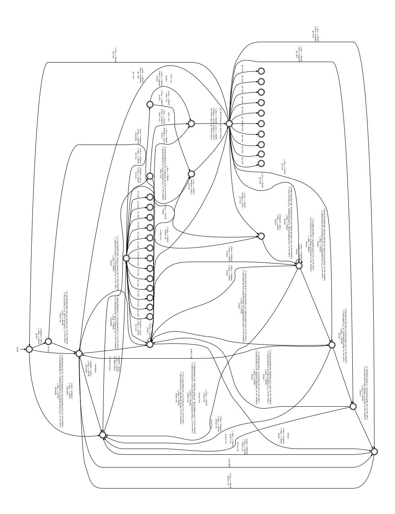

## B Full results

| trace                                | algorithm          | k      | sensitivity  | specificity  | bcr          | ms                   |
|--------------------------------------|--------------------|--------|--------------|--------------|--------------|----------------------|
| Resource Locker                      | JRIP               | 1      | 0.70         | 1.00         | 0.85         | 28642.00             |
| Resource Locker                      | J48                | 1      | 0.50         | 0.99         | 0.74         | 36476.00             |
| Resource Locker                      | AdaBoost           | 1      | 0.50         | 0.98         | 0.74         | 36180.00             |
| Resource Locker                      | NaiveBayes         | 1      | 0.46         | 0.96         | 0.71         | 151069.00            |
| Resource Locker                      | NaiveBayes         | 0      | 0.98         | 0.34         | 0.66         | 46492.00             |
| Resource Locker<br>Resource Locker   | J48<br>JRIP        | 0<br>2 | 0.93<br>0.29 | 0.35<br>0.99 | 0.64<br>0.64 | 30217.00<br>71856.00 |
| Resource Locker                      | AdaBoost           | 0      | 0.93         | 0.33         | 0.63         | 28736.00             |
| Resource Locker                      | JRIP               | 0      | 0.90         | 0.33         | 0.61         | 15661.00             |
| Resource Locker                      | AdaBoost           | 2      | 0.22         | 0.99         | 0.60         | 61785.00             |
| Resource Locker                      | J48                | 2      | 0.22         | 0.98         | 0.60         | 54366.00             |
| Resource Locker                      | JRIP               | 3      | 0.19         | 1.00         | 0.59         | 76672.00             |
| Resource Locker                      | NaiveBayes         | 2      | 0.18         | 0.98         | 0.58         | 106361.00            |
| Resource Locker                      | J48                | 3      | 0.13         | 0.98         | 0.56         | 77860.00             |
| Resource Locker                      | AdaBoost           | 3      | 0.13         | 0.98         | 0.56         | 80325.00             |
| Resource Locker                      | NaiveBayes         | 3      | 0.06         | 1.00         | 0.53         | 149695.00            |
| Resource Locker                      | JRIP               | 4      | 0.06         | 1.00         | 0.53         | 96625.00             |
| Resource Locker                      | J48                | 4      | 0.03         | 1.00         | 0.52         | 113671.00            |
| Resource Locker                      | AdaBoost           | 4      | 0.03         | 1.00         | 0.52         | 113167.00            |
| Resource Locker                      | NaiveBayes         | 4      | 0.00         | 1.00         | 0.50         | 120488.00            |
| Frequency Server                     | J48                | 1      | 0.66         | 0.99         | 0.82         | 9444.00              |
| Frequency Server                     | AdaBoost           | 1      | 0.61         | 0.99         | 0.80         | 12879.00             |
| Frequency Server                     | NaiveBayes         | 1      | 0.59         | 0.95         | 0.77         | 30589.00             |
| Frequency Server                     | JRIP               | 1      | 0.55         | 0.98         | 0.77         | 8063.00              |
| Frequency Server                     | AdaBoost           | 0      | 0.97         | 0.54         | 0.76         | 12439.00             |
| Frequency Server                     | JRIP               | 0      | 1.00         | 0.50         | 0.75         | 7140.00              |
| Frequency Server                     | NaiveBayes         | 2      | 0.51         | 0.88         | 0.69         | 44087.00             |
| Frequency Server                     | AdaBoost           | 2      | 0.37         | 0.98         | 0.68         | 18068.00             |
| Frequency Server                     | J48                | 0      | 0.97         | 0.36         | 0.67         | 9457.00              |
| Frequency Server                     | NaiveBayes         | 0      | 0.98         | 0.35         | 0.67         | 28865.00             |
| Frequency Server                     | J48                | 2      | 0.35         | 0.94         | 0.65         | 11490.00             |
| Frequency Server<br>Frequency Server | JRIP<br>NaiveBayes | 2<br>3 | 0.29<br>0.34 | 1.00<br>0.93 | 0.65<br>0.64 | 15447.00<br>39233.00 |
| Frequency Server                     | AdaBoost           | 4      | 0.22         | 1.00         | 0.61         | 19682.00             |
| Frequency Server                     | AdaBoost           | 3      | 0.25         | 0.96         | 0.60         | 16063.00             |
| Frequency Server                     | J48                | 3      | 0.22         | 0.98         | 0.60         | 10868.00             |
| Frequency Server                     | JRIP               | 3      | 0.19         | 0.99         | 0.59         | 14448.00             |
| Frequency Server                     | J48                | 4      | 0.17         | 0.99         | 0.58         | 14573.00             |
| Frequency Server                     | JRIP               | 4      | 0.13         | 1.00         | 0.56         | 21380.00             |
| Frequency Server                     | NaiveBayes         | 4      | 0.20         | 0.89         | 0.55         | 51148.00             |
| Signature                            | AdaBoost           | 2      | 0.98         | 0.84         | 0.91         | 1551.00              |
| Signature                            | NaiveBayes         | 4      | 0.90         | 0.84         | 0.87         | 1519.00              |
| Signature                            | JRIP               | 4      | 0.98         | 0.64         | 0.81         | 1530.00              |
| Signature                            | AdaBoost           | 3      | 0.98         | 0.60         | 0.79         | 1514.00              |
| Signature                            | JRIP               | 3      | 0.98         | 0.60         | 0.79         | 1532.00              |
| Signature                            | NaiveBayes         | 2      | 0.90         | 0.68         | 0.79         | 1581.00              |
| Signature                            | J48                | 1      | 0.94         | 0.60         | 0.77         | 1684.00              |
| Signature                            | JRIP               | 1      | 0.94         | 0.60         | 0.77         | 1527.00              |
| Signature                            | J48                | 2      | 0.94         | 0.60         | 0.77         | 1690.00              |
| Signature                            | J48                | 3      | 0.94         | 0.60         | 0.77         | 1764.00              |
| Signature                            | J48                | 4      | 0.94         | 0.60         | 0.77         | 1700.00              |
| Signature                            | NaiveBayes         | 1      | 0.86         | 0.60         | 0.73         | 1525.00              |
| Signature                            | NaiveBayes         | 3      | 0.90         | 0.56         | 0.73         | 1520.00              |
| Signature                            | JRIP               | 2      | 0.98         | 0.40         | 0.69         | 1555.00              |
| Signature                            | AdaBoost           | 1      | 0.98         | 0.36         | 0.67         | 1518.00              |
| Signature                            | AdaBoost           | 4      | 0.98         | 0.36         | 0.67         | 1518.00              |
| Signature                            | J48                | 0      | 1.00         | 0.00         | 0.50         | 1748.00              |
| Signature                            | AdaBoost           | 0      | 1.00         | 0.00         | 0.50         | 1515.00              |
| Signature                            | JRIP               | 0      | 1.00         | 0.00         | 0.50         | 1465.00              |
| Signature                            | NaiveBayes         | 0      | 1.00         | 0.00         | 0.50         | 1619.00              |

| trace           | algorithm  | k | sensitivity | specificity | bcr  | ms        |
|-----------------|------------|---|-------------|-------------|------|-----------|
| StringTokenizer | AdaBoost   | 4 | 0.95        | 1.00        | 0.97 | 15409.00  |
| StringTokenizer | AdaBoost   | 3 | 0.95        | 0.86        | 0.91 | 18700.00  |
| StringTokenizer | JRIP       | 3 | 0.95        | 0.80        | 0.88 | 21625.00  |
| StringTokenizer | NaiveBayes | 2 | 0.90        | 0.83        | 0.86 | 32104.00  |
| StringTokenizer | J48        | 2 | 0.95        | 0.74        | 0.84 | 7283.00   |
| StringTokenizer | J48        | 3 | 0.95        | 0.74        | 0.84 | 12973.00  |
| StringTokenizer | J48        | 4 | 0.95        | 0.71        | 0.83 | 14339.00  |
| StringTokenizer | NaiveBayes | 1 | 0.95        | 0.69        | 0.82 | 20559.00  |
| StringTokenizer | J48        | 1 | 0.95        | 0.65        | 0.80 | 6987.00   |
| StringTokenizer | JRIP       | 2 | 0.95        | 0.65        | 0.80 | 8487.00   |
| StringTokenizer | AdaBoost   | 1 | 0.95        | 0.61        | 0.78 | 8196.00   |
| StringTokenizer | JRIP       | 1 | 0.95        | 0.55        | 0.75 | 7694.00   |
| StringTokenizer | AdaBoost   | 2 | 0.95        | 0.52        | 0.73 | 9870.00   |
| StringTokenizer | NaiveBayes | 3 | 0.95        | 0.42        | 0.68 | 63393.00  |
| StringTokenizer | JRIP       | 4 | 0.95        | 0.38        | 0.67 | 13519.00  |
| StringTokenizer | NaiveBayes | 4 | 0.90        | 0.35        | 0.62 | 59698.00  |
| StringTokenizer | JRIP       | 0 | 1.00        | 0.02        | 0.51 | 852.00    |
| StringTokenizer | J48        | 0 | 1.00        | 0.00        | 0.50 | 1006.00   |
| StringTokenizer | AdaBoost   | 0 | 1.00        | 0.00        | 0.50 | 1215.00   |
| StringTokenizer | NaiveBayes | 0 | 1.00        | 0.00        | 0.50 | 3050.00   |
| Socket          | AdaBoost   | 0 | 0.68        | 0.98        | 0.83 | 267084.00 |
| Socket          | J48        | 0 | 0.71        | 0.88        | 0.80 | 259888.00 |
| Socket          | JRIP       | 0 | 0.76        | 0.74        | 0.75 | 199268.00 |
| Socket          | JRIP       | 2 | 0.53        | 0.97        | 0.75 | 331734.00 |
| Socket          | AdaBoost   | 1 | 0.45        | 1.00        | 0.72 | 409624.00 |
| Socket          | J48        | 3 | 0.45        | 1.00        | 0.72 | 544547.00 |
| Socket          | J48        | 1 | 0.45        | 0.95        | 0.70 | 178301.00 |
| Socket          | J48        | 2 | 0.45        | 0.95        | 0.70 | 249693.00 |
| Socket          | AdaBoost   | 2 | 0.45        | 0.95        | 0.70 | 310713.00 |
| Socket          | JRIP       | 1 | 0.45        | 0.85        | 0.65 | 300986.00 |
| Socket          | NaiveBayes | 0 | NA          | NA          | NA   | NA        |
| Socket          | NaiveBayes | 1 | NA          | NA          | NA   | NA        |
| Socket          | NaiveBayes | 2 | NA          | NA          | NA   | NA        |
| Socket          | AdaBoost   | 3 | NA          | NA          | NA   | NA        |
| Socket          | JRIP       | 3 | NA          | NA          | NA   | NA        |
| Socket          | NaiveBayes | 3 | NA          | NA          | NA   | NA        |
| Socket          | J48        | 4 | NA          | NA          | NA   | NA        |
| Socket          | AdaBoost   | 4 | NA          | NA          | NA   | NA        |
| Socket          | JRIP       | 4 | NA          | NA          | NA   | NA        |
| Socket          | NaiveBayes | 4 | NA          | NA          | NA   | NA        |