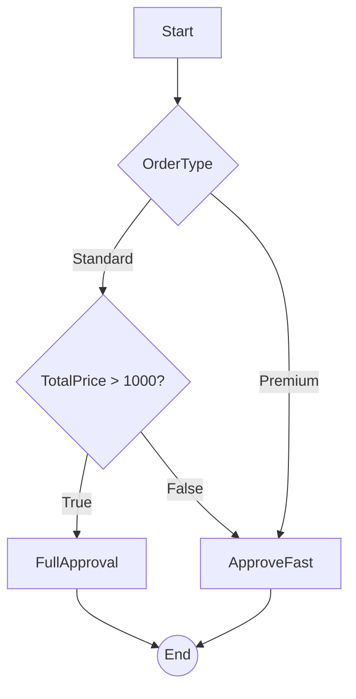
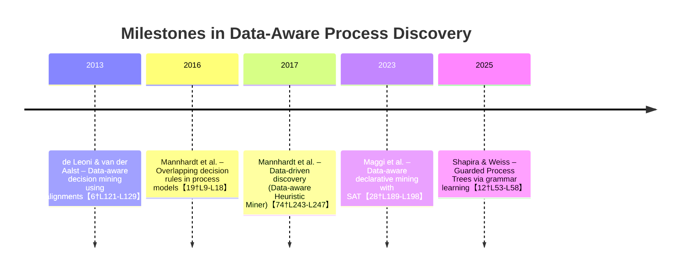

# Executive Summary  
Data-aware process discovery extends conventional process mining by incorporating the data perspective into discovered models.  In addition to the control-flow (sequence of activities), data-aware discovery identifies the guards (conditions) that govern branching decisions and the update functions that change process variables.  Formal models include *Data Petri Nets* (Petri nets with variables, guards, and update actions) and labeled transition systems augmented with variables and guards【55†L128-L136】【36†L213-L220】.  Key approaches fall into several categories: **heuristic** (e.g. data-aware Heuristic Miner), **machine-learning/classification** (e.g. alignment-based decision mining, explainable ML), **declarative** (e.g. MP-Declare with data constraints solved by SAT), and **hybrid** (combining procedural miners with guard learning).  Each method makes different assumptions about log annotations (e.g. requiring event attributes or decision logs) and outputs different model formalisms.  Tools such as eXdpn (Python package) and ProM plugins implement many techniques, often tested on standard event logs (BPI challenges, hospital billing logs, etc.).  Evaluation uses standard control-flow metrics (fitness, precision) plus data metrics (e.g. rule accuracy or F1 of discovered guards)【60†L31-L39】.  We survey key algorithms (inputs, outputs, complexity), tools and benchmarks, and illustrate example discovered models.  Finally, we discuss open challenges (scalability, soundness, continuous data, explainability) and future directions.  

# Formal Models and Definitions  
**Petri nets with data:** A *Data Petri Net (DPN)* extends a Petri net with a set of process variables, guard conditions, and update functions【55†L128-L136】.  Formally, each transition has a *guard* (a predicate on variable values) and an *update* (an expression assigning new values).  A transition can fire only if its guard holds, and then updates its variables accordingly【55†L128-L136】.  In a DPN, a *state* is given by both the marking and the variable valuation, and transitions enforce input (pre-)conditions and output (post-)conditions on data【55†L128-L136】.  

**Guard-update systems:** In the broader sense, a *transition system with variables* (also called a guard-update model) has the form M=(S,Σ,V,D,T,I), where V is a set of typed variables with domains D_v, and T consists of tuples (s, (g,a,f), s') meaning from state s you may go to s' with label a if guard g holds and variables are updated by f【36†L213-L220】.  Thus, guards are predicates over the current variable assignment and updates are functions mapping old to new assignments【36†L213-L220】.  This general model underlies many data-aware languages (e.g. Colored Petri nets).  

**Example:** In a loan process, a guard might be “Amount > 1000” on a transition to a full-check branch, and an update might be “CreditScore := newScore” after an approval step.  For instance, an event log trace might be `Create[Amount=1500] → PolicyCheck[V=TRUE] → FullCheck → ...`, suggesting that a discovered model should include a place with two outgoing transitions: one guarded by `Amount>1000` (taking the full check path) and one guarded by `Amount≤1000` or `¬(Amount>1000)` (skipping it).  

**Models:** Beyond Petri nets and general transition systems, other formalisms include *process trees* with guards (Guarded Process Trees【12†L53-L58】), *Causal Nets* (a compact Petri-net-like structure used by Mannhardt et al.), and *MP-Declare* (declarative constraints with data conditions)【28†L189-L198】【75†L13-L21】.  In MP-Declare, constraints can have *activation conditions* and *correlation conditions* over data【75†L13-L21】.  

# Discovery Approaches  
Data-aware discovery methods can be grouped by technique.  We summarize key methods, their inputs/outputs, assumptions, complexity, and references.  

- **Heuristic/Interactive Discovery:** Builds on frequency-based miners by leveraging data attributes.  The *Data-aware Heuristic Miner (DHM)* by Mannhardt et al. (CAiSE’17) extends the Heuristic Miner by using classification on case attributes to identify conditional (infrequent) paths【74†L243-L247】.  It discovers both control-flow and guards simultaneously: CF edges are included only if supported by data classifiers.  Inputs: an event log with case attributes; output: a *causal net* or workflow net annotated with guards.  Complexity: polynomial counting plus classification (scales to medium logs).  Limitations: handles discrete/categorical data well but may overfit without pruning.  This method was later integrated into an interactive tool iDHM【67†L2-L10】【72†L304-L308】.  

- **Classification/Alignment-based:** These methods typically take a discovered control-flow model (or the log alone) and frame each decision point as a classification task.  For example, *Decision Mining* in ProM builds a Petri net first and then uses decision-tree learning (or other ML) on the log’s data to derive guards on branch places【17†L87-L96】【19†L9-L18】.  De Leoni and van der Aalst (2013) apply alignments to tie log traces to a given Petri net, then learn decision rules that explain the observed routing【6†L121-L129】.  Park et al. (2023) propose an *explainable predictive decision miner*: they mine a process model (via Inductive Miner) and extract *situation tables* of relevant attributes at each split, then train ML models (RF, SVM, NN) to predict the chosen branch, yielding probabilistic guards【43†L311-L319】【60†L31-L39】.  Inputs: event log with case/event data and optionally a model; outputs: either annotated Petri nets or separate decision models.  These are essentially a two-stage pipeline.  They require annotated logs and assume sufficient training data for each decision point.  Complexity: training decision trees or ML models is usually fast, but interpretability may suffer for complex models.  Reported F1-scores (classification accuracy) are used to measure data-guard accuracy【60†L31-L39】.  

- **Grammar/Evolutionary (Guarded Process Trees):** Shapira & Weiss (2025) introduce *Guarded Process Trees (GPTs)* and a discovery method.  First they mine a base process tree (e.g. Inductive Miner) for control-flow, then use grammatical evolution to assign guards to tree edges【12†L53-L58】.  The result is a hierarchical model with conditions on branches.  Input: event log with data; output: a process tree with boolean guards on XOR splits, which can be translated into a Petri net【12†L53-L58】.  Complexity: mining the tree is polynomial; learning guards uses evolutionary search (NP-hard, but heuristically managed).  Limitations: may yield complex guard expressions and requires tuning; however, improves precision by filtering infeasible paths.  

- **Declarative Constraint Mining:** Instead of procedural models, some approaches mine *Declare* (or MP-Declare) constraints with data conditions.  Maggi et al. (2023) formulate *Data-Aware Declarative Mining* problems and solve them via SAT encoding【28†L189-L198】【75†L13-L21】.  They can discover or check *MP-Declare* rules with data conditions.  For example, one can mine a rule “(Payment occurs after Order) with activation condition (Amount > 1000)” by SAT-based search.  Inputs: event log (traces with attributes); outputs: a set of declarative rules (FOL/Declare templates) with data conditions.  Complexity: SAT/Alloy solving can handle moderately sized logs and models; reported to scale to real-life logs of hundreds of cases【28†L189-L198】.  Limitations: mostly finds constraints, not a unified imperative model; does not produce explicit update functions.  

- **Other/Hybrid:** Some methods combine techniques.  For example, eXdpn by Park et al. (2022) is a Python tool that automates an ML workflow: it discovers a Petri net (via a standard miner), identifies decision points, then trains classifiers to extract *explainable guards* using SHAP or decision trees【41†L293-L302】【43†L311-L319】.  The result is a Petri net with data guards (sometimes represented as neural nets or rules).  There is also work on ILP/region-based discovery for control-flow (no data) and on learning data-flow dependencies via statistical tests, but pure ILP methods for data-aware nets are rare.  

**Comparison:** These approaches differ in expressiveness and assumptions.  For example, DHM and GPT output procedural models with guards, whereas declarative mining outputs logical rules.  Table 1 below compares prominent methods.  

| Method | Paper Name | Author(s) | Model Formalism | Discovers CF? | Discovers Guards? | Discovers Updates? | Annotated Logs? | Scalability | Tool | Ref. |
| :--- | :--- | :--- | :--- | :--- | :--- | :--- | :--- | :--- | :--- | :--- |
| Inductive Miner (baseline) | Discovering Block-structured Process Models from Event Logs | Leemans et al. | Petri net (WF-net) | Yes | No | No | No | High (large logs) | ProM/PM4Py | (baseline) |
| ProM Decision Miner | Decision Mining in ProM | Rozinat & van der Aalst | Petri net + decision rules | Yes | Yes (rules) | No | Yes | Moderate | ProM plugin | [19, 17] |
| Data-Aware Heuristic Miner | Data-driven Process Discovery - Revealing Conditional Infrequent Behavior | Mannhardt et al. | Causal net / Petri net | Yes | Yes (Boolean) | No | Yes | Medium | ProM (iDHM) | [74, 72] |
| Align+Classification | Aligning Event Logs and Process Models for Multi-perspective Analysis | de Leoni & van der Aalst | Petri net with annotated guards | Yes | Yes (learned) | No | Yes | Medium | ProM plugin? | [6] |
| eXdpn / Explainable Miner | Explainable Data-aware Process Discovery | Park et al. | Petri net + classifiers | Yes | Yes (ML models) | No | Yes | Medium | eXdpn (Python) | [43, 60] |
| Guarded Process Trees | Mining Guarded Process Trees via Grammatical Evolution | Shapira & Weiss | Process tree w/ guards | Yes | Yes (evolved) | No | Yes | Low-Medium | - | [12] |
| MP-Declare (Data-Aware) | Data-aware Declarative Process Mining | Maggi et al. | Declarative constraints (FOL) | No | Yes (data conditions) | No | Yes | Low-Medium (SAT) | RuM/Alloy tools | [28, 75] |

Note: *Updates* means discovering variable-update functions, which few approaches support explicitly (most focus on guards and assume simple updates or none). *Annotated logs* means requiring case or event attributes beyond the activity name.  Scalability is relative and depends on tool implementations.  

# Tools and Benchmarks  
Several implementations support data-aware discovery.  For control-flow, standard tools like ProM (with Inductive Miner) or PM4Py are used; for data perspectives, examples include:  
- **ProM iDHM (Interactive Data-aware Heuristics Miner):** Offers an interactive GUI to tune thresholds and includes conformance checking feedback【67†L2-L10】. It requires attribute logs.  
- **ProM Decision Miner:** As described, analyzes an existing Petri net model and log, applying Weka classifiers to find decision rules【17†L39-L47】【17†L86-L94】.  
- **eXdpn (Python):** The “explainable data Petri nets” tool by Park et al. can be installed via pip. It automates discovery of guard datasets, trains ML models (trees, SHAP, etc.), and outputs Petri nets with guards【41†L293-L302】【43†L311-L319】.  
- **RuM tool (Declare):** Implements MP-Declare constraint discovery and reasoning. Maggi et al. used Alloy/SAT (via the Declare/RuM infrastructure) for data-aware declarative mining【28†L189-L198】.  
- **Guarded Process Tree implementation:** Shapira & Weiss mention a proof-of-concept (perhaps not publicly available yet).  

**Datasets:** Evaluations often use public event logs with data.  Common benchmarks include the BPI Challenge logs (purchase-to-pay, e.g. 2012, 2019) that contain case attributes (amount, case type), a hospital billing log (used by Mannhardt as in iDHM demo【67†L2-L10】), and synthetic logs generated via colored Petri nets (as in Park’s online evaluation【60†L31-L39】).  Authors frequently report quantitative results (e.g. F1 scores on BPIC2012/2019 tasks【60†L31-L39】) and qualitative examples (like a custom Purchase-To-Pay model in【59†L517-L525】).  

# Evaluation Metrics  
Metrics extend standard process-mining measures to account for data.  For the control-flow part, **fitness** (how well the model reproduces the log) and **precision** (absence of extra behavior) are used, often via alignments or token replay【55†L128-L136】.  For the data perspective, one typically uses **classification metrics** on the learned guards: e.g. accuracy, precision/recall, or F1 of predicted branch labels【60†L31-L39】.  For instance, Park et al. report F1-scores for each decision point using different ML methods【60†L31-L39】.  Another view is to measure *completeness* of guard coverage (fraction of log cases whose path matches the guard conditions) and *consistency* (fraction of times a guard correctly predicts the chosen branch).  If update functions are discovered (rarely), correctness is validated by checking if variable values match logs after firing.  Finally, generalization (model simplicity vs. fitness) is often informally discussed, but not many data-specific metrics have been standardized yet.  

# Case Studies and Examples  
To illustrate, consider a **purchase order process**.  Suppose the decision “Approve vs. Escalate” depends on two variables: *OrderType* and *TotalPrice*.  Example log snippets:  

- Case 1: Create(OrderType=Standard, TotalPrice=2000) → PolicyCheck(VIP=false) → AddApproval → End.  
- Case 2: Create(OrderType=Premium, TotalPrice= 800) → PolicyCheck(VIP=true) → QuickApprove → End.  

A data-aware miner might discover a model like:

Here “OrderType=Premium” and “TotalPrice>1000” are guards on transitions. A discovered **Data Petri Net** would encode this as a split place with two outgoing transitions, each carrying a guard condition over the *TotalPrice* or *OrderType* variable. Tools would validate that each log trace follows one guarded branch. In this example, if *OrderType* is Premium, the log takes the Premium path regardless of price; otherwise it checks if *TotalPrice>1000*.  

In practice, authors report such case studies.  For instance, Park et al. simulate a P2P (purchase-to-pay) process in CPN Tools with known decision logic and show that their learned model’s conditions (via SHAP explanations) match the true rules【59†L521-L529】【59†L535-L540】.  Mannhardt et al. show examples where DHM uncovers rare behavior that would be missed by pure frequency-based miners【74†L243-L247】.  

# Open Challenges and Future Directions  
While progress has been made, data-aware discovery faces many challenges:  
- **Scalability:** Many techniques rely on computationally intensive steps (alignment, SAT solving, or evolutionary search). Handling large logs with rich data remains hard. Fast approximate methods or parallelization are needed.  
- **Continuous and Complex Data:** Real logs often have continuous values, text, or numerous attributes. Finding succinct guards (e.g. ranges or feature combinations) without overfitting is difficult. Advanced ML or symbolic regression may help.  
- **Non-determinism and Noise:** Users’ decisions may not be fully determined by logged data (hidden factors, randomness). Discovering *overlapping* or probabilistic guard rules is an open issue (see overlapping rules【19†L9-L18】). Robustness to noisy or incomplete data requires hybrid methods (e.g. outlier detection).  
- **Updates/Actions:** Most work focuses on guards and assumes simple data updates. Inferring complex update functions (e.g. expressions that compute new values) is rarely addressed. This requires logs with value snapshots before/after transitions, and synthesis techniques (perhaps ILP or program synthesis).  
- **Soundness and Semantics:** Ensuring discovered models are sound (free of deadlocks/livelocks) in the data-aware sense is nontrivial【32†L114-L123】【55†L128-L136】. Extensions of conformance and soundness checking to data-aware models (beyond SAT queries) are needed.  
- **Usability and Explainability:** Complex data-aware models can be hard to present to users. More work is needed on visualizing models with data (e.g. highlighting significant variables, interactive rule exploration) and on integrating domain knowledge (to restrict search space).  

In summary, data-aware process discovery enriches models with decision logic but introduces significant complexity.  Future research may combine AI (e.g. symbolic learning, large-language models) with formal methods to tackle these challenges. 

**Table 1:** Comparison of key data-aware discovery methods.  

