# Evaluation: Logic-Accelerated DPN Discovery

This notebook evaluates the DPN discovery pipeline on **synthetic test cases** of increasing complexity.
Each test case targets a specific aspect of process discovery:

| # | Test Case | Control Flow | Guards | Updates | Complexity |
|---|-----------|-------------|--------|---------|------------|
| 1 | Simple Sequence | A → B → C | `True` | `x := x + 1` | ★☆☆ |
| 2 | XOR Split/Join | A → {B \| C} → D | `score ≥ 50` / `score < 50` | — | ★★☆ |
| 3 | Loop | A → B ↺ → C | `i < 3` / `i ≥ 3` | `i := i + 1` | ★★☆ |
| 4 | Concurrency (AND) | A → (B ∥ C) → D | `True` | `x := x + v`, `y := y + v` | ★★★ |
| 5 | Multi-variable XOR | A → {B \| C \| D} → E | compound (`amount`, `risk`) | `amount := amount · 1.1` | ★★★ |
| 6 | Combined: Loop + XOR + Updates | nested structures | multi-variable | arithmetic | ★★★★ |

For each test case we:
1. Define the **ground-truth** process model (expected structure, guards, updates)
2. Generate a small **synthetic event log** (few traces)
3. Run the **full discovery pipeline**
4. **Visualize** the discovered DPN and intermediate EFSM
5. **Assess** correctness of discovered guards and update functions


```python
# ── Imports & Setup ──────────────────────────────────────────────────────
import logging
from IPython.display import display, Image, HTML

from dpn_discovery.models import Event, Trace, EventLog, MergeStrategy
from dpn_discovery.preprocessing import parse_event_log
from dpn_discovery.pipeline import run_pipeline, run_pipeline_full
from dpn_discovery.dpn_transform import dpn_to_pnml
from dpn_discovery.smt import get_solver, set_solver
from dpn_discovery.smt.yices2_solver import Yices2SMTSolver
from dpn_discovery.visualization import DPNVisualizer, VisualizerSettings

# Use Yices2 as the SMT backend
set_solver(Yices2SMTSolver())
smt = get_solver()

# Logging: show pipeline steps
logging.basicConfig(level=logging.INFO, format="%(levelname)-8s %(message)s", force=True)

# Visualization settings (SVG for inline display)
viz_settings = VisualizerSettings(output_format="svg", rankdir="LR")
viz = DPNVisualizer(viz_settings)
```


```python
# Force-reload updated modules
import importlib
import dpn_discovery.guard_synthesis
import dpn_discovery.pipeline
importlib.reload(dpn_discovery.guard_synthesis)
importlib.reload(dpn_discovery.pipeline)
from dpn_discovery.pipeline import run_pipeline, run_pipeline_full
print("Modules reloaded.")
```

    Modules reloaded.


```python
# ── Helper functions ─────────────────────────────────────────────────────

def make_log(raw_traces: list[list[tuple[str, dict]]]) -> EventLog:
    """Build an EventLog from a compact list-of-lists representation.
    
    Each trace is a list of (activity, payload_dict) tuples.
    """
    traces = []
    activities = set()
    variables = set()
    for raw in raw_traces:
        events = []
        for act, payload in raw:
            activities.add(act)
            variables.update(payload.keys())
            events.append(Event(activity=act, payload=payload))
        traces.append(Trace(events=events))
    return EventLog(traces=traces, activities=activities, variables=variables)


def show_results(name: str, log: EventLog, **pipeline_kwargs):
    """Run pipeline, print summary, and display DPN + EFSM visualizations."""
    print(f"\n{'='*70}")
    print(f"  {name}")
    print(f"{'='*70}")
    print(f"  Traces: {len(log.traces)}  |  Activities: {log.activities}  |  Variables: {log.variables}")
    print()

    pta, efsm, dpn = run_pipeline_full(log, **pipeline_kwargs)

    print(f"\n  PTA  : {len(pta.states)} states, {len(pta.transitions)} transitions")
    print(f"  EFSM : {len(efsm.states)} states, {len(efsm.transitions)} transitions")
    print(f"  DPN  : {len(dpn.places)} places, {len(dpn.transitions)} transitions")

    # Print discovered guards & updates
    print(f"\n  Discovered annotations:")
    for t in dpn.transitions:
        activity = t.name
        guard_str = smt.expr_to_string(t.guard) if t.guard is not None else "True"
        print(f"    {activity:30s}  guard = {guard_str}")
        if t.update_rule:
            for var, expr in sorted(t.update_rule.items()):
                print(f"    {'':30s}  {var}' := {smt.expr_to_string(expr)}")
    print()

    # Render visualizations inline
    efsm_dot = viz.render_efsm(efsm, title=f"{name} — EFSM")
    dpn_dot = viz.render_dpn(dpn, title=f"{name} — DPN")

    display(HTML(f"<h4>{name} — Merged EFSM</h4>"))
    display(efsm_dot)
    display(HTML(f"<h4>{name} — Discovered DPN</h4>"))
    display(dpn_dot)

    return pta, efsm, dpn
```

### Pipeline Parameter Choices

**`min_merge_score = 1` (EDSM threshold $k$):** The EDSM scoring function counts shared 
outgoing activity labels between two candidate states. With the default $k = 0$, states 
sharing *zero* outgoing labels still qualify for merging (score $0 \geq 0$). This leads to 
cascading over-merging — once a state accumulates multiple activities, the consistency check 
becomes vacuously true, and the entire EFSM collapses into a **single-state flower net**. 
Setting $k = 1$ requires at least one shared outgoing activity as structural evidence.

**`MergeStrategy.BLUE_FRINGE` for sequential / XOR / loop test cases:** Blue-Fringe merging 
(Walkinshaw et al. Alg. 1 & 2) shares prefixes purely by activity label, placing the branching 
point at the state where activities diverge (e.g., B vs C from the same state). This ensures 
guard synthesis has access to the **pre-state data** at the decision point. MINT classifiers 
would split the prefix earlier (at the A level) where the pre-state is empty, preventing 
meaningful guard discovery.

**`MergeStrategy.NONE` for concurrency (TC4):** MINT and Blue-Fringe both assume deterministic 
next-event prediction, which is violated when the same data state can lead to either ordering 
of concurrent activities. By keeping the full PTA, bisimulation reduction merges only truly 
equivalent states, and the **theory of regions** (Cortadella et al.) derives the AND-split/join 
places from the interleaving structure.

---
## TC 1 — Simple Sequence (★☆☆)

**Ground truth:**  
```
A  →  B  →  C
```

- **Variables:** `x` (integer counter)  
- **Guards:** all `True` (no branching)  
- **Updates:** `x := x + 1` at each step  

**Purpose:** Baseline — verify the pipeline discovers a pure sequence with a simple counter update.


```python
tc1_log = make_log([
    # Trace 1:  x increments 0 → 1 → 2
    [("A", {"x": 0}), ("B", {"x": 1}), ("C", {"x": 2})],
    # Trace 2:  same structure, different initial value
    [("A", {"x": 5}), ("B", {"x": 6}), ("C", {"x": 7})],
    # Trace 3
    [("A", {"x": 10}), ("B", {"x": 11}), ("C", {"x": 12})],
])

_, _, tc1_dpn = show_results(
    "TC1: Simple Sequence", tc1_log,
    merge_strategy=MergeStrategy.BLUE_FRINGE, min_merge_score=1,
)
```

    INFO     Step 1  >  Using pre-loaded EventLog
    INFO              Activities = {'B', 'C', 'A'}  |  Variables = {'x'}  |  Traces = 3
    INFO     Step 2  >  Classifier training skipped (strategy=BLUE_FRINGE)
    INFO     Step 3  >  Building Prefix Tree Acceptor
    INFO              States = 4  |  Transitions = 3
    INFO     Step 4  >  State merging (strategy=BLUE_FRINGE)
    WARNING    Blue-Fringe merging is available but MINT is recommended. Blue-Fringe does not use classifiers and may under-merge.
    INFO       Merge loop done: 3 iterations, 0 merges, 4 → 4 states
    INFO              States = 4 -> 4  |  Transitions = 3 -> 3
    INFO     Step 4b >  Bisimulation-based state reduction
    INFO              States = 4 -> 4  |  Transitions = 3
    INFO     Step 5  >  Synthesising guards (PHOG-accelerated SAT)
    INFO     Guard synthesis: 4 states, 3 transitions, 1 variables
    INFO              Guards synthesised
    INFO     Step 6  >  Synthesising postconditions (abduction)
    INFO     Postcondition synthesis: 3 transitions, 1 variables
    INFO       [1/3] q0 → q1 (A): 3 observation pairs
    INFO       [2/3] q1 → q2 (B): 3 observation pairs
    INFO       [3/3] q2 → q3 (C): 3 observation pairs
    INFO              Postconditions synthesised
    INFO     Step 7  >  Region-based EFSM -> DPN (Cortadella et al. S4)
    INFO       Region synthesis: |S| = 4, |E| = 3, |T| = 3
    INFO         Iteration 1: 3 pre-regions + 3 complements = 6 total regions
    INFO         Excitation closure satisfied.
    INFO         Irredundant cover: 4 regions (from 6 total)
    INFO         DPN: 4 places, 3 transitions
    INFO              Places = 4  |  Transitions = 3
    INFO     Step 7b >  Post-synthesis DPN reduction (transition collapse)
    INFO              Places = 4 -> 4  |  Transitions = 3 -> 3


    
    ======================================================================
      TC1: Simple Sequence
    ======================================================================
      Traces: 3  |  Activities: {'B', 'C', 'A'}  |  Variables: {'x'}
    
    
      PTA  : 4 states, 3 transitions
      EFSM : 4 states, 3 transitions
      DPN  : 4 places, 3 transitions
    
      Discovered annotations:
        t_A_1                           guard = true
        t_B_2                           guard = true
                                        x' := (+ 1 x)
        t_C_3                           guard = true
                                        x' := (+ 1 x)
    


<h4>TC1: Simple Sequence — Merged EFSM</h4>


    
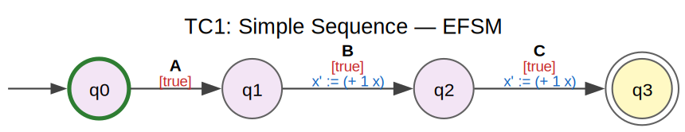
    


<h4>TC1: Simple Sequence — Discovered DPN</h4>


    
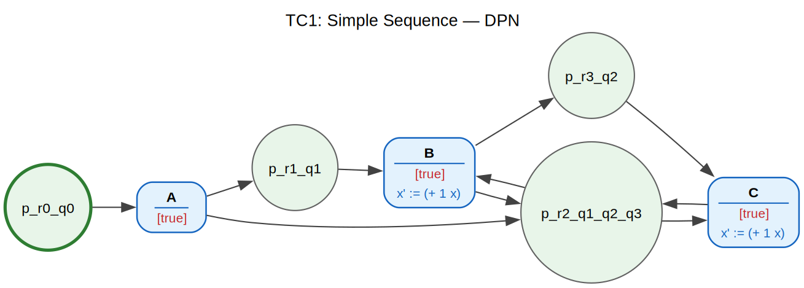
    


**Expected result:**  
- 3 transitions (A, B, C) connected sequentially  
- All guards = `True`  
- Update: `x' := x + 1` on every transition  

---
## TC 2 — XOR Split / Join (★★☆)

**Ground truth:**  
```
        ┌─ B ─┐
  A  ──►│     │──► D
        └─ C ─┘
```

- **Variables:** `score` (integer)  
- **Guards:** B: `score ≥ 50` (pass), C: `score < 50` (fail)  
- **Updates:** identity (no variable changes)  

**Purpose:** Test exclusive-choice discovery and guard synthesis on a single variable threshold.


```python
tc2_log = make_log([
    # Pass branch (score >= 50)
    [("A", {"score": 80}),  ("B", {"score": 80}),  ("D", {"score": 80})],
    [("A", {"score": 50}),  ("B", {"score": 50}),  ("D", {"score": 50})],
    [("A", {"score": 95}),  ("B", {"score": 95}),  ("D", {"score": 95})],
    # Fail branch (score < 50)
    [("A", {"score": 30}),  ("C", {"score": 30}),  ("D", {"score": 30})],
    [("A", {"score": 10}),  ("C", {"score": 10}),  ("D", {"score": 10})],
    [("A", {"score": 49}),  ("C", {"score": 49}),  ("D", {"score": 49})],
])

_, _, tc2_dpn = show_results(
    "TC2: XOR Split/Join", tc2_log,
    merge_strategy=MergeStrategy.BLUE_FRINGE, min_merge_score=1,
)
```

    INFO     Step 1  >  Using pre-loaded EventLog
    INFO              Activities = {'B', 'D', 'C', 'A'}  |  Variables = {'score'}  |  Traces = 6
    INFO     Step 2  >  Classifier training skipped (strategy=BLUE_FRINGE)
    INFO     Step 3  >  Building Prefix Tree Acceptor
    INFO              States = 6  |  Transitions = 5
    INFO     Step 4  >  State merging (strategy=BLUE_FRINGE)
    WARNING    Blue-Fringe merging is available but MINT is recommended. Blue-Fringe does not use classifiers and may under-merge.
    INFO       Merge loop done: 4 iterations, 1 merges, 6 → 4 states
    INFO              States = 6 -> 4  |  Transitions = 5 -> 4
    INFO     Step 4b >  Bisimulation-based state reduction
    INFO              States = 4 -> 4  |  Transitions = 4
    INFO     Step 5  >  Synthesising guards (PHOG-accelerated SAT)
    INFO     Guard synthesis: 4 states, 4 transitions, 1 variables
    INFO       [2/4] State q1: pairwise cross-activity guards for ['B', 'C']
    INFO       Partition verified (cross-activity): 2 guards are pairwise disjoint and exhaustive
    INFO              Guards synthesised
    INFO     Step 6  >  Synthesising postconditions (abduction)
    INFO     Postcondition synthesis: 4 transitions, 1 variables
    INFO       [1/4] q0 → q1 (A): 6 observation pairs
    INFO       [2/4] q1 → q2 (B): 3 observation pairs
    INFO       [3/4] q2 → q3 (D): 6 observation pairs
    INFO       [4/4] q1 → q2 (C): 3 observation pairs
    INFO              Postconditions synthesised
    INFO     Step 7  >  Region-based EFSM -> DPN (Cortadella et al. S4)
    INFO       Region synthesis: |S| = 4, |E| = 4, |T| = 4
    INFO         Iteration 1: 3 pre-regions + 3 complements = 6 total regions
    INFO         Excitation closure satisfied.
    INFO         Irredundant cover: 4 regions (from 6 total)
    INFO         DPN: 4 places, 4 transitions
    INFO              Places = 4  |  Transitions = 4
    INFO     Step 7b >  Post-synthesis DPN reduction (transition collapse)
    INFO       DPN reduction: places 4 -> 3  |  transitions 4 -> 4
    INFO              Places = 4 -> 3  |  Transitions = 4 -> 4


    
    ======================================================================
      TC2: XOR Split/Join
    ======================================================================
      Traces: 6  |  Activities: {'B', 'D', 'C', 'A'}  |  Variables: {'score'}
    
    
      PTA  : 6 states, 5 transitions
      EFSM : 4 states, 4 transitions
      DPN  : 3 places, 4 transitions
    
      Discovered annotations:
        t_A_1                           guard = true
        t_B_2                           guard = (< (+ 99/2 (* -1 score)) 0)
                                        score' := score
        t_C_3                           guard = (>= (+ 99/2 (* -1 score)) 0)
                                        score' := score
        t_D_4                           guard = true
                                        score' := score
    


<h4>TC2: XOR Split/Join — Merged EFSM</h4>


    
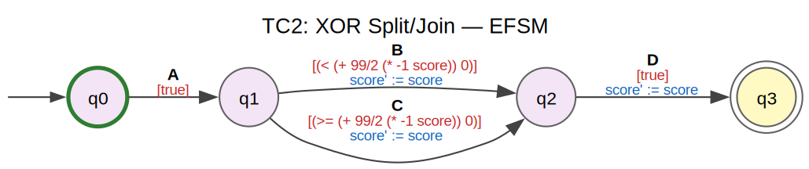
    


<h4>TC2: XOR Split/Join — Discovered DPN</h4>


    
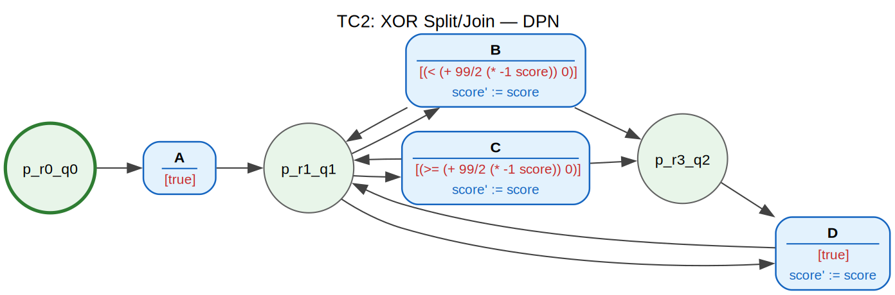
    


**Expected result:**  
- 4 transitions: A, B, C, D  
- Guard(B) ≈ `score ≥ 50`  
- Guard(C) ≈ `score < 50`  
- No update functions  

---
## TC 3 — Loop with Counter (★★☆)

**Ground truth:**  
```
  A  →  B ↺  →  C
         │
         └─ loop back if i < 3
```

- **Variables:** `i` (loop counter)  
- **Guards:** loop-back: `i < 3`, exit: `i ≥ 3`  
- **Updates:** `i := i + 1` on each B execution  

**Purpose:** Test loop discovery, loop guard synthesis, and counter update detection.


```python
tc3_log = make_log([
    # 3 iterations of B: i goes 0 → 1 → 2 → 3 → exit
    [("A", {"i": 0}), ("B", {"i": 1}), ("B", {"i": 2}), ("B", {"i": 3}), ("C", {"i": 3})],
    # Duplicate trace (reinforces the pattern)
    [("A", {"i": 0}), ("B", {"i": 1}), ("B", {"i": 2}), ("B", {"i": 3}), ("C", {"i": 3})],
    # Shorter loop: 2 iterations
    [("A", {"i": 1}), ("B", {"i": 2}), ("B", {"i": 3}), ("C", {"i": 3})],
    # Minimal: 1 iteration then exit
    [("A", {"i": 2}), ("B", {"i": 3}), ("C", {"i": 3})],
])

_, _, tc3_dpn = show_results(
    "TC3: Loop with Counter", tc3_log,
    merge_strategy=MergeStrategy.BLUE_FRINGE, min_merge_score=1,
)
```

    INFO     Step 1  >  Using pre-loaded EventLog
    INFO              Activities = {'B', 'C', 'A'}  |  Variables = {'i'}  |  Traces = 4
    INFO     Step 2  >  Classifier training skipped (strategy=BLUE_FRINGE)
    INFO     Step 3  >  Building Prefix Tree Acceptor
    INFO              States = 8  |  Transitions = 7
    INFO     Step 4  >  State merging (strategy=BLUE_FRINGE)
    WARNING    Blue-Fringe merging is available but MINT is recommended. Blue-Fringe does not use classifiers and may under-merge.
    INFO       Merge loop done: 3 iterations, 1 merges, 8 → 3 states
    INFO              States = 8 -> 3  |  Transitions = 7 -> 3
    INFO     Step 4b >  Bisimulation-based state reduction
    INFO              States = 3 -> 3  |  Transitions = 3
    INFO     Step 5  >  Synthesising guards (PHOG-accelerated SAT)
    INFO     Guard synthesis: 3 states, 3 transitions, 1 variables
    INFO       [2/3] State q1: pairwise cross-activity guards for ['B', 'C']
    INFO       Partition verified (cross-activity): 2 guards are pairwise disjoint and exhaustive
    INFO              Guards synthesised
    INFO     Step 6  >  Synthesising postconditions (abduction)
    INFO     Postcondition synthesis: 3 transitions, 1 variables
    INFO       [1/3] q0 → q1 (A): 4 observation pairs
    INFO       [2/3] q1 → q1 (B): 9 observation pairs
    INFO       [3/3] q1 → q5 (C): 4 observation pairs
    INFO              Postconditions synthesised
    INFO     Step 7  >  Region-based EFSM -> DPN (Cortadella et al. S4)
    INFO       Region synthesis: |S| = 3, |E| = 3, |T| = 3
    INFO         Iteration 1: 2 pre-regions + 2 complements = 4 total regions
    INFO         Excitation closure violated for: ['B'] -- splitting labels
    INFO         Iteration 2: 2 pre-regions + 2 complements = 4 total regions
    INFO         Excitation closure violated for: ['B'] -- splitting labels
    INFO         Iteration 3: 2 pre-regions + 2 complements = 4 total regions
    INFO         Excitation closure violated for: ['B'] -- splitting labels
    INFO         Iteration 4: 2 pre-regions + 2 complements = 4 total regions
    INFO         Excitation closure violated for: ['B'] -- splitting labels
    INFO         Iteration 5: 2 pre-regions + 2 complements = 4 total regions
    INFO         Excitation closure violated for: ['B'] -- splitting labels
    INFO         Iteration 6: 2 pre-regions + 2 complements = 4 total regions
    INFO         Excitation closure violated for: ['B'] -- splitting labels
    INFO         Iteration 7: 2 pre-regions + 2 complements = 4 total regions
    INFO         Excitation closure violated for: ['B'] -- splitting labels
    INFO         Iteration 8: 2 pre-regions + 2 complements = 4 total regions
    INFO         Excitation closure violated for: ['B'] -- splitting labels
    INFO         Iteration 9: 2 pre-regions + 2 complements = 4 total regions
    INFO         Excitation closure violated for: ['B'] -- splitting labels
    INFO         Iteration 10: 2 pre-regions + 2 complements = 4 total regions
    INFO         Excitation closure violated for: ['B'] -- splitting labels
    WARNING    Region synthesis: max iterations reached without full excitation closure.
    INFO         Irredundant cover: 3 regions (from 4 total)
    INFO         DPN: 3 places, 3 transitions
    INFO              Places = 3  |  Transitions = 3
    INFO     Step 7b >  Post-synthesis DPN reduction (transition collapse)
    INFO       DPN reduction: places 3 -> 2  |  transitions 3 -> 3
    INFO              Places = 3 -> 2  |  Transitions = 3 -> 3


    
    ======================================================================
      TC3: Loop with Counter
    ======================================================================
      Traces: 4  |  Activities: {'B', 'C', 'A'}  |  Variables: {'i'}
    
    
      PTA  : 8 states, 7 transitions
      EFSM : 3 states, 3 transitions
      DPN  : 2 places, 3 transitions
    
      Discovered annotations:
        t_A_1                           guard = true
        t_B_2                           guard = (>= (+ 5/2 (* -1 i)) 0)
                                        i' := (+ 1 i)
        t_C_3                           guard = (< (+ 5/2 (* -1 i)) 0)
                                        i' := i
    


<h4>TC3: Loop with Counter — Merged EFSM</h4>


    
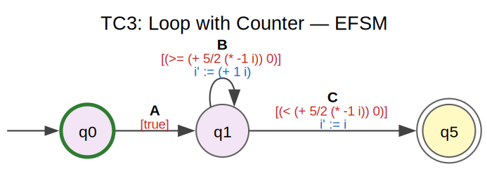
    


<h4>TC3: Loop with Counter — Discovered DPN</h4>


    
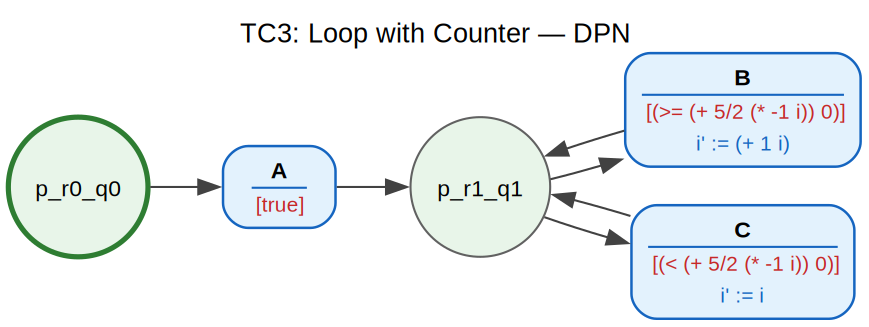
    


**Expected result:**  
- Self-loop on B (or equivalent cyclic structure)  
- Guard(B→B) ≈ `i < 3`, Guard(B→C) ≈ `i ≥ 3`  
- Update: `i' := i + 1` on B  

---
## TC 4 — Concurrency / AND Split-Join (★★★)

**Ground truth:**  
```
        ┌─ B ─┐
  A  ──►│     │──► D
        └─ C ─┘
  (B ∥ C — parallel, not exclusive)
```

- **Variables:** `x`, `y`  
- **Guards:** all `True`  
- **Updates:** B sets `x := x + 1`, C sets `y := y + 1`  

Evidence for concurrency: B and C appear in **both orderings** across traces.  

**Purpose:** Test whether the pipeline can distinguish concurrency from exclusive choice.

> **Strategy note:** We use `MergeStrategy.NONE` here because MINT classifiers assume
> deterministic next-event prediction, which is violated by concurrency (same data state
> can lead to either B-first or C-first). By keeping the full PTA, bisimulation reduction
> merges only truly equivalent states, and the **theory of regions** (Cortadella et al.)
> derives the AND-split/join places from the interleaving structure.


```python
tc4_log = make_log([
    # B before C
    [("A", {"x": 0, "y": 0}), ("B", {"x": 1, "y": 0}), ("C", {"x": 1, "y": 1}), ("D", {"x": 1, "y": 1})],
    [("A", {"x": 0, "y": 0}), ("B", {"x": 1, "y": 0}), ("C", {"x": 1, "y": 1}), ("D", {"x": 1, "y": 1})],
    # C before B
    [("A", {"x": 0, "y": 0}), ("C", {"x": 0, "y": 1}), ("B", {"x": 1, "y": 1}), ("D", {"x": 1, "y": 1})],
    [("A", {"x": 0, "y": 0}), ("C", {"x": 0, "y": 1}), ("B", {"x": 1, "y": 1}), ("D", {"x": 1, "y": 1})],
    # More variation
    [("A", {"x": 5, "y": 5}), ("B", {"x": 6, "y": 5}), ("C", {"x": 6, "y": 6}), ("D", {"x": 6, "y": 6})],
    [("A", {"x": 5, "y": 5}), ("C", {"x": 5, "y": 6}), ("B", {"x": 6, "y": 6}), ("D", {"x": 6, "y": 6})],
])

# Use NONE strategy: skip merging, rely on bisimulation + regions for concurrency
_, _, tc4_dpn = show_results(
    "TC4: Concurrency (AND Split/Join)", tc4_log,
    merge_strategy=MergeStrategy.NONE,
)
```

    INFO     Step 1  >  Using pre-loaded EventLog
    INFO              Activities = {'B', 'D', 'C', 'A'}  |  Variables = {'x', 'y'}  |  Traces = 6
    INFO     Step 2  >  Classifier training skipped (strategy=NONE)
    INFO     Step 3  >  Building Prefix Tree Acceptor
    INFO              States = 8  |  Transitions = 7
    INFO     Step 4  >  State merging (strategy=NONE)
    INFO     Merging disabled (strategy=NONE)
    INFO              States = 8 -> 8  |  Transitions = 7 -> 7
    INFO     Step 4b >  Bisimulation-based state reduction
    INFO       Bisimulation reduction: 2 merges → 6 states
    INFO              States = 8 -> 6  |  Transitions = 6
    INFO     Step 5  >  Synthesising guards (PHOG-accelerated SAT)
    INFO     Guard synthesis: 6 states, 6 transitions, 2 variables
    INFO       [2/6] State q1: pairwise cross-activity guards for ['B', 'C']


    
    ======================================================================
      TC4: Concurrency (AND Split/Join)
    ======================================================================
      Traces: 6  |  Activities: {'B', 'D', 'C', 'A'}  |  Variables: {'x', 'y'}
    


    INFO              Guards synthesised
    INFO     Step 6  >  Synthesising postconditions (abduction)
    INFO     Postcondition synthesis: 6 transitions, 2 variables
    INFO       [1/6] q0 → q1 (A): 6 observation pairs
    INFO       [2/6] q1 → q2 (B): 3 observation pairs
    INFO       [3/6] q2 → q3 (C): 3 observation pairs
    INFO       [4/6] q3 → q4 (D): 6 observation pairs
    INFO       [5/6] q1 → q5 (C): 3 observation pairs
    INFO       [6/6] q5 → q3 (B): 3 observation pairs
    INFO              Postconditions synthesised
    INFO     Step 7  >  Region-based EFSM -> DPN (Cortadella et al. S4)
    INFO       Region synthesis: |S| = 6, |E| = 4, |T| = 6
    INFO         Iteration 1: 2 pre-regions + 2 complements = 4 total regions
    INFO         Excitation closure violated for: ['B', 'D', 'C'] -- splitting labels
    INFO       Label split (A.5'): B -> 2 sub-events
    INFO       Label split (A.5'): C -> 2 sub-events
    INFO         Iteration 2: 5 pre-regions + 5 complements = 10 total regions
    INFO         Excitation closure satisfied.
    INFO         Irredundant cover: 6 regions (from 10 total)
    INFO         DPN: 6 places, 6 transitions
    INFO              Places = 6  |  Transitions = 6
    INFO     Step 7b >  Post-synthesis DPN reduction (transition collapse)
    INFO              Places = 6 -> 6  |  Transitions = 6 -> 6


    
      PTA  : 8 states, 7 transitions
      EFSM : 6 states, 6 transitions
      DPN  : 6 places, 6 transitions
    
      Discovered annotations:
        t_A_1                           guard = true
        t_B_2                           guard = true
                                        x' := (+ 1 x)
                                        y' := y
        t_B_3                           guard = true
                                        x' := (+ 1 x)
                                        y' := y
        t_C_4                           guard = true
                                        x' := x
                                        y' := (+ 1 y)
        t_C_5                           guard = true
                                        x' := x
                                        y' := (+ 1 y)
        t_D_6                           guard = true
                                        x' := x
                                        y' := y
    


<h4>TC4: Concurrency (AND Split/Join) — Merged EFSM</h4>


    
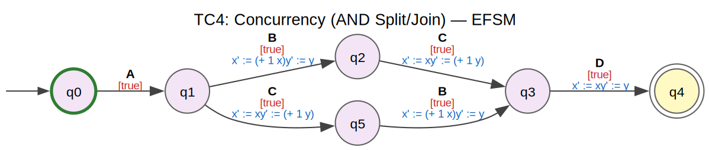
    


<h4>TC4: Concurrency (AND Split/Join) — Discovered DPN</h4>


    
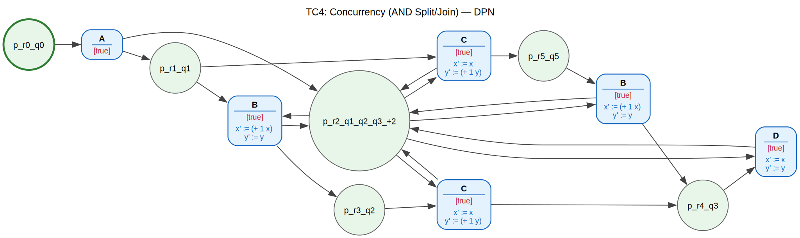
    


**Expected result:**  
- AND-split after A, AND-join before D (parallel places for B and C)  
- All guards = `True`  
- Update(B): `x' := x + 1`  
- Update(C): `y' := y + 1`  

---
## TC 5 — Multi-Variable XOR with Compound Guards (★★★)

**Ground truth:**  
```
        ┌─ B ─┐
  A  ──►├─ C ─┤──► E
        └─ D ─┘
```

- **Variables:** `amount` (int), `risk` (int)  
- **Guards:**  
  - B (approve): `amount ≤ 1000`  
  - C (review):  `amount > 1000 ∧ risk < 5`  
  - D (reject):  `amount > 1000 ∧ risk ≥ 5`  
- **Updates:** B: `amount' := amount + 100` (fee), C/D: identity  

**Purpose:** Test multi-way XOR with compound guards over two variables and a simple arithmetic update.


```python
tc5_log = make_log([
    # Branch B: amount <= 1000 → approve (amount += 100 fee)
    [("A", {"amount": 500,  "risk": 2}), ("B", {"amount": 600,  "risk": 2}), ("E", {"amount": 600,  "risk": 2})],
    [("A", {"amount": 200,  "risk": 8}), ("B", {"amount": 300,  "risk": 8}), ("E", {"amount": 300,  "risk": 8})],
    [("A", {"amount": 1000, "risk": 1}), ("B", {"amount": 1100, "risk": 1}), ("E", {"amount": 1100, "risk": 1})],
    # Branch C: amount > 1000 AND risk < 5 → review
    [("A", {"amount": 5000, "risk": 2}), ("C", {"amount": 5000, "risk": 2}), ("E", {"amount": 5000, "risk": 2})],
    [("A", {"amount": 2000, "risk": 4}), ("C", {"amount": 2000, "risk": 4}), ("E", {"amount": 2000, "risk": 4})],
    [("A", {"amount": 1500, "risk": 1}), ("C", {"amount": 1500, "risk": 1}), ("E", {"amount": 1500, "risk": 1})],
    # Branch D: amount > 1000 AND risk >= 5 → reject
    [("A", {"amount": 3000, "risk": 7}), ("D", {"amount": 3000, "risk": 7}), ("E", {"amount": 3000, "risk": 7})],
    [("A", {"amount": 8000, "risk": 9}), ("D", {"amount": 8000, "risk": 9}), ("E", {"amount": 8000, "risk": 9})],
    [("A", {"amount": 1200, "risk": 5}), ("D", {"amount": 1200, "risk": 5}), ("E", {"amount": 1200, "risk": 5})],
])

_, _, tc5_dpn = show_results(
    "TC5: Multi-Variable XOR", tc5_log,
    merge_strategy=MergeStrategy.BLUE_FRINGE, min_merge_score=1,
)
```

    INFO     Step 1  >  Using pre-loaded EventLog
    INFO              Activities = {'D', 'B', 'A', 'C', 'E'}  |  Variables = {'risk', 'amount'}  |  Traces = 9
    INFO     Step 2  >  Classifier training skipped (strategy=BLUE_FRINGE)
    INFO     Step 3  >  Building Prefix Tree Acceptor
    INFO              States = 8  |  Transitions = 7
    INFO     Step 4  >  State merging (strategy=BLUE_FRINGE)
    WARNING    Blue-Fringe merging is available but MINT is recommended. Blue-Fringe does not use classifiers and may under-merge.
    INFO       Merge loop done: 5 iterations, 2 merges, 8 → 4 states
    INFO              States = 8 -> 4  |  Transitions = 7 -> 5
    INFO     Step 4b >  Bisimulation-based state reduction
    INFO              States = 4 -> 4  |  Transitions = 5
    INFO     Step 5  >  Synthesising guards (PHOG-accelerated SAT)
    INFO     Guard synthesis: 4 states, 5 transitions, 2 variables
    INFO       [2/4] State q1: pairwise cross-activity guards for ['B', 'C', 'D']


    
    ======================================================================
      TC5: Multi-Variable XOR
    ======================================================================
      Traces: 9  |  Activities: {'D', 'B', 'A', 'C', 'E'}  |  Variables: {'risk', 'amount'}
    


    INFO       Partition verified (cross-activity): 3 guards are pairwise disjoint and exhaustive
    INFO              Guards synthesised
    INFO     Step 6  >  Synthesising postconditions (abduction)
    INFO     Postcondition synthesis: 5 transitions, 2 variables
    INFO       [1/5] q0 → q1 (A): 9 observation pairs
    INFO       [2/5] q1 → q2 (B): 3 observation pairs
    INFO       [3/5] q2 → q3 (E): 9 observation pairs
    INFO       [4/5] q1 → q2 (C): 3 observation pairs
    INFO       [5/5] q1 → q2 (D): 3 observation pairs
    INFO              Postconditions synthesised
    INFO     Step 7  >  Region-based EFSM -> DPN (Cortadella et al. S4)
    INFO       Region synthesis: |S| = 4, |E| = 5, |T| = 5
    INFO         Iteration 1: 3 pre-regions + 3 complements = 6 total regions
    INFO         Excitation closure satisfied.
    INFO         Irredundant cover: 4 regions (from 6 total)
    INFO         DPN: 4 places, 5 transitions
    INFO              Places = 4  |  Transitions = 5
    INFO     Step 7b >  Post-synthesis DPN reduction (transition collapse)
    INFO       DPN reduction: places 4 -> 3  |  transitions 5 -> 5
    INFO              Places = 4 -> 3  |  Transitions = 5 -> 5


    
      PTA  : 8 states, 7 transitions
      EFSM : 4 states, 5 transitions
      DPN  : 3 places, 5 transitions
    
      Discovered annotations:
        t_A_1                           guard = true
        t_B_2                           guard = (>= (+ 1100 (* -1 amount)) 0)
                                        amount' := (+ 100 amount)
                                        risk' := risk
        t_C_3                           guard = (and (< (+ 1200 (* -1 amount)) 0) (>= (+ 6 (* -1 risk)) 0))
                                        amount' := amount
                                        risk' := risk
        t_D_4                           guard = (and (< (+ 1100 (* -1 amount)) 0)
         (=> (>= (+ 6 (* -1 risk)) 0) (>= (+ 1200 (* -1 amount)) 0)))
                                        amount' := amount
                                        risk' := risk
        t_E_5                           guard = true
                                        amount' := amount
                                        risk' := risk
    


<h4>TC5: Multi-Variable XOR — Merged EFSM</h4>


    
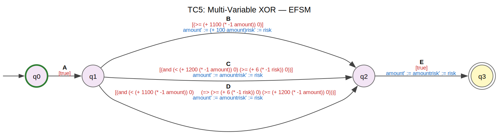
    


<h4>TC5: Multi-Variable XOR — Discovered DPN</h4>


    
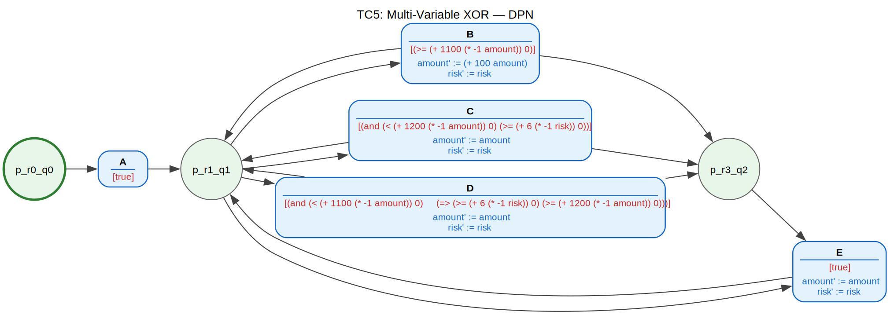
    


**Expected result:**  
- 3-way XOR split after A, join before E  
- Guard(B) ≈ `amount ≤ 1000`  
- Guard(C) ≈ `amount > 1000 ∧ risk < 5`  
- Guard(D) ≈ `amount > 1000 ∧ risk ≥ 5`  
- Update(B): `amount' := amount + 100`  

---
## TC 6 — Combined: Sequence + XOR + Loop + Updates (★★★★)

**Ground truth:**  
```
                    ┌─ Approve ─┐
  Register → Check ─┤           ├─► Close
        ↑    (loop) └─ Reject ──┘
        └──────┘
           i < 2
```

- **Variables:** `amount` (int), `i` (loop counter)  
- **Guards:**  
  - Check→Check (loop-back): `i < 2`  
  - Check→Approve: `i ≥ 2 ∧ amount ≤ 5000`  
  - Check→Reject:  `i ≥ 2 ∧ amount > 5000`  
- **Updates:**  
  - Register: `i := 0`  
  - Check: `i := i + 1`  
  - Approve: `amount := amount - 50` (processing fee)  

**Purpose:** Stress-test combining loops, XOR branching, and multiple update functions.


```python
tc6_log = make_log([
    # Loop twice, then approve (amount <= 5000)
    [
        ("Register", {"amount": 1000, "i": 0}),
        ("Check",    {"amount": 1000, "i": 1}),
        ("Check",    {"amount": 1000, "i": 2}),
        ("Approve",  {"amount": 950,  "i": 2}),
        ("Close",    {"amount": 950,  "i": 2}),
    ],
    [
        ("Register", {"amount": 3000, "i": 0}),
        ("Check",    {"amount": 3000, "i": 1}),
        ("Check",    {"amount": 3000, "i": 2}),
        ("Approve",  {"amount": 2950, "i": 2}),
        ("Close",    {"amount": 2950, "i": 2}),
    ],
    [
        ("Register", {"amount": 5000, "i": 0}),
        ("Check",    {"amount": 5000, "i": 1}),
        ("Check",    {"amount": 5000, "i": 2}),
        ("Approve",  {"amount": 4950, "i": 2}),
        ("Close",    {"amount": 4950, "i": 2}),
    ],
    # Loop twice, then reject (amount > 5000)
    [
        ("Register", {"amount": 8000,  "i": 0}),
        ("Check",    {"amount": 8000,  "i": 1}),
        ("Check",    {"amount": 8000,  "i": 2}),
        ("Reject",   {"amount": 8000,  "i": 2}),
        ("Close",    {"amount": 8000,  "i": 2}),
    ],
    [
        ("Register", {"amount": 15000, "i": 0}),
        ("Check",    {"amount": 15000, "i": 1}),
        ("Check",    {"amount": 15000, "i": 2}),
        ("Reject",   {"amount": 15000, "i": 2}),
        ("Close",    {"amount": 15000, "i": 2}),
    ],
    [
        ("Register", {"amount": 6000,  "i": 0}),
        ("Check",    {"amount": 6000,  "i": 1}),
        ("Check",    {"amount": 6000,  "i": 2}),
        ("Reject",   {"amount": 6000,  "i": 2}),
        ("Close",    {"amount": 6000,  "i": 2}),
    ],
])

_, _, tc6_dpn = show_results(
    "TC6: Loop + XOR + Updates", tc6_log,
    merge_strategy=MergeStrategy.BLUE_FRINGE, min_merge_score=1,
)
```

    INFO     Step 1  >  Using pre-loaded EventLog
    INFO              Activities = {'Check', 'Approve', 'Register', 'Close', 'Reject'}  |  Variables = {'i', 'amount'}  |  Traces = 6
    INFO     Step 2  >  Classifier training skipped (strategy=BLUE_FRINGE)
    INFO     Step 3  >  Building Prefix Tree Acceptor
    INFO              States = 8  |  Transitions = 7
    INFO     Step 4  >  State merging (strategy=BLUE_FRINGE)
    WARNING    Blue-Fringe merging is available but MINT is recommended. Blue-Fringe does not use classifiers and may under-merge.
    INFO       Merge loop done: 5 iterations, 2 merges, 8 → 4 states
    INFO              States = 8 -> 4  |  Transitions = 7 -> 5
    INFO     Step 4b >  Bisimulation-based state reduction
    INFO              States = 4 -> 4  |  Transitions = 5
    INFO     Step 5  >  Synthesising guards (PHOG-accelerated SAT)
    INFO     Guard synthesis: 4 states, 5 transitions, 2 variables
    INFO       [2/4] State q1: pairwise cross-activity guards for ['Check', 'Approve', 'Reject']


    
    ======================================================================
      TC6: Loop + XOR + Updates
    ======================================================================
      Traces: 6  |  Activities: {'Check', 'Approve', 'Register', 'Close', 'Reject'}  |  Variables: {'i', 'amount'}
    


    INFO       Partition verified (cross-activity): 3 guards are pairwise disjoint and exhaustive
    INFO              Guards synthesised
    INFO     Step 6  >  Synthesising postconditions (abduction)
    INFO     Postcondition synthesis: 5 transitions, 2 variables
    INFO       [1/5] q0 → q1 (Register): 6 observation pairs
    INFO       [2/5] q1 → q1 (Check): 12 observation pairs
    INFO       [3/5] q1 → q4 (Approve): 3 observation pairs
    INFO       [4/5] q4 → q5 (Close): 6 observation pairs
    INFO       [5/5] q1 → q4 (Reject): 3 observation pairs
    INFO              Postconditions synthesised
    INFO     Step 7  >  Region-based EFSM -> DPN (Cortadella et al. S4)
    INFO       Region synthesis: |S| = 4, |E| = 5, |T| = 5
    INFO         Iteration 1: 3 pre-regions + 3 complements = 6 total regions
    INFO         Excitation closure violated for: ['Check'] -- splitting labels
    INFO         Iteration 2: 3 pre-regions + 3 complements = 6 total regions
    INFO         Excitation closure violated for: ['Check'] -- splitting labels
    INFO         Iteration 3: 3 pre-regions + 3 complements = 6 total regions
    INFO         Excitation closure violated for: ['Check'] -- splitting labels
    INFO         Iteration 4: 3 pre-regions + 3 complements = 6 total regions
    INFO         Excitation closure violated for: ['Check'] -- splitting labels
    INFO         Iteration 5: 3 pre-regions + 3 complements = 6 total regions
    INFO         Excitation closure violated for: ['Check'] -- splitting labels
    INFO         Iteration 6: 3 pre-regions + 3 complements = 6 total regions
    INFO         Excitation closure violated for: ['Check'] -- splitting labels
    INFO         Iteration 7: 3 pre-regions + 3 complements = 6 total regions
    INFO         Excitation closure violated for: ['Check'] -- splitting labels
    INFO         Iteration 8: 3 pre-regions + 3 complements = 6 total regions
    INFO         Excitation closure violated for: ['Check'] -- splitting labels
    INFO         Iteration 9: 3 pre-regions + 3 complements = 6 total regions
    INFO         Excitation closure violated for: ['Check'] -- splitting labels
    INFO         Iteration 10: 3 pre-regions + 3 complements = 6 total regions
    INFO         Excitation closure violated for: ['Check'] -- splitting labels
    WARNING    Region synthesis: max iterations reached without full excitation closure.
    INFO         Irredundant cover: 4 regions (from 6 total)
    INFO         DPN: 4 places, 5 transitions
    INFO              Places = 4  |  Transitions = 5
    INFO     Step 7b >  Post-synthesis DPN reduction (transition collapse)
    INFO       DPN reduction: places 4 -> 3  |  transitions 5 -> 5
    INFO              Places = 4 -> 3  |  Transitions = 5 -> 5


    
      PTA  : 8 states, 7 transitions
      EFSM : 4 states, 5 transitions
      DPN  : 3 places, 5 transitions
    
      Discovered annotations:
        t_Approve_1                     guard = (and (>= (+ 5000 (* -1 amount)) 0) (< (+ 3/2 (* -1 i)) 0))
                                        amount' := (+ -50 amount)
                                        i' := i
        t_Check_2                       guard = (>= (+ 3/2 (* -1 i)) 0)
                                        amount' := amount
                                        i' := (+ 1 i)
        t_Close_3                       guard = true
                                        amount' := amount
                                        i' := i
        t_Register_4                    guard = true
                                        i' := 0
        t_Reject_5                      guard = (and (< (+ 3/2 (* -1 i)) 0)
         (=> (>= (+ 5000 (* -1 amount)) 0) (>= (+ 3/2 (* -1 i)) 0)))
                                        amount' := amount
                                        i' := i
    


<h4>TC6: Loop + XOR + Updates — Merged EFSM</h4>


    
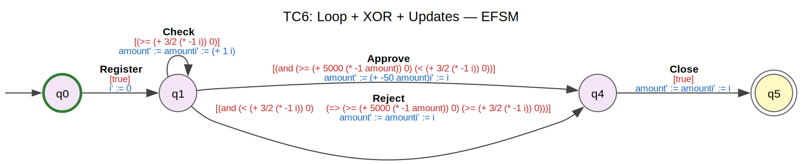
    


<h4>TC6: Loop + XOR + Updates — Discovered DPN</h4>


    
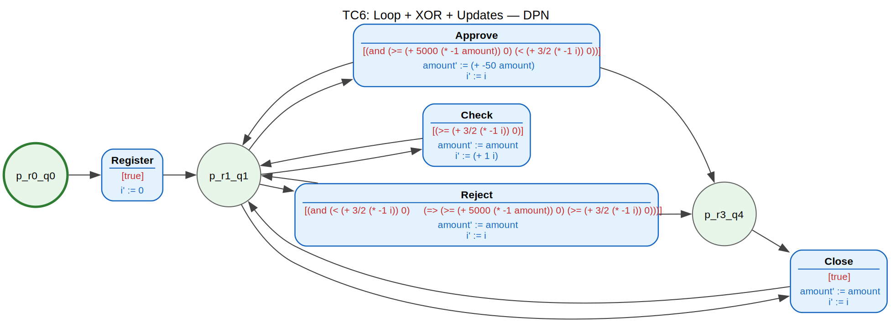
    


**Expected result:**  
- Loop on Check (self-loop or cycle)  
- Guard(Check→Check) ≈ `i < 2`  
- Guard(Check→Approve) ≈ `i ≥ 2 ∧ amount ≤ 5000`  
- Guard(Check→Reject) ≈ `i ≥ 2 ∧ amount > 5000`  
- Update(Check): `i' := i + 1`  
- Update(Approve): `amount' := amount - 50`  

---
## Summary & Comparison


```python
import pandas as pd

summary_data = {
    "Test Case": [
        "TC1: Sequence",
        "TC2: XOR Split/Join",
        "TC3: Loop",
        "TC4: Concurrency",
        "TC5: Multi-Var XOR",
        "TC6: Combined",
    ],
    "Traces": [
        len(tc1_log.traces),
        len(tc2_log.traces),
        len(tc3_log.traces),
        len(tc4_log.traces),
        len(tc5_log.traces),
        len(tc6_log.traces),
    ],
    "Variables": [
        len(tc1_log.variables),
        len(tc2_log.variables),
        len(tc3_log.variables),
        len(tc4_log.variables),
        len(tc5_log.variables),
        len(tc6_log.variables),
    ],
    "DPN Places": [
        len(tc1_dpn.places),
        len(tc2_dpn.places),
        len(tc3_dpn.places),
        len(tc4_dpn.places),
        len(tc5_dpn.places),
        len(tc6_dpn.places),
    ],
    "DPN Transitions": [
        len(tc1_dpn.transitions),
        len(tc2_dpn.transitions),
        len(tc3_dpn.transitions),
        len(tc4_dpn.transitions),
        len(tc5_dpn.transitions),
        len(tc6_dpn.transitions),
    ],
    "Control Flow": [
        "Sequence",
        "XOR split/join",
        "Loop",
        "AND split/join",
        "3-way XOR",
        "Loop + XOR",
    ],
    "Complexity": ["★☆☆", "★★☆", "★★☆", "★★★", "★★★", "★★★★"],
}

df_summary = pd.DataFrame(summary_data)
display(HTML("<h3>Evaluation Summary</h3>"))
display(df_summary.to_html(index=False))
```


<h3>Evaluation Summary</h3>


    '<table border="1" class="dataframe">\n  <thead>\n    <tr style="text-align: right;">\n      <th>Test Case</th>\n      <th>Traces</th>\n      <th>Variables</th>\n      <th>DPN Places</th>\n      <th>DPN Transitions</th>\n      <th>Control Flow</th>\n      <th>Complexity</th>\n    </tr>\n  </thead>\n  <tbody>\n    <tr>\n      <td>TC1: Sequence</td>\n      <td>3</td>\n      <td>1</td>\n      <td>4</td>\n      <td>3</td>\n      <td>Sequence</td>\n      <td>★☆☆</td>\n    </tr>\n    <tr>\n      <td>TC2: XOR Split/Join</td>\n      <td>6</td>\n      <td>1</td>\n      <td>3</td>\n      <td>4</td>\n      <td>XOR split/join</td>\n      <td>★★☆</td>\n    </tr>\n    <tr>\n      <td>TC3: Loop</td>\n      <td>4</td>\n      <td>1</td>\n      <td>2</td>\n      <td>3</td>\n      <td>Loop</td>\n      <td>★★☆</td>\n    </tr>\n    <tr>\n      <td>TC4: Concurrency</td>\n      <td>6</td>\n      <td>2</td>\n      <td>6</td>\n      <td>6</td>\n      <td>AND split/join</td>\n      <td>★★★</td>\n    </tr>\n    <tr>\n      <td>TC5: Multi-Var XOR</td>\n      <td>9</td>\n      <td>2</td>\n      <td>3</td>\n      <td>5</td>\n      <td>3-way XOR</td>\n      <td>★★★</td>\n    </tr>\n    <tr>\n      <td>TC6: Combined</td>\n      <td>6</td>\n      <td>2</td>\n      <td>3</td>\n      <td>5</td>\n      <td>Loop + XOR</td>\n      <td>★★★★</td>\n    </tr>\n  </tbody>\n</table>'

