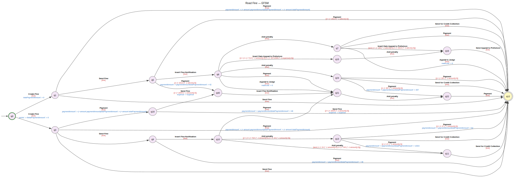
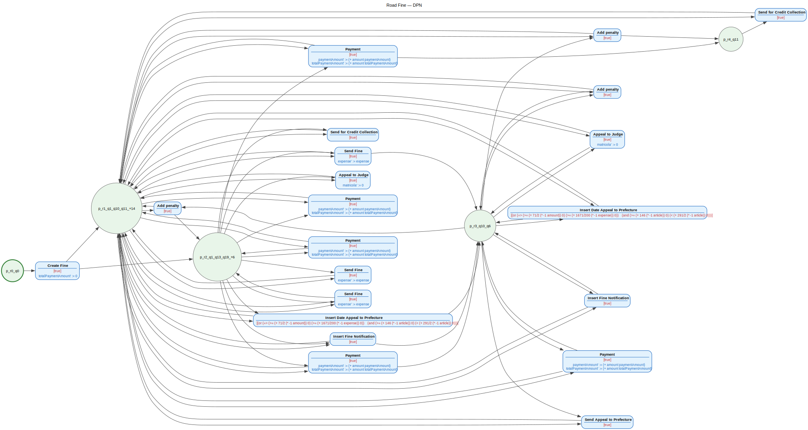
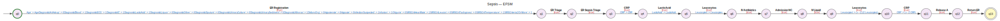
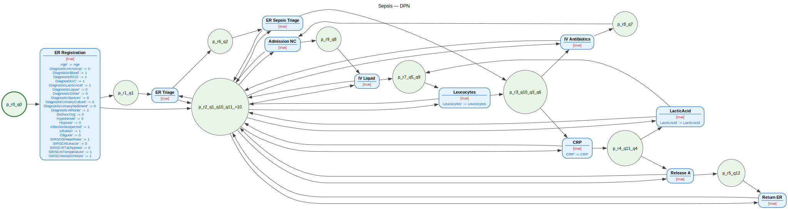
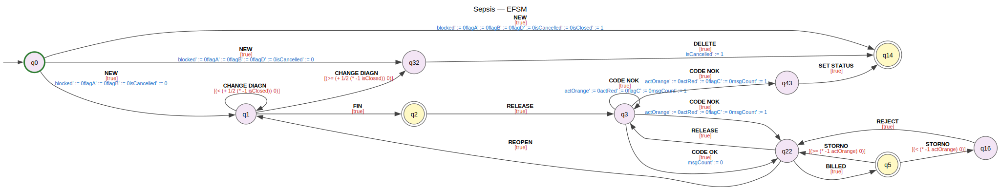
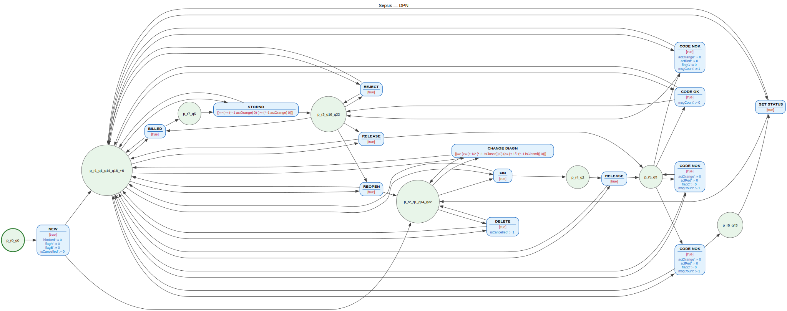

```python
# ── Imports & Setup ──────────────────────────────────────────────────────
import logging
from IPython.display import display, Image, HTML

from dpn_discovery.models import Event, Trace, EventLog, MergeStrategy
from dpn_discovery.preprocessing import parse_event_log
from dpn_discovery.pipeline import run_pipeline, run_pipeline_full
from dpn_discovery.dpn_transform import dpn_to_pnml
from dpn_discovery.smt import get_solver, set_solver
from dpn_discovery.smt.yices2_solver import Yices2SMTSolver
from dpn_discovery.visualization import DPNVisualizer, VisualizerSettings

# Use Yices2 as the SMT backend
set_solver(Yices2SMTSolver())
smt = get_solver()

# Logging: show pipeline steps
logging.basicConfig(level=logging.INFO, format="%(levelname)-8s %(message)s", force=True)

# Visualization settings (SVG for inline display)
viz_settings = VisualizerSettings(output_format="svg", rankdir="LR")
viz = DPNVisualizer(viz_settings)
```


```python
# ── Helper functions ─────────────────────────────────────────────────────

from dataclasses import dataclass
from pathlib import Path
from typing import Optional


def make_log(raw_traces: list[list[tuple[str, dict]]]) -> EventLog:
    """Build an EventLog from a compact list-of-lists representation.
    
    Each trace is a list of (activity, payload_dict) tuples.
    """
    traces = []
    activities = set()
    variables = set()
    for raw in raw_traces:
        events = []
        for act, payload in raw:
            activities.add(act)
            variables.update(payload.keys())
            events.append(Event(activity=act, payload=payload))
        traces.append(Trace(events=events))
    return EventLog(traces=traces, activities=activities, variables=variables)


def show_results(name: str, log: EventLog, **pipeline_kwargs):
    """Run pipeline, print summary, and display DPN + EFSM visualizations."""
    print(f"\n{'='*70}")
    print(f"  {name}")
    print(f"{'='*70}")
    print(f"  Traces: {len(log.traces)}  |  Activities: {log.activities}  |  Variables: {log.variables}")
    print()

    pta, efsm, dpn = run_pipeline_full(log, **pipeline_kwargs)

    print(f"\n  PTA  : {len(pta.states)} states, {len(pta.transitions)} transitions")
    print(f"  EFSM : {len(efsm.states)} states, {len(efsm.transitions)} transitions")
    print(f"  DPN  : {len(dpn.places)} places, {len(dpn.transitions)} transitions")

    # Print discovered guards & updates
    print(f"\n  Discovered annotations:")
    for t in dpn.transitions:
        activity = t.name
        guard_str = smt.expr_to_string(t.guard) if t.guard is not None else "True"
        print(f"    {activity:30s}  guard = {guard_str}")
        if t.update_rule:
            for var, expr in sorted(t.update_rule.items()):
                print(f"    {'':30s}  {var}' := {smt.expr_to_string(expr)}")
    print()

    # Render visualizations inline
    efsm_dot = viz.render_efsm(efsm, title=f"{name} — EFSM")
    dpn_dot = viz.render_dpn(dpn, title=f"{name} — DPN")

    display(HTML(f"<h4>{name} — Merged EFSM</h4>"))
    display(efsm_dot)
    display(HTML(f"<h4>{name} — Discovered DPN</h4>"))
    display(dpn_dot)

    return pta, efsm, dpn


@dataclass
class TestCase:
    name: str
    csv_path: Path
    ref_png: Path

    sample_ratio: Optional[float] = None
```


```python
import pm4py

from dpn_discovery.preprocessing import _dataframe_to_event_log


road_fine = TestCase("Road Fine", Path("/Users/christianimenkamp/Documents/Data-Repository/Community/Road-Traffic-Fine-Management-Process/Road_Traffic_Fine_Management_Process.xes"), "", sample_ratio=0.001)
sepsis_log = TestCase("Sepsis", Path("/Users/christianimenkamp/Documents/Data-Repository/Community/sepsis/Sepsis Cases - Event Log.xes"),  "sepsis/petri-net.png", sample_ratio=0.001)
hospital_billing = TestCase("Hospital Billing", Path("/Users/christianimenkamp/Documents/Data-Repository/Community/hospital-billing/hospital-billing.xes"), "hospital_billing/petri-net.png", sample_ratio=0.001)


```


```python
r_log = _dataframe_to_event_log(pm4py.read_xes(str(road_fine.csv_path)))
r_log = r_log.sample(road_fine.sample_ratio)

_, _, tc1_dpn = show_results(
    "Road Fine", r_log,
    merge_strategy=MergeStrategy.MINT, min_merge_score=1,
)
```

    parsing log, completed traces :: 100%|██████████| 150370/150370 [00:09<00:00, 16120.97it/s]
    INFO     Loaded event log: 150370 traces, Σ = {'Send for Credit Collection', 'Create Fine', 'Add penalty', 'Send Appeal to Prefecture', 'Send Fine', 'Insert Date Appeal to Prefecture', 'Appeal to Judge', 'Payment', 'Receive Result Appeal from Prefecture', 'Notify Result Appeal to Offender', 'Insert Fine Notification'}, V = {'matricola', 'points', 'expense', 'notificationType', 'dismissal', 'paymentAmount', 'amount', 'totalPaymentAmount', 'vehicleClass', 'lastSent', 'article'}
    INFO     Step 1  >  Using pre-loaded EventLog
    INFO              Activities = {'Send for Credit Collection', 'Create Fine', 'Add penalty', 'Send Appeal to Prefecture', 'Send Fine', 'Insert Date Appeal to Prefecture', 'Appeal to Judge', 'Payment', 'Receive Result Appeal from Prefecture', 'Notify Result Appeal to Offender', 'Insert Fine Notification'}  |  Variables = {'matricola', 'points', 'expense', 'notificationType', 'dismissal', 'paymentAmount', 'amount', 'totalPaymentAmount', 'vehicleClass', 'lastSent', 'article'}  |  Traces = 150
    INFO     Step 2  >  Training classifiers (algorithm=DECISION_TREE)
    INFO              Classifiers trained for 7 labels
    INFO     Step 3  >  Building Prefix Tree Acceptor
    INFO              States = 55  |  Transitions = 54
    INFO     Step 4  >  State merging (strategy=MINT)
    INFO       MINT merging (data-aware, Algorithm 3)


    
    ======================================================================
      Road Fine
    ======================================================================
      Traces: 150  |  Activities: {'Send for Credit Collection', 'Create Fine', 'Add penalty', 'Send Appeal to Prefecture', 'Send Fine', 'Insert Date Appeal to Prefecture', 'Appeal to Judge', 'Payment', 'Receive Result Appeal from Prefecture', 'Notify Result Appeal to Offender', 'Insert Fine Notification'}  |  Variables: {'matricola', 'points', 'expense', 'notificationType', 'dismissal', 'paymentAmount', 'amount', 'totalPaymentAmount', 'vehicleClass', 'lastSent', 'article'}
    


    INFO         merge loop: iter=50  |red|=50  |blue|=5  states=55  merges=0  failed=46
    INFO       Merge loop done: 54 iterations, 0 merges, 55 → 55 states
    INFO              States = 55 -> 55  |  Transitions = 54 -> 54
    INFO     Step 4b >  Bisimulation-based state reduction
    INFO       Bisimulation reduction: 37 merges → 18 states
    INFO              States = 55 -> 18  |  Transitions = 40
    INFO     Step 5  >  Synthesising guards (PHOG-accelerated SAT)
    INFO     Guard synthesis: 18 states, 40 transitions, 11 variables
    INFO       [1/18] State q0: synthesising guards for 2 competing 'Create Fine' transitions
    INFO       [2/18] State q1: synthesising guards for 2 competing 'Send Fine' transitions
    INFO       [3/18] State q10: synthesising guards for 2 competing 'Add penalty' transitions
    INFO       Partition verified (same-activity): 2 guards are pairwise disjoint and exhaustive
    INFO       [6/18] State q13: synthesising guards for 2 competing 'Payment' transitions
    INFO       Partition verified (same-activity): 2 guards are pairwise disjoint and exhaustive
    INFO       [9/18] State q19: synthesising guards for 2 competing 'Send Fine' transitions
    INFO       Partition verified (same-activity): 2 guards are pairwise disjoint and exhaustive
    INFO       [12/18] State q24: synthesising guards for 2 competing 'Payment' transitions
    INFO       Partition verified (same-activity): 2 guards are pairwise disjoint and exhaustive
    INFO       [13/18] State q3: synthesising guards for 2 competing 'Payment' transitions
    INFO       [13/18] State q3: synthesising guards for 2 competing 'Send Fine' transitions
    INFO       [15/18] State q5: synthesising guards for 2 competing 'Payment' transitions
    INFO       Partition verified (same-activity): 2 guards are pairwise disjoint and exhaustive
    INFO       [16/18] State q6: synthesising guards for 2 competing 'Add penalty' transitions
    INFO       [16/18] State q6: pairwise cross-activity guards for ['Insert Date Appeal to Prefecture', 'Payment', 'Appeal to Judge']
    INFO       [17/18] State q7: pairwise cross-activity guards for ['Send for Credit Collection', 'Payment', 'Appeal to Judge', 'Insert Date Appeal to Prefecture']
    INFO       [18/18] State q9: pairwise cross-activity guards for ['Insert Fine Notification', 'Payment']
    INFO              Guards synthesised
    INFO     Step 6  >  Synthesising postconditions (abduction)
    INFO     Postcondition synthesis: 40 transitions, 11 variables
    INFO       [1/40] q0 → q1 (Create Fine): 97 observation pairs
    INFO       [2/40] q1 → q12 (Send Fine): 12 observation pairs
    INFO       [3/40] q0 → q3 (Create Fine): 53 observation pairs
    INFO       [4/40] q3 → q12 (Payment): 27 observation pairs
    INFO       [5/40] q1 → q5 (Send Fine): 71 observation pairs
    INFO       [6/40] q5 → q6 (Insert Fine Notification): 67 observation pairs
    INFO       [7/40] q6 → q7 (Add penalty): 52 observation pairs
    INFO       [8/40] q7 → q12 (Send for Credit Collection): 44 observation pairs
    INFO       [9/40] q3 → q9 (Send Fine): 16 observation pairs
    INFO       [10/40] q9 → q10 (Insert Fine Notification): 15 observation pairs
    INFO       [11/40] q10 → q11 (Add penalty): 9 observation pairs
    INFO       [12/40] q11 → q12 (Send for Credit Collection): 10 observation pairs
    INFO       [13/40] q10 → q13 (Add penalty): 5 observation pairs
    INFO       [14/40] q13 → q12 (Send for Credit Collection): 3 observation pairs
    INFO       [15/40] q6 → q15 (Insert Date Appeal to Prefecture): 4 observation pairs
    INFO       [16/40] q15 → q16 (Add penalty): 4 observation pairs
    INFO       [17/40] q16 → q12 (Send Appeal to Prefecture): 5 observation pairs
    INFO       [18/40] q1 → q12 (Payment): 14 observation pairs
    INFO       [19/40] q3 → q19 (Payment): 2 observation pairs
    INFO       [20/40] q19 → q12 (Send Fine): 1 observation pairs
    INFO       [21/40] q6 → q21 (Payment): 2 observation pairs
    INFO       [22/40] q21 → q22 (Add penalty): 6 observation pairs
    INFO       [23/40] q22 → q12 (Payment): 7 observation pairs
    INFO       [24/40] q6 → q24 (Add penalty): 8 observation pairs
    INFO       [25/40] q24 → q12 (Payment): 2 observation pairs
    INFO       [26/40] q3 → q12 (Send Fine): 8 observation pairs
    INFO       [27/40] q7 → q12 (Payment): 6 observation pairs
    INFO       [28/40] q24 → q12 (Send for Credit Collection): 5 observation pairs
    INFO       [29/40] q9 → q12 (Payment): 1 observation pairs
    INFO       [30/40] q24 → q22 (Payment): 1 observation pairs
    INFO       [31/40] q13 → q12 (Payment): 1 observation pairs
    INFO       [32/40] q6 → q21 (Appeal to Judge): 1 observation pairs
    INFO       [33/40] q5 → q12 (Payment): 3 observation pairs
    INFO       [34/40] q7 → q12 (Appeal to Judge): 1 observation pairs
    INFO       [35/40] q5 → q40 (Payment): 1 observation pairs
    INFO       [36/40] q40 → q21 (Insert Fine Notification): 2 observation pairs
    INFO       [37/40] q13 → q11 (Payment): 1 observation pairs
    INFO       [38/40] q10 → q21 (Payment): 1 observation pairs
    INFO       [39/40] q7 → q16 (Insert Date Appeal to Prefecture): 1 observation pairs
    INFO       [40/40] q19 → q40 (Send Fine): 1 observation pairs
    INFO              Postconditions synthesised
    INFO     Step 7  >  Region-based EFSM -> DPN (Cortadella et al. S4)
    INFO       Region synthesis: |S| = 18, |E| = 9, |T| = 40
    INFO         Iteration 1: 2 pre-regions + 2 complements = 2 total regions
    INFO         Excitation closure violated for: ['Send for Credit Collection', 'Add penalty', 'Send Appeal to Prefecture', 'Send Fine', 'Insert Date Appeal to Prefecture', 'Appeal to Judge', 'Payment', 'Insert Fine Notification'] -- splitting labels
    INFO       Label split (A.5'): Add penalty -> 6 sub-events
    INFO       Label split (A.5'): Appeal to Judge -> 2 sub-events
    INFO       Label split (A.5'): Insert Date Appeal to Prefecture -> 2 sub-events
    INFO       Label split (A.5'): Insert Fine Notification -> 3 sub-events
    INFO       Label split (A.5'): Payment -> 6 sub-events
    INFO       Label split (A.5'): Send Fine -> 4 sub-events
    INFO       Label split (A.5'): Send for Credit Collection -> 4 sub-events
    INFO         Iteration 2: 8 pre-regions + 8 complements = 16 total regions
    INFO         Excitation closure violated for: ['Send Fine', 'Insert Date Appeal to Prefecture__split_7', 'Send Fine__split_15', 'Send for Credit Collection__split_20', 'Payment__split_10', 'Add penalty', 'Send Fine__split_16', 'Insert Date Appeal to Prefecture', 'Payment__split_14', 'Insert Fine Notification__split_9', 'Add penalty__split_4', 'Payment', 'Payment__split_13', 'Appeal to Judge__split_6', 'Appeal to Judge', 'Add penalty__split_5', 'Insert Fine Notification', 'Send Fine__split_17', 'Add penalty__split_1', 'Send for Credit Collection__split_18', 'Payment__split_11', 'Send for Credit Collection__split_19'] -- splitting labels
    INFO         Iteration 3: 8 pre-regions + 8 complements = 16 total regions
    INFO         Excitation closure violated for: ['Send Fine', 'Insert Date Appeal to Prefecture__split_7', 'Appeal to Judge__split_6', 'Appeal to Judge', 'Add penalty__split_5', 'Send Fine__split_15', 'Send for Credit Collection__split_20', 'Payment__split_10', 'Insert Fine Notification', 'Add penalty', 'Send Fine__split_16', 'Insert Date Appeal to Prefecture', 'Send Fine__split_17', 'Add penalty__split_1', 'Send for Credit Collection__split_18', 'Payment__split_14', 'Insert Fine Notification__split_9', 'Add penalty__split_4', 'Payment', 'Payment__split_11', 'Payment__split_13', 'Send for Credit Collection__split_19'] -- splitting labels
    INFO         Iteration 4: 8 pre-regions + 8 complements = 16 total regions
    INFO         Excitation closure violated for: ['Send Fine', 'Insert Date Appeal to Prefecture__split_7', 'Appeal to Judge__split_6', 'Appeal to Judge', 'Add penalty__split_5', 'Send Fine__split_15', 'Send for Credit Collection__split_20', 'Payment__split_10', 'Insert Fine Notification', 'Add penalty', 'Send Fine__split_16', 'Insert Date Appeal to Prefecture', 'Send Fine__split_17', 'Add penalty__split_1', 'Send for Credit Collection__split_18', 'Payment__split_14', 'Insert Fine Notification__split_9', 'Add penalty__split_4', 'Payment', 'Payment__split_11', 'Payment__split_13', 'Send for Credit Collection__split_19'] -- splitting labels
    INFO         Iteration 5: 8 pre-regions + 8 complements = 16 total regions
    INFO         Excitation closure violated for: ['Send Fine', 'Insert Date Appeal to Prefecture__split_7', 'Appeal to Judge__split_6', 'Appeal to Judge', 'Add penalty__split_5', 'Send Fine__split_15', 'Send for Credit Collection__split_20', 'Payment__split_10', 'Insert Fine Notification', 'Add penalty', 'Send Fine__split_16', 'Insert Date Appeal to Prefecture', 'Send Fine__split_17', 'Add penalty__split_1', 'Send for Credit Collection__split_18', 'Payment__split_14', 'Insert Fine Notification__split_9', 'Add penalty__split_4', 'Payment', 'Payment__split_11', 'Payment__split_13', 'Send for Credit Collection__split_19'] -- splitting labels
    INFO         Iteration 6: 8 pre-regions + 8 complements = 16 total regions
    INFO         Excitation closure violated for: ['Send Fine', 'Insert Date Appeal to Prefecture__split_7', 'Appeal to Judge__split_6', 'Appeal to Judge', 'Add penalty__split_5', 'Send Fine__split_15', 'Send for Credit Collection__split_20', 'Payment__split_10', 'Insert Fine Notification', 'Add penalty', 'Send Fine__split_16', 'Insert Date Appeal to Prefecture', 'Send Fine__split_17', 'Add penalty__split_1', 'Send for Credit Collection__split_18', 'Payment__split_14', 'Insert Fine Notification__split_9', 'Add penalty__split_4', 'Payment', 'Payment__split_11', 'Payment__split_13', 'Send for Credit Collection__split_19'] -- splitting labels
    INFO         Iteration 7: 8 pre-regions + 8 complements = 16 total regions
    INFO         Excitation closure violated for: ['Send Fine', 'Insert Date Appeal to Prefecture__split_7', 'Appeal to Judge__split_6', 'Appeal to Judge', 'Add penalty__split_5', 'Send Fine__split_15', 'Send for Credit Collection__split_20', 'Payment__split_10', 'Insert Fine Notification', 'Add penalty', 'Send Fine__split_16', 'Insert Date Appeal to Prefecture', 'Send Fine__split_17', 'Add penalty__split_1', 'Send for Credit Collection__split_18', 'Payment__split_14', 'Insert Fine Notification__split_9', 'Add penalty__split_4', 'Payment', 'Payment__split_11', 'Payment__split_13', 'Send for Credit Collection__split_19'] -- splitting labels
    INFO         Iteration 8: 8 pre-regions + 8 complements = 16 total regions
    INFO         Excitation closure violated for: ['Send Fine', 'Insert Date Appeal to Prefecture__split_7', 'Appeal to Judge__split_6', 'Appeal to Judge', 'Add penalty__split_5', 'Send Fine__split_15', 'Send for Credit Collection__split_20', 'Payment__split_10', 'Insert Fine Notification', 'Add penalty', 'Send Fine__split_16', 'Insert Date Appeal to Prefecture', 'Send Fine__split_17', 'Add penalty__split_1', 'Send for Credit Collection__split_18', 'Payment__split_14', 'Insert Fine Notification__split_9', 'Add penalty__split_4', 'Payment', 'Payment__split_11', 'Payment__split_13', 'Send for Credit Collection__split_19'] -- splitting labels
    INFO         Iteration 9: 8 pre-regions + 8 complements = 16 total regions
    INFO         Excitation closure violated for: ['Send Fine', 'Insert Date Appeal to Prefecture__split_7', 'Appeal to Judge__split_6', 'Appeal to Judge', 'Add penalty__split_5', 'Send Fine__split_15', 'Send for Credit Collection__split_20', 'Payment__split_10', 'Insert Fine Notification', 'Add penalty', 'Send Fine__split_16', 'Insert Date Appeal to Prefecture', 'Send Fine__split_17', 'Add penalty__split_1', 'Send for Credit Collection__split_18', 'Payment__split_14', 'Insert Fine Notification__split_9', 'Add penalty__split_4', 'Payment', 'Payment__split_11', 'Payment__split_13', 'Send for Credit Collection__split_19'] -- splitting labels
    INFO         Iteration 10: 8 pre-regions + 8 complements = 16 total regions
    INFO         Excitation closure violated for: ['Send Fine', 'Insert Date Appeal to Prefecture__split_7', 'Appeal to Judge__split_6', 'Appeal to Judge', 'Add penalty__split_5', 'Send Fine__split_15', 'Send for Credit Collection__split_20', 'Payment__split_10', 'Insert Fine Notification', 'Add penalty', 'Send Fine__split_16', 'Insert Date Appeal to Prefecture', 'Send Fine__split_17', 'Add penalty__split_1', 'Send for Credit Collection__split_18', 'Payment__split_14', 'Insert Fine Notification__split_9', 'Add penalty__split_4', 'Payment', 'Payment__split_11', 'Payment__split_13', 'Send for Credit Collection__split_19'] -- splitting labels
    WARNING    Region synthesis: max iterations reached without full excitation closure.
    INFO         Irredundant cover: 9 regions (from 16 total)
    INFO         DPN: 9 places, 29 transitions
    INFO              Places = 9  |  Transitions = 29
    INFO     Step 7b >  Post-synthesis DPN reduction (transition collapse)
    INFO       DPN reduction: places 9 -> 5  |  transitions 29 -> 21
    INFO              Places = 9 -> 5  |  Transitions = 29 -> 21


    
      PTA  : 55 states, 54 transitions
      EFSM : 18 states, 40 transitions
      DPN  : 5 places, 21 transitions
    
      Discovered annotations:
        t_Add penalty_1                 guard = true
        t_Add penalty_2                 guard = true
        t_Add penalty_3                 guard = true
        t_Appeal to Judge_7             guard = true
                                        matricola' := 0
        t_Appeal to Judge_8             guard = true
                                        matricola' := 0
        t_Create Fine_9                 guard = true
                                        totalPaymentAmount' := 0
        t_Insert Date Appeal to Prefecture_10  guard = (or (=> (>= (+ 71/2 (* -1 amount)) 0) (>= (+ 1671/200 (* -1 expense)) 0))
        (and (>= (+ 146 (* -1 article)) 0) (< (+ 291/2 (* -1 article)) 0)))
        t_Insert Date Appeal to Prefecture_11  guard = (or (=> (>= (+ 71/2 (* -1 amount)) 0) (>= (+ 1671/200 (* -1 expense)) 0))
        (and (>= (+ 146 (* -1 article)) 0) (< (+ 291/2 (* -1 article)) 0)))
        t_Insert Fine Notification_12   guard = true
        t_Insert Fine Notification_13   guard = true
        t_Payment_15                    guard = true
                                        paymentAmount' := (+ amount paymentAmount)
                                        totalPaymentAmount' := (+ amount totalPaymentAmount)
        t_Payment_16                    guard = true
                                        paymentAmount' := (+ amount paymentAmount)
                                        totalPaymentAmount' := (+ amount totalPaymentAmount)
        t_Payment_17                    guard = true
                                        paymentAmount' := (+ amount paymentAmount)
                                        totalPaymentAmount' := (+ amount totalPaymentAmount)
        t_Payment_18                    guard = true
                                        paymentAmount' := (+ amount paymentAmount)
                                        totalPaymentAmount' := (+ amount totalPaymentAmount)
        t_Payment_20                    guard = true
                                        paymentAmount' := (+ amount paymentAmount)
                                        totalPaymentAmount' := (+ amount totalPaymentAmount)
        t_Send Appeal to Prefecture_21  guard = true
        t_Send Fine_22                  guard = true
                                        expense' := expense
        t_Send Fine_23                  guard = true
                                        expense' := expense
        t_Send Fine_24                  guard = true
                                        expense' := expense
        t_Send for Credit Collection_26  guard = true
        t_Send for Credit Collection_27  guard = true
    


<h4>Road Fine — Merged EFSM</h4>


    

    


<h4>Road Fine — Discovered DPN</h4>


    

    


```python
s_log = _dataframe_to_event_log(pm4py.read_xes(str(sepsis_log.csv_path)))
s_log = s_log.sample(sepsis_log.sample_ratio)

_, _, tc1_dpn = show_results(
    "Sepsis", s_log,
    merge_strategy=MergeStrategy.MINT, min_merge_score=1,
)
```

    parsing log, completed traces :: 100%|██████████| 1050/1050 [00:00<00:00, 5425.04it/s]
    INFO     Loaded event log: 1050 traces, Σ = {'Leucocytes', 'LacticAcid', 'Release D', 'ER Registration', 'Release A', 'IV Antibiotics', 'ER Triage', 'Release C', 'IV Liquid', 'CRP', 'Return ER', 'Admission IC', 'Admission NC', 'ER Sepsis Triage', 'Release B', 'Release E'}, V = {'Leucocytes', 'SIRSCritTemperature', 'Hypoxie', 'DiagnosticLiquor', 'SIRSCritHeartRate', 'DiagnosticSputum', 'Diagnose', 'DiagnosticArtAstrup', 'DisfuncOrg', 'DiagnosticBlood', 'DiagnosticECG', 'SIRSCritTachypnea', 'DiagnosticOther', 'Infusion', 'LacticAcid', 'Age', 'SIRSCritLeucos', 'DiagnosticLacticAcid', 'CRP', 'Oligurie', 'SIRSCriteria2OrMore', 'Hypotensie', 'DiagnosticUrinarySediment', 'DiagnosticXthorax', 'DiagnosticUrinaryCulture', 'InfectionSuspected', 'DiagnosticIC'}
    INFO     Step 1  >  Using pre-loaded EventLog
    INFO              Activities = {'Leucocytes', 'LacticAcid', 'Release D', 'ER Registration', 'Release A', 'IV Antibiotics', 'ER Triage', 'Release C', 'IV Liquid', 'CRP', 'Return ER', 'Admission IC', 'Admission NC', 'ER Sepsis Triage', 'Release B', 'Release E'}  |  Variables = {'Leucocytes', 'SIRSCritTemperature', 'Hypoxie', 'DiagnosticLiquor', 'SIRSCritHeartRate', 'DiagnosticSputum', 'Diagnose', 'DiagnosticArtAstrup', 'DisfuncOrg', 'DiagnosticBlood', 'DiagnosticECG', 'SIRSCritTachypnea', 'DiagnosticOther', 'Infusion', 'LacticAcid', 'Age', 'SIRSCritLeucos', 'DiagnosticLacticAcid', 'CRP', 'Oligurie', 'SIRSCriteria2OrMore', 'Hypotensie', 'DiagnosticUrinarySediment', 'DiagnosticXthorax', 'DiagnosticUrinaryCulture', 'InfectionSuspected', 'DiagnosticIC'}  |  Traces = 1
    INFO     Step 2  >  Training classifiers (algorithm=DECISION_TREE)
    INFO              Classifiers trained for 10 labels
    INFO     Step 3  >  Building Prefix Tree Acceptor
    INFO              States = 14  |  Transitions = 13
    INFO     Step 4  >  State merging (strategy=MINT)
    INFO       MINT merging (data-aware, Algorithm 3)
    INFO       Merge loop done: 13 iterations, 0 merges, 14 → 14 states
    INFO              States = 14 -> 14  |  Transitions = 13 -> 13
    INFO     Step 4b >  Bisimulation-based state reduction
    INFO              States = 14 -> 14  |  Transitions = 13
    INFO     Step 5  >  Synthesising guards (PHOG-accelerated SAT)
    INFO     Guard synthesis: 14 states, 13 transitions, 27 variables
    INFO              Guards synthesised
    INFO     Step 6  >  Synthesising postconditions (abduction)
    INFO     Postcondition synthesis: 13 transitions, 27 variables
    INFO       [1/13] q0 → q1 (ER Registration): 1 observation pairs
    INFO       [2/13] q1 → q2 (ER Triage): 1 observation pairs
    INFO       [3/13] q2 → q3 (ER Sepsis Triage): 1 observation pairs
    INFO       [4/13] q3 → q4 (CRP): 1 observation pairs
    INFO       [5/13] q4 → q5 (LacticAcid): 1 observation pairs
    INFO       [6/13] q5 → q6 (Leucocytes): 1 observation pairs
    INFO       [7/13] q6 → q7 (IV Antibiotics): 1 observation pairs
    INFO       [8/13] q7 → q8 (Admission NC): 1 observation pairs
    INFO       [9/13] q8 → q9 (IV Liquid): 1 observation pairs
    INFO       [10/13] q9 → q10 (Leucocytes): 1 observation pairs
    INFO       [11/13] q10 → q11 (CRP): 1 observation pairs
    INFO       [12/13] q11 → q12 (Release A): 1 observation pairs
    INFO       [13/13] q12 → q13 (Return ER): 1 observation pairs
    INFO              Postconditions synthesised
    INFO     Step 7  >  Region-based EFSM -> DPN (Cortadella et al. S4)
    INFO       Region synthesis: |S| = 14, |E| = 11, |T| = 13
    INFO         Iteration 1: 9 pre-regions + 9 complements = 18 total regions
    INFO         Excitation closure violated for: ['LacticAcid', 'Release A', 'IV Antibiotics', 'CRP'] -- splitting labels
    INFO         Iteration 2: 9 pre-regions + 9 complements = 18 total regions
    INFO         Excitation closure violated for: ['LacticAcid', 'Release A', 'IV Antibiotics', 'CRP'] -- splitting labels
    INFO         Iteration 3: 9 pre-regions + 9 complements = 18 total regions
    INFO         Excitation closure violated for: ['LacticAcid', 'Release A', 'IV Antibiotics', 'CRP'] -- splitting labels
    INFO         Iteration 4: 9 pre-regions + 9 complements = 18 total regions
    INFO         Excitation closure violated for: ['LacticAcid', 'Release A', 'IV Antibiotics', 'CRP'] -- splitting labels
    INFO         Iteration 5: 9 pre-regions + 9 complements = 18 total regions
    INFO         Excitation closure violated for: ['LacticAcid', 'Release A', 'IV Antibiotics', 'CRP'] -- splitting labels
    INFO         Iteration 6: 9 pre-regions + 9 complements = 18 total regions
    INFO         Excitation closure violated for: ['LacticAcid', 'Release A', 'IV Antibiotics', 'CRP'] -- splitting labels
    INFO         Iteration 7: 9 pre-regions + 9 complements = 18 total regions
    INFO         Excitation closure violated for: ['LacticAcid', 'Release A', 'IV Antibiotics', 'CRP'] -- splitting labels
    INFO         Iteration 8: 9 pre-regions + 9 complements = 18 total regions
    INFO         Excitation closure violated for: ['LacticAcid', 'Release A', 'IV Antibiotics', 'CRP'] -- splitting labels
    INFO         Iteration 9: 9 pre-regions + 9 complements = 18 total regions
    INFO         Excitation closure violated for: ['LacticAcid', 'Release A', 'IV Antibiotics', 'CRP'] -- splitting labels
    INFO         Iteration 10: 9 pre-regions + 9 complements = 18 total regions
    INFO         Excitation closure violated for: ['LacticAcid', 'Release A', 'IV Antibiotics', 'CRP'] -- splitting labels
    WARNING    Region synthesis: max iterations reached without full excitation closure.
    INFO         Irredundant cover: 10 regions (from 18 total)
    INFO         DPN: 10 places, 11 transitions
    INFO              Places = 10  |  Transitions = 11
    INFO     Step 7b >  Post-synthesis DPN reduction (transition collapse)
    INFO              Places = 10 -> 10  |  Transitions = 11 -> 11


    
    ======================================================================
      Sepsis
    ======================================================================
      Traces: 1  |  Activities: {'Leucocytes', 'LacticAcid', 'Release D', 'ER Registration', 'Release A', 'IV Antibiotics', 'ER Triage', 'Release C', 'IV Liquid', 'CRP', 'Return ER', 'Admission IC', 'Admission NC', 'ER Sepsis Triage', 'Release B', 'Release E'}  |  Variables: {'Leucocytes', 'SIRSCritTemperature', 'Hypoxie', 'DiagnosticLiquor', 'SIRSCritHeartRate', 'DiagnosticSputum', 'Diagnose', 'DiagnosticArtAstrup', 'DisfuncOrg', 'DiagnosticBlood', 'DiagnosticECG', 'SIRSCritTachypnea', 'DiagnosticOther', 'Infusion', 'LacticAcid', 'Age', 'SIRSCritLeucos', 'DiagnosticLacticAcid', 'CRP', 'Oligurie', 'SIRSCriteria2OrMore', 'Hypotensie', 'DiagnosticUrinarySediment', 'DiagnosticXthorax', 'DiagnosticUrinaryCulture', 'InfectionSuspected', 'DiagnosticIC'}
    
    
      PTA  : 14 states, 13 transitions
      EFSM : 14 states, 13 transitions
      DPN  : 10 places, 11 transitions
    
      Discovered annotations:
        t_Admission NC_1                guard = true
        t_CRP_2                         guard = true
                                        CRP' := CRP
        t_ER Registration_3             guard = true
                                        Age' := Age
                                        DiagnosticArtAstrup' := 0
                                        DiagnosticBlood' := 1
                                        DiagnosticECG' := 1
                                        DiagnosticIC' := 1
                                        DiagnosticLacticAcid' := 1
                                        DiagnosticLiquor' := 0
                                        DiagnosticOther' := 0
                                        DiagnosticSputum' := 0
                                        DiagnosticUrinaryCulture' := 0
                                        DiagnosticUrinarySediment' := 0
                                        DiagnosticXthorax' := 1
                                        DisfuncOrg' := 0
                                        Hypotensie' := 0
                                        Hypoxie' := 0
                                        InfectionSuspected' := 1
                                        Infusion' := 1
                                        Oligurie' := 0
                                        SIRSCritHeartRate' := 1
                                        SIRSCritLeucos' := 0
                                        SIRSCritTachypnea' := 0
                                        SIRSCritTemperature' := 1
                                        SIRSCriteria2OrMore' := 1
        t_ER Sepsis Triage_4            guard = true
        t_ER Triage_5                   guard = true
        t_IV Antibiotics_6              guard = true
        t_IV Liquid_7                   guard = true
        t_LacticAcid_8                  guard = true
                                        LacticAcid' := LacticAcid
        t_Leucocytes_9                  guard = true
                                        Leucocytes' := Leucocytes
        t_Release A_10                  guard = true
        t_Return ER_11                  guard = true
    


<h4>Sepsis — Merged EFSM</h4>


    

    


<h4>Sepsis — Discovered DPN</h4>


    

    


```python
h_log = _dataframe_to_event_log(pm4py.read_xes(str(hospital_billing.csv_path)))
h_log = h_log.sample(hospital_billing.sample_ratio)

_, _, tc1_dpn = show_results(
    "Sepsis", h_log,
    merge_strategy=MergeStrategy.MINT, min_merge_score=1,
)
```

    parsing log, completed traces :: 100%|██████████| 100000/100000 [00:08<00:00, 12399.64it/s]
    INFO     Loaded event log: 100000 traces, Σ = {'DELETE', 'JOIN-PAT', 'EMPTY', 'RELEASE', 'CODE NOK', 'CODE OK', 'REJECT', 'SET STATUS', 'REOPEN', 'ZDBC_BEHAN', 'CHANGE END', 'CHANGE DIAGN', 'NEW', 'BILLED', 'MANUAL', 'STORNO', 'CODE ERROR', 'FIN'}, V = {'actRed', 'flagA', 'flagB', 'flagC', 'msgCode', 'state', 'speciality', 'msgCount', 'blocked', 'isCancelled', 'actOrange', 'version', 'isClosed', 'closeCode', 'flagD', 'msgType', 'caseType', 'diagnosis'}
    INFO     Step 1  >  Using pre-loaded EventLog
    INFO              Activities = {'DELETE', 'JOIN-PAT', 'EMPTY', 'RELEASE', 'CODE NOK', 'CODE OK', 'REJECT', 'SET STATUS', 'REOPEN', 'ZDBC_BEHAN', 'CHANGE END', 'CHANGE DIAGN', 'NEW', 'BILLED', 'MANUAL', 'STORNO', 'CODE ERROR', 'FIN'}  |  Variables = {'actRed', 'flagA', 'flagB', 'flagC', 'msgCode', 'state', 'speciality', 'msgCount', 'blocked', 'isCancelled', 'actOrange', 'version', 'isClosed', 'closeCode', 'flagD', 'msgType', 'caseType', 'diagnosis'}  |  Traces = 100
    INFO     Step 2  >  Training classifiers (algorithm=DECISION_TREE)
    INFO              Classifiers trained for 10 labels
    INFO     Step 3  >  Building Prefix Tree Acceptor
    INFO              States = 50  |  Transitions = 49
    INFO     Step 4  >  State merging (strategy=MINT)
    INFO       MINT merging (data-aware, Algorithm 3)


    
    ======================================================================
      Sepsis
    ======================================================================
      Traces: 100  |  Activities: {'DELETE', 'JOIN-PAT', 'EMPTY', 'RELEASE', 'CODE NOK', 'CODE OK', 'REJECT', 'SET STATUS', 'REOPEN', 'ZDBC_BEHAN', 'CHANGE END', 'CHANGE DIAGN', 'NEW', 'BILLED', 'MANUAL', 'STORNO', 'CODE ERROR', 'FIN'}  |  Variables: {'actRed', 'flagA', 'flagB', 'flagC', 'msgCode', 'state', 'speciality', 'msgCount', 'blocked', 'isCancelled', 'actOrange', 'version', 'isClosed', 'closeCode', 'flagD', 'msgType', 'caseType', 'diagnosis'}
    


    INFO       Merge loop done: 20 iterations, 11 merges, 50 → 10 states
    INFO              States = 50 -> 10  |  Transitions = 49 -> 19
    INFO     Step 4b >  Bisimulation-based state reduction
    INFO              States = 10 -> 10  |  Transitions = 19
    INFO     Step 5  >  Synthesising guards (PHOG-accelerated SAT)
    INFO     Guard synthesis: 10 states, 19 transitions, 18 variables
    INFO       [1/10] State q0: synthesising guards for 3 competing 'NEW' transitions
    INFO       [2/10] State q1: synthesising guards for 2 competing 'CHANGE DIAGN' transitions
    INFO       Partition verified (same-activity): 2 guards are pairwise disjoint and exhaustive
    INFO       [6/10] State q22: pairwise cross-activity guards for ['BILLED', 'REOPEN', 'RELEASE']
    INFO       [7/10] State q3: synthesising guards for 3 competing 'CODE NOK' transitions
    INFO       [10/10] State q5: synthesising guards for 2 competing 'STORNO' transitions
    INFO       Partition verified (same-activity): 2 guards are pairwise disjoint and exhaustive
    INFO              Guards synthesised
    INFO     Step 6  >  Synthesising postconditions (abduction)
    INFO     Postcondition synthesis: 19 transitions, 18 variables
    INFO       [1/19] q0 → q1 (NEW): 72 observation pairs
    INFO       [2/19] q1 → q2 (FIN): 72 observation pairs
    INFO       [3/19] q2 → q3 (RELEASE): 70 observation pairs
    INFO       [4/19] q3 → q22 (CODE OK): 69 observation pairs
    INFO       [5/19] q22 → q5 (BILLED): 70 observation pairs
    INFO       [6/19] q1 → q1 (CHANGE DIAGN): 48 observation pairs
    INFO       [7/19] q1 → q32 (CHANGE DIAGN): 2 observation pairs
    INFO       [8/19] q32 → q14 (DELETE): 6 observation pairs
    INFO       [9/19] q0 → q14 (NEW): 24 observation pairs
    INFO       [10/19] q5 → q16 (STORNO): 2 observation pairs
    INFO       [11/19] q16 → q22 (REJECT): 2 observation pairs
    INFO       [12/19] q3 → q22 (CODE NOK): 1 observation pairs
    INFO       [13/19] q22 → q1 (REOPEN): 2 observation pairs
    INFO       [14/19] q22 → q3 (RELEASE): 1 observation pairs
    INFO       [15/19] q0 → q32 (NEW): 4 observation pairs
    INFO       [16/19] q3 → q43 (CODE NOK): 1 observation pairs
    INFO       [17/19] q43 → q14 (SET STATUS): 1 observation pairs
    INFO       [18/19] q3 → q3 (CODE NOK): 1 observation pairs
    INFO       [19/19] q5 → q22 (STORNO): 1 observation pairs
    INFO              Postconditions synthesised
    INFO     Step 7  >  Region-based EFSM -> DPN (Cortadella et al. S4)
    INFO       Region synthesis: |S| = 10, |E| = 12, |T| = 19
    INFO         Iteration 1: 4 pre-regions + 4 complements = 8 total regions
    INFO         Excitation closure violated for: ['DELETE', 'RELEASE', 'CODE NOK', 'CODE OK', 'REJECT', 'SET STATUS', 'REOPEN', 'CHANGE DIAGN', 'BILLED', 'FIN'] -- splitting labels
    INFO       Label split (A.5'): CHANGE DIAGN -> 2 sub-events
    INFO       Label split (A.5'): CODE NOK -> 3 sub-events
    INFO       Label split (A.5'): RELEASE -> 2 sub-events
    INFO         Iteration 2: 7 pre-regions + 7 complements = 14 total regions
    INFO         Excitation closure violated for: ['DELETE', 'CODE NOK__split_2', 'REJECT', 'REOPEN', 'RELEASE__split_4', 'CHANGE DIAGN__split_1', 'CHANGE DIAGN', 'BILLED', 'FIN'] -- splitting labels
    INFO         Iteration 3: 7 pre-regions + 7 complements = 14 total regions
    INFO         Excitation closure violated for: ['DELETE', 'REJECT', 'RELEASE__split_4', 'CHANGE DIAGN__split_1', 'CHANGE DIAGN', 'BILLED', 'CODE NOK__split_2', 'REOPEN', 'FIN'] -- splitting labels
    INFO         Iteration 4: 7 pre-regions + 7 complements = 14 total regions
    INFO         Excitation closure violated for: ['DELETE', 'REJECT', 'RELEASE__split_4', 'CHANGE DIAGN__split_1', 'CHANGE DIAGN', 'BILLED', 'CODE NOK__split_2', 'REOPEN', 'FIN'] -- splitting labels
    INFO         Iteration 5: 7 pre-regions + 7 complements = 14 total regions
    INFO         Excitation closure violated for: ['DELETE', 'REJECT', 'RELEASE__split_4', 'CHANGE DIAGN__split_1', 'CHANGE DIAGN', 'BILLED', 'CODE NOK__split_2', 'REOPEN', 'FIN'] -- splitting labels
    INFO         Iteration 6: 7 pre-regions + 7 complements = 14 total regions
    INFO         Excitation closure violated for: ['DELETE', 'REJECT', 'RELEASE__split_4', 'CHANGE DIAGN__split_1', 'CHANGE DIAGN', 'BILLED', 'CODE NOK__split_2', 'REOPEN', 'FIN'] -- splitting labels
    INFO         Iteration 7: 7 pre-regions + 7 complements = 14 total regions
    INFO         Excitation closure violated for: ['DELETE', 'REJECT', 'RELEASE__split_4', 'CHANGE DIAGN__split_1', 'CHANGE DIAGN', 'BILLED', 'CODE NOK__split_2', 'REOPEN', 'FIN'] -- splitting labels
    INFO         Iteration 8: 7 pre-regions + 7 complements = 14 total regions
    INFO         Excitation closure violated for: ['DELETE', 'REJECT', 'RELEASE__split_4', 'CHANGE DIAGN__split_1', 'CHANGE DIAGN', 'BILLED', 'CODE NOK__split_2', 'REOPEN', 'FIN'] -- splitting labels
    INFO         Iteration 9: 7 pre-regions + 7 complements = 14 total regions
    INFO         Excitation closure violated for: ['DELETE', 'REJECT', 'RELEASE__split_4', 'CHANGE DIAGN__split_1', 'CHANGE DIAGN', 'BILLED', 'CODE NOK__split_2', 'REOPEN', 'FIN'] -- splitting labels
    INFO         Iteration 10: 7 pre-regions + 7 complements = 14 total regions
    INFO         Excitation closure violated for: ['DELETE', 'REJECT', 'RELEASE__split_4', 'CHANGE DIAGN__split_1', 'CHANGE DIAGN', 'BILLED', 'CODE NOK__split_2', 'REOPEN', 'FIN'] -- splitting labels
    WARNING    Region synthesis: max iterations reached without full excitation closure.
    INFO         Irredundant cover: 8 regions (from 14 total)
    INFO         DPN: 8 places, 16 transitions
    INFO              Places = 8  |  Transitions = 16
    INFO     Step 7b >  Post-synthesis DPN reduction (transition collapse)
    INFO       DPN reduction: places 8 -> 8  |  transitions 16 -> 15
    INFO              Places = 8 -> 8  |  Transitions = 16 -> 15


    
      PTA  : 50 states, 49 transitions
      EFSM : 10 states, 19 transitions
      DPN  : 8 places, 15 transitions
    
      Discovered annotations:
        t_BILLED_1                      guard = true
        t_CHANGE DIAGN_2                guard = (=> (>= (+ 1/2 (* -1 isClosed)) 0) (>= (+ 1/2 (* -1 isClosed)) 0))
        t_CODE NOK_4                    guard = true
                                        actOrange' := 0
                                        actRed' := 0
                                        flagC' := 0
                                        msgCount' := 1
        t_CODE NOK_5                    guard = true
                                        actOrange' := 0
                                        actRed' := 0
                                        flagC' := 0
                                        msgCount' := 1
        t_CODE NOK_6                    guard = true
                                        actOrange' := 0
                                        actRed' := 0
                                        flagC' := 0
                                        msgCount' := 1
        t_CODE OK_7                     guard = true
                                        msgCount' := 0
        t_DELETE_8                      guard = true
                                        isCancelled' := 1
        t_FIN_9                         guard = true
        t_NEW_10                        guard = true
                                        blocked' := 0
                                        flagA' := 0
                                        flagB' := 0
                                        isCancelled' := 0
        t_REJECT_11                     guard = true
        t_RELEASE_12                    guard = true
        t_RELEASE_13                    guard = true
        t_REOPEN_14                     guard = true
        t_SET STATUS_15                 guard = true
        t_STORNO_16                     guard = (=> (>= (* -1 actOrange) 0) (>= (* -1 actOrange) 0))
    


<h4>Sepsis — Merged EFSM</h4>


    

    


<h4>Sepsis — Discovered DPN</h4>


    

    

